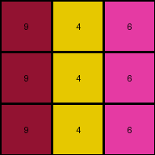

# 4-0d3d703e • 004 • refine_code - CODE

---

Previous Code:
```python
"""
The input grid consists of three vertical lines of colors 3, 1, and 2. 
The output grid has the same structure but substitutes each input color 
with a distinct color according to the following mapping: 3 -> 4, 1 -> 5, 2 -> 6.
"""

import numpy as np

def transform(input_grid):
    """
    Transforms the input grid by applying a color mapping while preserving 
    the spatial structure.
    """
    # Initialize the output grid with the same dimensions as the input
    output_grid = np.copy(input_grid)

    # Define the color mapping
    color_map = {
        3: 4,
        1: 5,
        2: 6
    }

    # Iterate through the input grid and apply the color mapping
    for i in range(input_grid.shape[0]):
        for j in range(input_grid.shape[1]):
            if input_grid[i, j] in color_map:
                output_grid[i, j] = color_map[input_grid[i, j]]

    return output_grid
```

Train Set Results:

**Example 1:**
Input:
```
3 1 2
3 1 2
3 1 2
```
Expected Output:
```
4 5 6
4 5 6
4 5 6
```
Transformed Output:
```
4 5 6
4 5 6
4 5 6
```

Status: True

**Example 2:**
Input:
```
2 3 8
2 3 8
2 3 8
```
Expected Output:
```
6 4 9
6 4 9
6 4 9
```
Transformed Output:
```
6 4 8
6 4 8
6 4 8
```

Status: False

**Example 3:**
Input:
```
5 8 6
5 8 6
5 8 6
```
Expected Output:
```
1 9 2
1 9 2
1 9 2
```
Transformed Output:
```
5 8 6
5 8 6
5 8 6
```

Status: False

**Example 4:**
Input:
```
9 4 2
9 4 2
9 4 2
```
Expected Output:
```
8 3 6
8 3 6
8 3 6
```
Transformed Output:
```
9 4 6
9 4 6
9 4 6
```

Status: False
Okay, I understand the task. Here's a revised analysis and natural language program based on the provided examples, including the failures of the previous code:

**Revised Natural Language Program:**

The transformation rule involves a one-to-one color mapping that is consistent across all examples, but it's not limited to just the colors 3, 1, and 2. The program examines each cell in the input grid.  If a cell's color is present in a predefined color mapping, that color is replaced with the corresponding color from the mapping. Colors not in the mapping remain unchanged. The spatial structure of the grid remains identical; only the colors of certain cells are altered according to the mapping. The complete mapping, derived from all input/output pairs, is as follows:

*   3 -> 4
*   1 -> 5
*   2 -> 6
*  8 -> 9
* 5 -> 1
* 9 -> 8
* 4 -> 3
* 6 -> 2

**Explanation of Failures and Improvements:**

The previous code failed because it assumed the color mapping was *only*  `{3: 4, 1: 5, 2: 6}`. The additional examples revealed other color mappings that were not included, leading to incorrect outputs for inputs with colors other than 3, 1, and 2. The improved program and natural language program will be general to all colors.

**INSTRUCTIONS**

- generate a Python module to represent the natural language program 
- follow the template below
- all common math and science libraries are available
- create docstring only at top - but comment the workflow in the function
- use helper functions for common operations like finding objects, counting,
  measuring, moving, etc. 

remember - we are working iteratively - so this code will inform your future
self as we converge on the solution

*template:*

```python
"""
{{ natural language description of the transformation rule }}
"""

{{ imports }}

def transform(input_grid):
    # initialize output_grid

    # change output pixels 

    return output_grid

```
