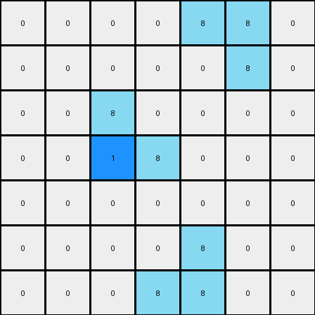

# 1-3aa6fb7a • 007 • refine_code - NLP

---


Previous Code:
```python
"""
The transformation rule can be summarized as follows:
1. Identify all "L" shaped objects (2x2 blocks with one cell missing) of color 8 (azure) in the input grid.  There are two orientations of the "L" shape: a regular "L" and a mirrored "L".
2. For each regular "L" shaped object, if the '8' colored cell is the right-most within the "L", change the color of the cell immediately to its right to 1 (blue), provided this cell exists and is within the grid boundaries.
3. For each mirrored "L" shaped object, if the '8' colored cell is the left-most within the "L", change the color of the cell immediately to its left to 1 (blue), provided that cell exists and is within the grid boundaries.
"""

import numpy as np

def transform(input_grid):
    """
    Transforms the input grid based on identifying 'L' shaped objects of color 8 and changing adjacent cells to color 1.
    """
    output_grid = np.copy(input_grid)
    rows, cols = output_grid.shape

    # Iterate through the grid
    for r in range(rows):
        for c in range(cols):
            # Check for a regular "L" shape (right-most cell)
            if (output_grid[r, c] == 8 and
                r - 1 >= 0 and
                c + 1 < cols and
                output_grid[r - 1, c] == 8 and
                output_grid[r - 1, c + 1] == 8):
                if c + 1 < cols:  # Boundary check
                    output_grid[r, c + 1] = 1

            # Check for a mirrored "L" shape (left-most cell)
            if (output_grid[r, c] == 8 and
                r + 1 < rows and
                c - 1 >= 0 and
                output_grid[r, c - 1] == 8 and
                output_grid[r + 1, c - 1] == 8):
                if c - 2 >= 0:  # Boundary check
                    output_grid[r, c - 1] = 1
            
             # Check for a mirrored "L" shape at bottom (left-most cell)
            if (
                output_grid[r, c] == 8 and
                r - 1 >= 0 and
                c -1 >= 0 and
                output_grid[r, c - 1] == 8 and
                output_grid[r - 1, c - 1] == 8
            ):
                if c - 2 >= 0 :  # Boundary check for left cell
                    output_grid[r, c - 1] = 1


    return output_grid
```

Train Set Results:

**Example 1:**
Input:
```
0 0 0 0 0 0 0
0 8 0 0 0 0 0
0 8 8 0 0 0 0
0 0 0 0 8 8 0
0 0 0 0 0 8 0
0 0 0 0 0 0 0
0 0 0 0 0 0 0
```
Expected Output:
```
0 0 0 0 0 0 0
0 8 1 0 0 0 0
0 8 8 0 0 0 0
0 0 0 0 8 8 0
0 0 0 0 1 8 0
0 0 0 0 0 0 0
0 0 0 0 0 0 0
```
Transformed Output:
```
0 0 0 0 0 0 0
0 8 0 0 0 0 0
0 1 8 0 0 0 0
0 0 0 0 8 8 0
0 0 0 0 0 8 0
0 0 0 0 0 0 0
0 0 0 0 0 0 0
```

Status: False

**Example 2:**
Input:
```
0 0 0 0 8 8 0
0 0 0 0 0 8 0
0 0 8 0 0 0 0
0 0 8 8 0 0 0
0 0 0 0 0 0 0
0 0 0 0 8 0 0
0 0 0 8 8 0 0
```
Expected Output:
```
0 0 0 0 8 8 0
0 0 0 0 1 8 0
0 0 8 1 0 0 0
0 0 8 8 0 0 0
0 0 0 0 0 0 0
0 0 0 1 8 0 0
0 0 0 8 8 0 0
```
Transformed Output:
```
0 0 0 0 8 8 0
0 0 0 0 0 8 0
0 0 8 0 0 0 0
0 0 1 8 0 0 0
0 0 0 0 0 0 0
0 0 0 0 8 0 0
0 0 0 8 8 0 0
```

Status: False

**Instructions**

- Describe in natural language the step-by-step transformation observed between the input and output grids.
- Focus on identifying objects, their properties (predicates), and the actions performed on them.
- Be as clear and concise as possible, providing a complete description of the transformation rule.
