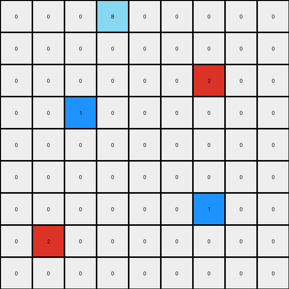

# 2-0ca9ddb6 • 003 • refine_code - NLP

---


Previous Code:
```python
"""
1.  **Identify Singular Color Cells:** Locate all the cells with colors, each being the unique member of that color in the input grid. The example colors provided are Red (2) at (3,2) and Blue(1) at (6,6).

2.  **Create Plus Shapes:** For each identified single-color cell:
    *   Generate a "plus" shape centered around, but not touching the original cell with a new color. The shapes and colors around the red and blue cells are the same, and are at a one cell distance.
    *   For the red cell (color 2), place yellow (color 4) cells in a plus shape around the center. The arms of each "plus" extend one cell away from the original cell.
    *    For the blue cell (color 1), place orange(color 7) cells in a plus shape around the center. The arms of each "plus" extend one cell away from the original cell.

3. **Background:** All other cells remain unchanged (color 0).
"""

import numpy as np

def find_unique_color_cells(grid):
    # Count occurrences of each color
    color_counts = np.bincount(grid.flatten(), minlength=10)
    
    # Find colors that appear only once
    unique_colors = np.where(color_counts == 1)[0]
    
    # Find the coordinates of these unique colors
    unique_cells = []
    for color in unique_colors:
        coords = np.where(grid == color)
        unique_cells.append((color, (coords[0][0], coords[1][0])))
    
    return unique_cells

def create_plus_shape(grid, center, color):
    # Define the offsets for the plus shape (up, down, left, right)
    offsets = [(-1, 0), (1, 0), (0, -1), (0, 1)]
    
    # Get the dimensions of the grid
    rows, cols = grid.shape
    
    # Place the new color around the center
    for offset in offsets:
        new_row = center[0] + offset[0]
        new_col = center[1] + offset[1]
        
        # Check if the new coordinates are within the grid bounds
        if 0 <= new_row < rows and 0 <= new_col < cols:
            grid[new_row, new_col] = color
    
    return grid

def transform(input_grid):
    # Initialize output_grid as a copy of the input_grid
    output_grid = np.copy(input_grid)

    # Find unique color cells
    unique_cells = find_unique_color_cells(input_grid)

    # Create plus shapes around each unique cell
    for color, center in unique_cells:
        if color == 2:  # Red cell
          output_grid = create_plus_shape(output_grid, center, 4)  # Yellow plus
        elif color == 1:  # Blue cell
            output_grid = create_plus_shape(output_grid, center, 7)    # Orange Plus

    return output_grid
```

Train Set Results:

**Example 1:**
Input:
```
0 0 0 0 0 0 0 0 0
0 0 0 0 0 0 0 0 0
0 0 0 0 0 0 0 0 0
0 0 2 0 0 0 0 0 0
0 0 0 0 0 0 0 0 0
0 0 0 0 0 0 0 0 0
0 0 0 0 0 0 1 0 0
0 0 0 0 0 0 0 0 0
0 0 0 0 0 0 0 0 0
```
Expected Output:
```
0 0 0 0 0 0 0 0 0
0 0 0 0 0 0 0 0 0
0 4 0 4 0 0 0 0 0
0 0 2 0 0 0 0 0 0
0 4 0 4 0 0 0 0 0
0 0 0 0 0 0 7 0 0
0 0 0 0 0 7 1 7 0
0 0 0 0 0 0 7 0 0
0 0 0 0 0 0 0 0 0
```
Transformed Output:
```
0 0 0 0 0 0 0 0 0
0 0 0 0 0 0 0 0 0
0 0 4 0 0 0 0 0 0
0 4 2 4 0 0 0 0 0
0 0 4 0 0 0 0 0 0
0 0 0 0 0 0 7 0 0
0 0 0 0 0 7 1 7 0
0 0 0 0 0 0 7 0 0
0 0 0 0 0 0 0 0 0
```

Status: False

**Example 2:**
Input:
```
0 0 0 8 0 0 0 0 0
0 0 0 0 0 0 0 0 0
0 0 0 0 0 0 2 0 0
0 0 1 0 0 0 0 0 0
0 0 0 0 0 0 0 0 0
0 0 0 0 0 0 0 0 0
0 0 0 0 0 0 1 0 0
0 2 0 0 0 0 0 0 0
0 0 0 0 0 0 0 0 0
```
Expected Output:
```
0 0 0 8 0 0 0 0 0
0 0 0 0 0 4 0 4 0
0 0 7 0 0 0 2 0 0
0 7 1 7 0 4 0 4 0
0 0 7 0 0 0 0 0 0
0 0 0 0 0 0 7 0 0
4 0 4 0 0 7 1 7 0
0 2 0 0 0 0 7 0 0
4 0 4 0 0 0 0 0 0
```
Transformed Output:
```
0 0 0 8 0 0 0 0 0
0 0 0 0 0 0 0 0 0
0 0 0 0 0 0 2 0 0
0 0 1 0 0 0 0 0 0
0 0 0 0 0 0 0 0 0
0 0 0 0 0 0 0 0 0
0 0 0 0 0 0 1 0 0
0 2 0 0 0 0 0 0 0
0 0 0 0 0 0 0 0 0
```

Status: False

**Example 3:**
Input:
```
0 0 0 0 0 0 0 0 0
0 0 0 0 0 0 0 0 0
0 0 2 0 0 0 0 0 0
0 0 0 0 0 0 0 0 0
0 0 0 0 0 0 0 0 0
0 0 0 0 0 0 6 0 0
0 0 0 0 0 0 0 0 0
0 0 0 1 0 0 0 0 0
0 0 0 0 0 0 0 0 0
```
Expected Output:
```
0 0 0 0 0 0 0 0 0
0 4 0 4 0 0 0 0 0
0 0 2 0 0 0 0 0 0
0 4 0 4 0 0 0 0 0
0 0 0 0 0 0 0 0 0
0 0 0 0 0 0 6 0 0
0 0 0 7 0 0 0 0 0
0 0 7 1 7 0 0 0 0
0 0 0 7 0 0 0 0 0
```
Transformed Output:
```
0 0 0 0 0 0 0 0 0
0 0 4 0 0 0 0 0 0
0 4 2 4 0 0 0 0 0
0 0 4 0 0 0 0 0 0
0 0 0 0 0 0 0 0 0
0 0 0 0 0 0 6 0 0
0 0 0 7 0 0 0 0 0
0 0 7 1 7 0 0 0 0
0 0 0 7 0 0 0 0 0
```

Status: False

**Instructions**

- Describe in natural language the step-by-step transformation observed between the input and output grids.
- Focus on identifying objects, their properties (predicates), and the actions performed on them.
- Be as clear and concise as possible, providing a complete description of the transformation rule.
