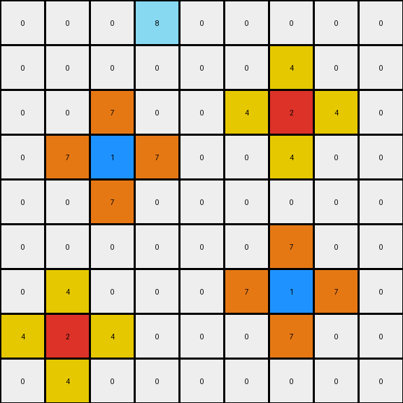

# 2-0ca9ddb6 • 011 • refine_code - NLP

---

Previous Code:
```python
"""
1.  **Identify Target Color Cells:** Locate cells with colors red (2) and blue (1).

2.  **Create Plus Shapes:**
    *   For each identified red cell (color 2), generate a "plus" shape centered *around*, but *not* touching, the original cell using yellow (color 4). The "arms" of the plus extend one cell away from the red cell.
    *   For each identified blue cell (color 1), generate a "plus" shape centered *around*, but *not* touching, the original cell using orange (color 7). The "arms" of the plus extend one cell away from the blue cell.

3.  **Preserve Other Cells:** Any cell that is not part of the identified target cells or the generated "plus" shapes retains its original color. This includes the magenta cell (6) and the white background (0).
"""

import numpy as np

def create_plus_shape(grid, center, color):
    """Creates a plus shape around a center cell with a specified color."""
    rows, cols = grid.shape
    offsets = [(-1, 0), (1, 0), (0, -1), (0, 1)]  # Up, Down, Left, Right
    for dr, dc in offsets:
        r, c = center[0] + dr, center[1] + dc
        if 0 <= r < rows and 0 <= c < cols:
            grid[r, c] = color
    return grid

def transform(input_grid):
    """Transforms the input grid according to the described rule."""
    output_grid = np.copy(input_grid)
    rows, cols = input_grid.shape

    for r in range(rows):
        for c in range(cols):
            if input_grid[r, c] == 2:  # Red cell
                output_grid = create_plus_shape(output_grid, (r, c), 4)  # Yellow plus
            elif input_grid[r, c] == 1:  # Blue cell
                output_grid = create_plus_shape(output_grid, (r, c), 7)  # Orange plus

    return output_grid
```

Train Set Results:

**Example 1:**
Input:
```
0 0 0 0 0 0 0 0 0
0 0 0 0 0 0 0 0 0
0 0 0 0 0 0 0 0 0
0 0 2 0 0 0 0 0 0
0 0 0 0 0 0 0 0 0
0 0 0 0 0 0 0 0 0
0 0 0 0 0 0 1 0 0
0 0 0 0 0 0 0 0 0
0 0 0 0 0 0 0 0 0
```
Expected Output:
```
0 0 0 0 0 0 0 0 0
0 0 0 0 0 0 0 0 0
0 4 0 4 0 0 0 0 0
0 0 2 0 0 0 0 0 0
0 4 0 4 0 0 0 0 0
0 0 0 0 0 0 7 0 0
0 0 0 0 0 7 1 7 0
0 0 0 0 0 0 7 0 0
0 0 0 0 0 0 0 0 0
```
Transformed Output:
```
0 0 0 0 0 0 0 0 0
0 0 0 0 0 0 0 0 0
0 0 4 0 0 0 0 0 0
0 4 2 4 0 0 0 0 0
0 0 4 0 0 0 0 0 0
0 0 0 0 0 0 7 0 0
0 0 0 0 0 7 1 7 0
0 0 0 0 0 0 7 0 0
0 0 0 0 0 0 0 0 0
```

Status: False

**Example 2:**
Input:
```
0 0 0 8 0 0 0 0 0
0 0 0 0 0 0 0 0 0
0 0 0 0 0 0 2 0 0
0 0 1 0 0 0 0 0 0
0 0 0 0 0 0 0 0 0
0 0 0 0 0 0 0 0 0
0 0 0 0 0 0 1 0 0
0 2 0 0 0 0 0 0 0
0 0 0 0 0 0 0 0 0
```
Expected Output:
```
0 0 0 8 0 0 0 0 0
0 0 0 0 0 4 0 4 0
0 0 7 0 0 0 2 0 0
0 7 1 7 0 4 0 4 0
0 0 7 0 0 0 0 0 0
0 0 0 0 0 0 7 0 0
4 0 4 0 0 7 1 7 0
0 2 0 0 0 0 7 0 0
4 0 4 0 0 0 0 0 0
```
Transformed Output:
```
0 0 0 8 0 0 0 0 0
0 0 0 0 0 0 4 0 0
0 0 7 0 0 4 2 4 0
0 7 1 7 0 0 4 0 0
0 0 7 0 0 0 0 0 0
0 0 0 0 0 0 7 0 0
0 4 0 0 0 7 1 7 0
4 2 4 0 0 0 7 0 0
0 4 0 0 0 0 0 0 0
```

Status: False

**Example 3:**
Input:
```
0 0 0 0 0 0 0 0 0
0 0 0 0 0 0 0 0 0
0 0 2 0 0 0 0 0 0
0 0 0 0 0 0 0 0 0
0 0 0 0 0 0 0 0 0
0 0 0 0 0 0 6 0 0
0 0 0 0 0 0 0 0 0
0 0 0 1 0 0 0 0 0
0 0 0 0 0 0 0 0 0
```
Expected Output:
```
0 0 0 0 0 0 0 0 0
0 4 0 4 0 0 0 0 0
0 0 2 0 0 0 0 0 0
0 4 0 4 0 0 0 0 0
0 0 0 0 0 0 0 0 0
0 0 0 0 0 0 6 0 0
0 0 0 7 0 0 0 0 0
0 0 7 1 7 0 0 0 0
0 0 0 7 0 0 0 0 0
```
Transformed Output:
```
0 0 0 0 0 0 0 0 0
0 0 4 0 0 0 0 0 0
0 4 2 4 0 0 0 0 0
0 0 4 0 0 0 0 0 0
0 0 0 0 0 0 0 0 0
0 0 0 0 0 0 6 0 0
0 0 0 7 0 0 0 0 0
0 0 7 1 7 0 0 0 0
0 0 0 7 0 0 0 0 0
```

Status: False
**Instructions**

- Describe in natural language the step-by-step transformation observed between the input and output grids.
- Focus on identifying objects, their properties (predicates), and the actions performed on them.
- Be as clear and concise as possible, providing a complete description of the transformation rule.
