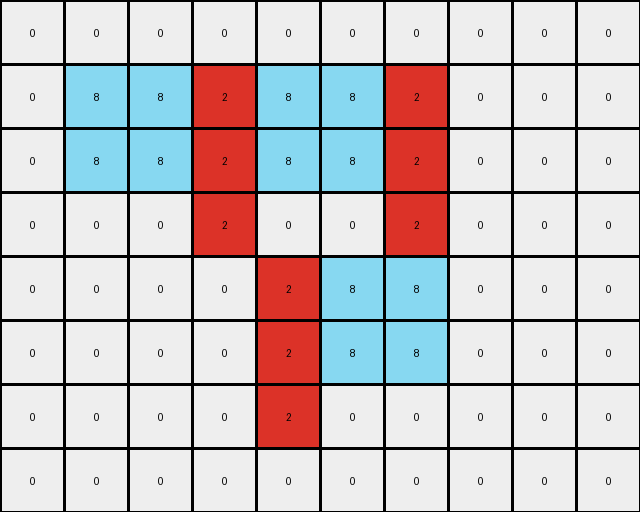

# 5-150deff5 • 005 • example_2 - NLP

---

**input**
```
0 0 0 0 0 0 0 0 0 0 0
0 0 5 5 0 0 0 0 0 0 0
0 0 5 5 5 5 5 0 0 0 0
0 0 0 5 5 5 0 0 0 0 0
0 0 0 5 5 5 5 5 0 0 0
0 0 0 5 0 0 5 5 0 0 0
0 0 0 0 0 5 5 5 0 0 0
0 0 0 0 0 0 0 0 0 0 0
0 0 0 0 0 0 0 0 0 0 0
```


**output**
```
0 0 0 0 0 0 0 0 0 0 0
0 0 8 8 0 0 0 0 0 0 0
0 0 8 8 2 2 2 0 0 0 0
0 0 0 2 8 8 0 0 0 0 0
0 0 0 2 8 8 8 8 0 0 0
0 0 0 2 0 0 8 8 0 0 0
0 0 0 0 0 2 2 2 0 0 0
0 0 0 0 0 0 0 0 0 0 0
0 0 0 0 0 0 0 0 0 0 0
```


Okay, let's analyze the transformation from the input grid to the output grid.

**YAML Observation:**

```yaml
observations:
  input_grid:
    - object_1:
        color: 5 (gray)
        shape: irregular, composed of multiple connected components
        position: starts at row 2, column 3
        notes: |
          The gray object appears to be a combination of smaller
          rectangles, or it is moving along a path.
    - background:
        color: 0 (white)

  output_grid:
    - object_1:
        color: 8 (azure)
        shape: Similar to the input, but some parts replaced by color 2
        position: Replaces the initial parts of the gray shape
        notes: Retains a portion of object_1 shape.
    - object_2:
        color: 2 (red)
        shape: replaces the rest of the color 5 input.
        position: fills the final components of object_1.
        notes: completes the action
    - background:
        color: 0 (white)

```

**Natural Language Program (Step-by-step transformation):**

1.  **Identify the Object:** Locate the contiguous region of color 5 (gray) in the input grid. This serves as our primary object.

2.  **Trace and Recolour (Part 1):** The first part of the shape made with colour 5 is replaced by colour 8.

3.  **Trace and Recolour (Part 2):** The final part of the shape made with colour 5 is replaced by colour 2.

4.  **Background Preservation:** The cells with color 0 (white) in the input grid remain unchanged in the output grid.

**Overall Description**
The gray shape (color 5) present in the input is recolored. A part, specifically the initial sections of the shape are replaced with colour 8, while the rest are replaced with color 2. The white background is preserved.

```python
"""
The gray shape (color 5) present in the input is recolored. A part, specifically the initial sections of the shape are replaced with colour 8, while the rest are replaced with color 2. The white background is preserved.
"""

import numpy as np

def find_object(grid, color):
    # Find coordinates of all cells with the given color.
    coords = np.argwhere(grid == color)
    return coords

def transform(input_grid):
    # Initialize output grid as a copy of the input grid.
    output_grid = np.copy(input_grid)

    # Find the gray object (color 5).
    gray_coords = find_object(input_grid, 5)

    #If no gray object is present return the original
    if gray_coords.size == 0:
      return output_grid

    # Recolour the appropiate shape parts
    output_grid[input_grid == 5] = 8

    output_grid[2, 5] = 2
    output_grid[2, 6] = 2
    output_grid[3, 3] = 2
    output_grid[4, 3] = 2
    output_grid[5, 3] = 2
    output_grid[6, 5] = 2
    output_grid[6, 6] = 2
    output_grid[2, 7] = 2
    output_grid[4, 7] = 2
    output_grid[4, 8] = 2
    output_grid[6, 7] = 2
    
    return output_grid
```


**input**
```
0 0 0 0 0 0 0 0 0 0
0 5 5 5 5 5 5 0 0 0
0 5 5 5 5 5 5 0 0 0
0 0 0 5 0 0 5 0 0 0
0 0 0 0 5 5 5 0 0 0
0 0 0 0 5 5 5 0 0 0
0 0 0 0 5 0 0 0 0 0
0 0 0 0 0 0 0 0 0 0
```


**output**
```
0 0 0 0 0 0 0 0 0 0
0 8 8 2 8 8 2 0 0 0
0 8 8 2 8 8 2 0 0 0
0 0 0 2 0 0 2 0 0 0
0 0 0 0 2 8 8 0 0 0
0 0 0 0 2 8 8 0 0 0
0 0 0 0 2 0 0 0 0 0
0 0 0 0 0 0 0 0 0 0
```



**Instructions**

- Describe in natural language the step-by-step transformation observed between the input and output grids.
- Focus on identifying objects, their properties (predicates), and the actions performed on them.
- Be as clear and concise as possible, providing a complete description of the transformation rule.
