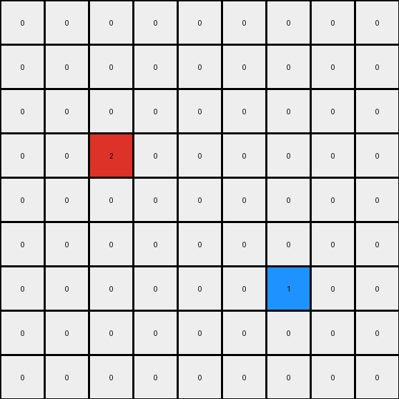

# 2-0ca9ddb6 • 009 • example_3 - NLP

---

**input**
```
0 0 0 0 0 0 0 0 0
0 0 0 0 0 0 0 0 0
0 0 0 0 0 0 0 0 0
0 0 2 0 0 0 0 0 0
0 0 0 0 0 0 0 0 0
0 0 0 0 0 0 0 0 0
0 0 0 0 0 0 1 0 0
0 0 0 0 0 0 0 0 0
0 0 0 0 0 0 0 0 0
```




**output**
```
0 0 0 0 0 0 0 0 0
0 0 0 0 0 0 0 0 0
0 4 0 4 0 0 0 0 0
0 0 2 0 0 0 0 0 0
0 4 0 4 0 0 0 0 0
0 0 0 0 0 0 7 0 0
0 0 0 0 0 7 1 7 0
0 0 0 0 0 0 7 0 0
0 0 0 0 0 0 0 0 0
```


Okay, let's analyze the transformation from the input grid to the output grid.

**YAML Summary of Observations**

```yaml
input_grid:
  objects:
    - color: 2
      position: (3, 2)
      shape: single cell
    - color: 1
      position: (6, 6)
      shape: single cell
  size: (9, 9)
  background_color: 0

output_grid:
  objects:
    - color: 2
      position: (3, 2)
      shape: single cell
    - color: 1
      position: (6, 6)
      shape: single cell
    - color: 4
      positions: [(2, 1), (2, 3), (4, 1), (4, 3)]
      shape: four single cells
    - color: 7
      positions: [(5,6), (6,5), (6,6), (6,7), (7,6)]
      shape: L-shape plus cells
  size: (9, 9)
  background_color: 0
```

**Natural Language Program: Step-by-Step Transformation**

1.  **Identify Initial Objects:** In the input grid, we have two single-cell objects: one red (color 2) at position (3, 2) and one blue (color 1) at position (6, 6).

2.  **Preserve Key Objects:** The red (color 2) and blue (color 1) objects from the input are preserved in the output grid in the same positions.

3.  **Introduce New Objects around Original Positions:**
    *   Around the red object (color 2), four instances of yellow object (color 4) are placed at the following relative positions: one cell up and one cell left, one cell up and one cell right, one cell down and one cell left, and one cell down and one cell right. These positions would correspond to (2, 1), (2, 3), (4, 1), and (4, 3) in the grid.

    *   Around the blue object (color 1), a cross, or "plus" shape made of the orange color (color 7) is introduced, centered at the original blue cell's location (6, 6). This shape consists of the following cells: (5,6), (6,5), (6,6), (6,7), (7,6).

4. **Background:** The rest of the cells remain unchanged (color 0).

**Summary of the rule**

The transformation rule involves preserving the original single-cell objects and introducing new objects of different colors around them in specific patterns. Yellow cells surround the red cell, and a cross shaped made of orange cells surround the blue cell.

```python
"""
The transformation rule involves preserving the original single-cell objects and introducing new objects of different colors around them in specific patterns. Yellow cells surround the red cell, and a cross shaped made of orange cells surround the blue cell.
"""

import numpy as np

def transform(input_grid):
    # Initialize output_grid as a copy of the input_grid
    output_grid = np.copy(input_grid)

    # Iterate through the input grid to find the single-cell objects
    for i in range(input_grid.shape[0]):
        for j in range(input_grid.shape[1]):
            # Check for the red cell (color 2)
            if input_grid[i, j] == 2:
                # Place yellow cells (color 4) around the red cell
                if i > 0 and j > 0:
                    output_grid[i - 1, j - 1] = 4
                if i > 0 and j < input_grid.shape[1] - 1:
                    output_grid[i - 1, j + 1] = 4
                if i < input_grid.shape[0] - 1 and j > 0:
                    output_grid[i + 1, j - 1] = 4
                if i < input_grid.shape[0] - 1 and j < input_grid.shape[1] - 1:
                    output_grid[i + 1, j + 1] = 4

            # Check for the blue cell (color 1)
            if input_grid[i, j] == 1:
                # Place orange cells (color 7) in cross shape around blue
                if i > 0:
                    output_grid[i-1, j] = 7
                if j > 0:
                    output_grid[i, j-1] = 7
                output_grid[i,j] = 7
                if j < input_grid.shape[1] -1:
                    output_grid[i, j+1] = 7
                if i < input_grid.shape[0] -1:
                    output_grid[i+1, j] = 7

    return output_grid
```

**input**
```
0 0 0 8 0 0 0 0 0
0 0 0 0 0 0 0 0 0
0 0 0 0 0 0 2 0 0
0 0 1 0 0 0 0 0 0
0 0 0 0 0 0 0 0 0
0 0 0 0 0 0 0 0 0
0 0 0 0 0 0 1 0 0
0 2 0 0 0 0 0 0 0
0 0 0 0 0 0 0 0 0
```


**output**
```
0 0 0 8 0 0 0 0 0
0 0 0 0 0 4 0 4 0
0 0 7 0 0 0 2 0 0
0 7 1 7 0 4 0 4 0
0 0 7 0 0 0 0 0 0
0 0 0 0 0 0 7 0 0
4 0 4 0 0 7 1 7 0
0 2 0 0 0 0 7 0 0
4 0 4 0 0 0 0 0 0
```


Okay, let's analyze the transformation from the input grid to the output grid in the second example.

**YAML Summary of Observations**

```yaml
input_grid:
  objects:
    - color: 8
      position: (0, 3)
      shape: single cell
    - color: 2
      positions: [(2, 6), (7, 1)]
      shape: single cells
    - color: 1
      positions: [(3, 2), (6, 6)]
      shape: single cells
  size: (9, 9)
  background_color: 0

output_grid:
  objects:
    - color: 8
      position: (0, 3)
      shape: single cell
    - color: 2
      positions: [(2, 6), (7, 1)]
      shape: single cells
    - color: 1
      positions: [(3, 2), (6, 6)]
      shape: single cells
    - color: 4
      positions: [(1, 5), (1, 7), (3, 5), (3, 7), (6, 0), (6, 2), (8, 0), (8, 2)]
      shape: single cells
    - color: 7
      positions: [(2,2), (3,1), (3,2), (3,3), (4,2), (5,6), (6,5), (6,6), (6,7), (7,6)]
      shape: L-shapes + single cell
  size: (9, 9)
  background_color: 0
```

**Natural Language Program: Step-by-Step Transformation**

1.  **Identify Initial Objects:** The input grid has several single-cell objects of colors 8, 2, and 1.

2.  **Preserve Key Objects:** The single-cell objects of colors 8, 2 and 1 from the input are preserved in the output grid at their original positions.

3.  **Introduce New Objects around Original Positions (Conditionally):**
    *   Around each red object (color 2), four instances of yellow object (color 4) are placed: one cell up and one cell left, one cell up and one cell right, one cell down and one cell left, and one cell down and one cell right, *if possible within the grid boundaries*.

    *   Around each blue object (color 1), orange cells (color 7) are placed to form a "plus" shape *if possible within the grid boundaries*. One cell up, down, left and right.

4.  **Background:** All other cells in the grid remain unchanged (color 0).

**Summary of the rule**

The transformation rule involves preserving the original single-cell objects (colors 8, 2, and 1) and introducing new objects of different colors around the 2 and 1 colored cells, in specific patterns, taking boundaries into account. Yellow cells surround the red cells, and a cross shaped made of orange cells surround the blue cells.

```python
"""
The transformation rule involves preserving the original single-cell objects (colors 8, 2, and 1) and introducing new objects of different colors around the 2 and 1 colored cells, in specific patterns, taking boundaries into account. Yellow cells surround the red cells, and a cross shaped made of orange cells surround the blue cells.
"""

import numpy as np

def transform(input_grid):
    # Initialize output_grid as a copy of the input_grid
    output_grid = np.copy(input_grid)

    # Iterate through the input grid to find the single-cell objects
    for i in range(input_grid.shape[0]):
        for j in range(input_grid.shape[1]):
            # Check for the red cell (color 2)
            if input_grid[i, j] == 2:
                # Place yellow cells (color 4) around the red cell
                if i > 0 and j > 0:
                    output_grid[i - 1, j - 1] = 4
                if i > 0 and j < input_grid.shape[1] - 1:
                    output_grid[i - 1, j + 1] = 4
                if i < input_grid.shape[0] - 1 and j > 0:
                    output_grid[i + 1, j - 1] = 4
                if i < input_grid.shape[0] - 1 and j < input_grid.shape[1] - 1:
                    output_grid[i + 1, j + 1] = 4

            # Check for the blue cell (color 1)
            if input_grid[i, j] == 1:
                # Place orange cells (color 7) in cross shape around blue
                if i > 0:
                    output_grid[i-1, j] = 7
                if j > 0:
                    output_grid[i, j-1] = 7
                output_grid[i,j] = 7 # added to keep the blue pixel
                if j < input_grid.shape[1] -1:
                    output_grid[i, j+1] = 7
                if i < input_grid.shape[0] -1:
                    output_grid[i+1, j] = 7

    return output_grid
```


**input**
```
0 0 0 0 0 0 0 0 0
0 0 0 0 0 0 0 0 0
0 0 2 0 0 0 0 0 0
0 0 0 0 0 0 0 0 0
0 0 0 0 0 0 0 0 0
0 0 0 0 0 0 6 0 0
0 0 0 0 0 0 0 0 0
0 0 0 1 0 0 0 0 0
0 0 0 0 0 0 0 0 0
```


**output**
```
0 0 0 0 0 0 0 0 0
0 4 0 4 0 0 0 0 0
0 0 2 0 0 0 0 0 0
0 4 0 4 0 0 0 0 0
0 0 0 0 0 0 0 0 0
0 0 0 0 0 0 6 0 0
0 0 0 7 0 0 0 0 0
0 0 7 1 7 0 0 0 0
0 0 0 7 0 0 0 0 0
```


**Instructions**

- Describe in natural language the step-by-step transformation observed between the input and output grids.
- Focus on identifying objects, their properties (predicates), and the actions performed on them.
- Be as clear and concise as possible, providing a complete description of the transformation rule.
