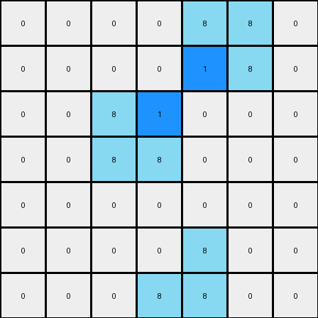

# 1-3aa6fb7a • 007 • refine_code - NLP

---


Previous Code:
```python
"""
Transformation Rule:

1.  Identify L-shaped objects (color 8) in the input grid.
2.  For each L-shaped object, find the "inner corner" cell.
3.  Insert a cell of color 1 (blue) at each inner corner.
"""

import numpy as np

def find_l_shapes(grid, color):
    """
    Finds L-shaped objects of a specific color in the grid.
    Returns a list of coordinates (row, col) of the "tip" of each L.
    The tip is defined as the cell which has neighbors to the right and down.
    """
    l_shapes = []
    rows, cols = grid.shape
    for r in range(rows - 1):
        for c in range(cols - 1):
            if grid[r, c] == color:
                # Check for L-shape (tip at top-left)
                if grid[r + 1, c] == color and grid[r, c + 1] == color:
                    l_shapes.append((r, c))
                # Check for L-shape (tip at top-right)
                elif grid[r + 1, c] == color and grid[r, c-1] == color and c > 0:
                    l_shapes.append((r,c))
                # Check for L-shape (tip at bottom-left)
                elif grid[r-1,c] == color and grid[r,c+1] == color and r > 0:
                    l_shapes.append((r,c))
                 # Check for L-shape (tip at bottom-right)
                elif grid[r-1,c] == color and grid[r,c-1] == color and r > 0 and c > 0:
                    l_shapes.append((r,c))    
    return l_shapes

def get_inner_corner(grid, tip, color):
    """
    Finds the inner corner coordinate for a given L-shape tip.
    """
    r, c = tip
    # Check which type of L-shape it is and calculate the inner corner
    
    if grid[r + 1, c] == color and grid[r, c + 1] == color:
         return (r + 1, c + 1)

    elif grid[r + 1, c] == color and grid[r, c - 1] == color:
        return (r+1, c-1)
        
    elif grid[r - 1, c] == color and grid[r, c + 1] == color:
        return (r-1, c+1)
        
    elif grid[r - 1, c] == color and grid[r, c - 1] == color:
        return (r-1,c-1)

    return None  # Should not happen if the tip is correctly identified


def transform(input_grid):
    """
    Transforms the input grid according to the L-shape rule.
    """
    # Initialize output_grid as a copy of the input_grid
    output_grid = np.copy(input_grid)
    
    # Find all L-shapes of color 8
    l_shapes = find_l_shapes(output_grid, 8)

    # For each L-shape, find the inner corner and change its color to 1
    for tip in l_shapes:
        inner_corner = get_inner_corner(output_grid, tip, 8)
        if inner_corner:
            output_grid[inner_corner] = 1

    return output_grid
```

Train Set Results:

**Example 1:**
Input:
```
0 0 0 0 0 0 0
0 8 0 0 0 0 0
0 8 8 0 0 0 0
0 0 0 0 8 8 0
0 0 0 0 0 8 0
0 0 0 0 0 0 0
0 0 0 0 0 0 0
```
Expected Output:
```
0 0 0 0 0 0 0
0 8 1 0 0 0 0
0 8 8 0 0 0 0
0 0 0 0 8 8 0
0 0 0 0 1 8 0
0 0 0 0 0 0 0
0 0 0 0 0 0 0
```
Transformed Output:
```
0 0 0 0 0 0 0
0 8 1 0 0 0 0
0 8 8 0 0 0 0
0 0 0 0 8 8 0
0 0 0 0 1 8 0
0 0 0 0 0 0 0
0 0 0 0 0 0 0
```

Status: True

**Example 2:**
Input:
```
0 0 0 0 8 8 0
0 0 0 0 0 8 0
0 0 8 0 0 0 0
0 0 8 8 0 0 0
0 0 0 0 0 0 0
0 0 0 0 8 0 0
0 0 0 8 8 0 0
```
Expected Output:
```
0 0 0 0 8 8 0
0 0 0 0 1 8 0
0 0 8 1 0 0 0
0 0 8 8 0 0 0
0 0 0 0 0 0 0
0 0 0 1 8 0 0
0 0 0 8 8 0 0
```
Transformed Output:
```
0 0 0 0 8 8 0
0 0 0 0 1 8 0
0 0 8 1 0 0 0
0 0 8 8 0 0 0
0 0 0 0 0 0 0
0 0 0 0 8 0 0
0 0 0 8 8 0 0
```

Status: False

**Instructions**

- Describe in natural language the step-by-step transformation observed between the input and output grids.
- Focus on identifying objects, their properties (predicates), and the actions performed on them.
- Be as clear and concise as possible, providing a complete description of the transformation rule.
