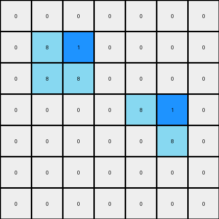
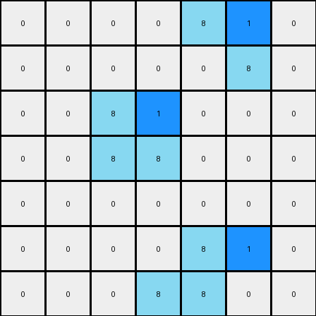

# 1-3aa6fb7a • 003 • refine_code - NLP

---

Previous Code:
```python
"""
The transformation rule involves identifying azure (8) objects and placing blue (1) cells adjacent to specific points on these objects. The first azure object gets a blue cell to the right of the top end, and the second azure object receives a blue cell to the left of its bottom end.
"""

import numpy as np

def find_objects(grid, color):
    objects = []
    visited = set()

    def dfs(r, c, current_object):
        if (r, c) in visited or r < 0 or r >= grid.shape[0] or c < 0 or c >= grid.shape[1] or grid[r, c] != color:
            return
        visited.add((r, c))
        current_object.append((r, c))
        dfs(r + 1, c, current_object)
        dfs(r - 1, c, current_object)
        dfs(r, c + 1, current_object)
        dfs(r, c - 1, current_object)

    for r in range(grid.shape[0]):
        for c in range(grid.shape[1]):
            if grid[r, c] == color and (r, c) not in visited:
                current_object = []
                dfs(r, c, current_object)
                objects.append(current_object)
    return objects

def transform(input_grid):
    # Initialize output_grid as a copy of input_grid
    output_grid = np.copy(input_grid)
    
    # Find azure (8) objects
    azure_objects = find_objects(input_grid, 8)
    
    # Process each azure object
    for obj in azure_objects:
        # Sort object cells by row and column
        obj.sort(key=lambda x: (x[0], x[1]))
        
        # First object (assume it is the vertical line)
        if obj[0][0] < obj[-1][0]:   # top to bottom
            top_cell = obj[0]
            output_grid[top_cell[0], top_cell[1] + 1] = 1  # Place blue cell to the right
        # second object (assume horizontal)
        elif obj[0][1] < obj[-1][1]:
            bottom_cell = obj[-1]
            output_grid[bottom_cell[0], bottom_cell[1]-1] = 1
    return output_grid
```

Train Set Results:

**Example 1:**
Input:
```
0 0 0 0 0 0 0
0 8 0 0 0 0 0
0 8 8 0 0 0 0
0 0 0 0 8 8 0
0 0 0 0 0 8 0
0 0 0 0 0 0 0
0 0 0 0 0 0 0
```
Expected Output:
```
0 0 0 0 0 0 0
0 8 1 0 0 0 0
0 8 8 0 0 0 0
0 0 0 0 8 8 0
0 0 0 0 1 8 0
0 0 0 0 0 0 0
0 0 0 0 0 0 0
```
Transformed Output:
```
0 0 0 0 0 0 0
0 8 1 0 0 0 0
0 8 8 0 0 0 0
0 0 0 0 8 1 0
0 0 0 0 0 8 0
0 0 0 0 0 0 0
0 0 0 0 0 0 0
```

Status: False

**Example 2:**
Input:
```
0 0 0 0 8 8 0
0 0 0 0 0 8 0
0 0 8 0 0 0 0
0 0 8 8 0 0 0
0 0 0 0 0 0 0
0 0 0 0 8 0 0
0 0 0 8 8 0 0
```
Expected Output:
```
0 0 0 0 8 8 0
0 0 0 0 1 8 0
0 0 8 1 0 0 0
0 0 8 8 0 0 0
0 0 0 0 0 0 0
0 0 0 1 8 0 0
0 0 0 8 8 0 0
```
Transformed Output:
```
0 0 0 0 8 1 0
0 0 0 0 0 8 0
0 0 8 1 0 0 0
0 0 8 8 0 0 0
0 0 0 0 0 0 0
0 0 0 0 8 1 0
0 0 0 8 8 0 0
```

Status: False
**Instructions**

- Describe in natural language the step-by-step transformation observed between the input and output grids.
- Focus on identifying objects, their properties (predicates), and the actions performed on them.
- Be as clear and concise as possible, providing a complete description of the transformation rule.
