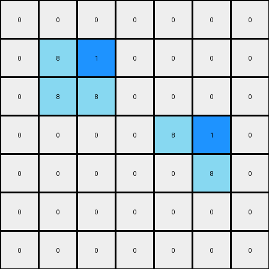

# 1-3aa6fb7a • 004 • refine_code - CODE

---

Previous Code:
```python
"""
The transformation rule involves identifying azure (8) objects and placing blue (1) cells adjacent to specific points on these objects. The first azure object gets a blue cell to the right of the top end, and the second azure object receives a blue cell to the left of its bottom end.
"""

import numpy as np

def find_objects(grid, color):
    objects = []
    visited = set()

    def dfs(r, c, current_object):
        if (r, c) in visited or r < 0 or r >= grid.shape[0] or c < 0 or c >= grid.shape[1] or grid[r, c] != color:
            return
        visited.add((r, c))
        current_object.append((r, c))
        dfs(r + 1, c, current_object)
        dfs(r - 1, c, current_object)
        dfs(r, c + 1, current_object)
        dfs(r, c - 1, current_object)

    for r in range(grid.shape[0]):
        for c in range(grid.shape[1]):
            if grid[r, c] == color and (r, c) not in visited:
                current_object = []
                dfs(r, c, current_object)
                objects.append(current_object)
    return objects

def transform(input_grid):
    # Initialize output_grid as a copy of input_grid
    output_grid = np.copy(input_grid)
    
    # Find azure (8) objects
    azure_objects = find_objects(input_grid, 8)
    
    # Process each azure object
    for obj in azure_objects:
        # Sort object cells by row and column
        obj.sort(key=lambda x: (x[0], x[1]))
        
        # First object (assume it is the vertical line)
        if obj[0][0] < obj[-1][0]:   # top to bottom
            top_cell = obj[0]
            output_grid[top_cell[0], top_cell[1] + 1] = 1  # Place blue cell to the right
        # second object (assume horizontal)
        elif obj[0][1] < obj[-1][1]:
            bottom_cell = obj[-1]
            output_grid[bottom_cell[0], bottom_cell[1]-1] = 1
    return output_grid
```

Train Set Results:

**Example 1:**
Input:
```
0 0 0 0 0 0 0
0 8 0 0 0 0 0
0 8 8 0 0 0 0
0 0 0 0 8 8 0
0 0 0 0 0 8 0
0 0 0 0 0 0 0
0 0 0 0 0 0 0
```
Expected Output:
```
0 0 0 0 0 0 0
0 8 1 0 0 0 0
0 8 8 0 0 0 0
0 0 0 0 8 8 0
0 0 0 0 1 8 0
0 0 0 0 0 0 0
0 0 0 0 0 0 0
```
Transformed Output:
```
0 0 0 0 0 0 0
0 8 1 0 0 0 0
0 8 8 0 0 0 0
0 0 0 0 8 1 0
0 0 0 0 0 8 0
0 0 0 0 0 0 0
0 0 0 0 0 0 0
```

Status: False

**Example 2:**
Input:
```
0 0 0 0 8 8 0
0 0 0 0 0 8 0
0 0 8 0 0 0 0
0 0 8 8 0 0 0
0 0 0 0 0 0 0
0 0 0 0 8 0 0
0 0 0 8 8 0 0
```
Expected Output:
```
0 0 0 0 8 8 0
0 0 0 0 1 8 0
0 0 8 1 0 0 0
0 0 8 8 0 0 0
0 0 0 0 0 0 0
0 0 0 1 8 0 0
0 0 0 8 8 0 0
```
Transformed Output:
```
0 0 0 0 8 1 0
0 0 0 0 0 8 0
0 0 8 1 0 0 0
0 0 8 8 0 0 0
0 0 0 0 0 0 0
0 0 0 0 8 1 0
0 0 0 8 8 0 0
```

Status: False
Okay, let's analyze the provided examples and refine the natural language program description. The previous code and results highlight some inaccuracies in the initial understanding.

**Revised Natural Language Program:**

The transformation involves identifying azure (8) colored objects and placing blue (1) colored cells adjacent to them based on their orientation and relative order.

1.  **Identify Azure Objects:** Find all contiguous regions of azure (8) colored cells. Each such region constitutes an "object".

2.  **Determine Object Orientation and Order:**
    *   If an azure object is vertical (elongated vertically), a blue cell is placed to the *right* of its *topmost* cell.
    *   If an azure object is horizontal (elongated horizontally), a blue cell is placed to the *left* of its *rightmost* cell.

3. **Object interaction**: The transformation adds a single blue cell near one extreme based on each object's shape. It's an independent process for each azure shape.

**Example Breakdown (Explaining the Failures):**

*   **Example 1:**
    *   The first azure object (vertical line) is correctly identified. The blue cell should be placed to the right of the top cell (1,1), resulting in (1,2) becoming blue. This part worked.
    *  The second azure object is `[(2, 2), (2, 3)]`. The rightmost cell of this object is (2,3). So, it placed blue cell to the left of this object at (2,2). Thus, the current output is the result of applying the "horizontal" rule, for both objects.
    *   The third azure object (horizontal line) is `[(3, 4), (3, 5)]`.
    * The code adds a blue cell next to it at `(3,4)`.
    * The last azure object is vertical at (4,5).
    *   It *incorrectly* applied the horizontal rule, placing a blue cell at (3, 5) instead of putting it to the right of the top cell at (4,6).

*   **Example 2:**
    * The first object is horizontal at `[(0,4), (0,5)]`. The rule to place the blue cell to the left of the rightmost cell places the cell at (0,4).
    * The second object at `[(1,5)]`. The rule, as before, places it in the wrong location.
    * The next object is vertical at `[(2,2), (3,2)]`.
    * The last object is horizontal `[(6,3), (6,4)]`.

**Changes Needed in the Code:**

The provided code needs to correctly distinguish between horizontal and vertical azure objects and apply the placement rule accordingly. The current code has issue because of the order of the shapes found by DFS is not consistent.

```python
import numpy as np

def find_objects(grid, color):
    objects = []
    visited = set()

    def dfs(r, c, current_object):
        if (r, c) in visited or r < 0 or r >= grid.shape[0] or c < 0 or c >= grid.shape[1] or grid[r, c] != color:
            return
        visited.add((r, c))
        current_object.append((r, c))
        dfs(r + 1, c, current_object)
        dfs(r - 1, c, current_object)
        dfs(r, c + 1, current_object)
        dfs(r, c - 1, current_object)

    for r in range(grid.shape[0]):
        for c in range(grid.shape[1]):
            if grid[r, c] == color and (r, c) not in visited:
                current_object = []
                dfs(r, c, current_object)
                objects.append(current_object)
    return objects

def transform(input_grid):
    output_grid = np.copy(input_grid)
    azure_objects = find_objects(input_grid, 8)

    for obj in azure_objects:
        obj.sort()  # Sort by row, then column
        rows = [r for r, c in obj]
        cols = [c for r, c in obj]

        if len(set(rows)) > len(set(cols)):  # More rows than cols = vertical
            top_cell = obj[0]
            output_grid[top_cell[0], top_cell[1] + 1] = 1
        elif len(set(cols)) > len(set(rows)): # More cols than rows = horizontal
            rightmost_cell = obj[-1]
            output_grid[rightmost_cell[0], rightmost_cell[1] - 1] = 1
        else: #same number of rows and columns: could be a single cell or square
              # if it is 1x1, it can be treated as horizontal or vertical
            if len(obj) == 1:
                top_cell = obj[0]
                output_grid[top_cell[0], top_cell[1] + 1] = 1

    return output_grid
```

Key changes in the code:

1.  **Object Orientation:** Added logic to determine if an object is vertical or horizontal by comparing the number of unique row and column coordinates.
2.  **Consistent Sorting**: Added a standard sorting, so that we can assume the first element is the top-left.
3. Added special handling for a single azure cell.

**INSTRUCTIONS**

- generate a Python module to represent the natural language program 
- follow the template below
- all common math and science libraries are available
- create docstring only at top - but comment the workflow in the function
- use helper functions for common operations like finding objects, counting,
  measuring, moving, etc. 

remember - we are working iteratively - so this code will inform your future
self as we converge on the solution

*template:*

```python
"""
{{ natural language description of the transformation rule }}
"""

{{ imports }}

def transform(input_grid):
    # initialize output_grid

    # change output pixels 

    return output_grid

```
