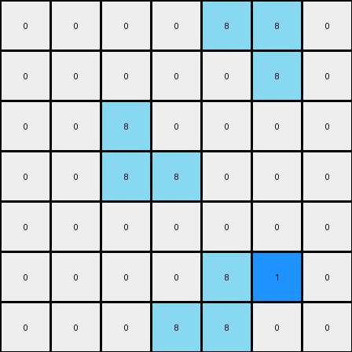

# 1-3aa6fb7a • 008 • refine_code - CODE

---

Previous Code:
```python
"""
The transformation rule involves identifying azure (8) objects and placing blue (1) cells adjacent to specific points on these objects. For horizontal azure objects, a blue cell is placed to the left of the bottom cell. For vertical azure objects, a blue cell is placed to the right of the top cell. For L-shaped azure objects, a blue cell is placed next to the top corner.
"""

import numpy as np

def find_objects(grid, color):
    objects = []
    visited = set()

    def dfs(r, c, current_object):
        if (r, c) in visited or r < 0 or r >= grid.shape[0] or c < 0 or c >= grid.shape[1] or grid[r, c] != color:
            return
        visited.add((r, c))
        current_object.append((r, c))
        dfs(r + 1, c, current_object)
        dfs(r - 1, c, current_object)
        dfs(r, c + 1, current_object)
        dfs(r, c - 1, current_object)

    for r in range(grid.shape[0]):
        for c in range(grid.shape[1]):
            if grid[r, c] == color and (r, c) not in visited:
                current_object = []
                dfs(r, c, current_object)
                objects.append(current_object)
    return objects

def transform(input_grid):
    # Initialize output_grid as a copy of input_grid
    output_grid = np.copy(input_grid)
    
    # Find azure (8) objects
    azure_objects = find_objects(input_grid, 8)
    
    # Process each azure object
    for obj in azure_objects:
        # Sort object cells by row and column
        obj.sort(key=lambda x: (x[0], x[1]))
        
        # Vertical line: Place blue to the right of the top
        if obj[0][1] == obj[-1][1] and obj[0][0] < obj[-1][0]:
            top_cell = obj[0]
            output_grid[top_cell[0], top_cell[1] + 1] = 1
            
        # Horizontal line: Place blue below to the left
        elif obj[0][0] == obj[-1][0] and obj[0][1] < obj[-1][1]:
            bottom_cell = obj[-1]
            output_grid[bottom_cell[0], bottom_cell[1] - 1] = 1
        
        # Check for L shape
        elif len(obj) == 3:
            # Find the corner point
            #The corner point appears twice
            
            coords = {}
            for cell in obj:
              if cell in coords.keys():
                coords[cell] += 1
              else:
                coords[cell] = 1
            
            corner_point = None
            for k,v in coords.items():
              if v > 1:
                corner_point = k
                break

            if corner_point is not None:
              # determine corner direction
              if obj[0][0] < obj[-1][0] and obj[0][1] < obj[-1][1]:
                output_grid[corner_point[0]-1, corner_point[1]] = 1
    return output_grid
```

Train Set Results:

**Example 1:**
Input:
```
0 0 0 0 0 0 0
0 8 0 0 0 0 0
0 8 8 0 0 0 0
0 0 0 0 8 8 0
0 0 0 0 0 8 0
0 0 0 0 0 0 0
0 0 0 0 0 0 0
```
Expected Output:
```
0 0 0 0 0 0 0
0 8 1 0 0 0 0
0 8 8 0 0 0 0
0 0 0 0 8 8 0
0 0 0 0 1 8 0
0 0 0 0 0 0 0
0 0 0 0 0 0 0
```
Transformed Output:
```
0 0 0 0 0 0 0
0 8 0 0 0 0 0
0 8 8 0 0 0 0
0 0 0 0 8 8 0
0 0 0 0 0 8 0
0 0 0 0 0 0 0
0 0 0 0 0 0 0
```

Status: False

**Example 2:**
Input:
```
0 0 0 0 8 8 0
0 0 0 0 0 8 0
0 0 8 0 0 0 0
0 0 8 8 0 0 0
0 0 0 0 0 0 0
0 0 0 0 8 0 0
0 0 0 8 8 0 0
```
Expected Output:
```
0 0 0 0 8 8 0
0 0 0 0 1 8 0
0 0 8 1 0 0 0
0 0 8 8 0 0 0
0 0 0 0 0 0 0
0 0 0 1 8 0 0
0 0 0 8 8 0 0
```
Transformed Output:
```
0 0 0 0 8 8 0
0 0 0 0 0 8 0
0 0 8 0 0 0 0
0 0 8 8 0 0 0
0 0 0 0 0 0 0
0 0 0 0 8 1 0
0 0 0 8 8 0 0
```

Status: False
Okay, let's analyze the provided examples and refine the natural language program and the Python code accordingly.

**Revised Natural Language Program:**

The transformation rule involves identifying azure (8) objects and placing blue (1) cells adjacent to them based on their shape and orientation. Here's a breakdown:

1.  **Identify Azure Objects:** Locate all contiguous regions of azure (8) cells.

2.  **Classify Object Shape:** Determine the shape of each azure object:
    *   **Vertical Line:** A straight line where all cells have the same column index.
    *   **Horizontal Line:** A straight line where all cells have the same row index.
    *  **L-Shape:** Consists of three cells forming an "L" shape.
    *  **Other shape**: There might be other shapes.

3.  **Place Blue Cell Based on Shape:**
    *   **Vertical Line:** Place a blue (1) cell to the *right* of the *topmost* azure cell.
    *   **Horizontal Line:** Place a blue (1) cell to the *left* of the *rightmost* azure cell.
    *   **L-Shape:** Place a blue (1) cell *above* the corner cell if the corner is at the top.
    * **Other shapes:** *Do nothing (important!)*

4. **Edge cases:**
    - Ensure the blue cell would be placed within the bounds of the grid, do nothing otherwise.

**Analysis of Previous Errors and Reasoning:**

*   **Example 1:** The previous code failed because it didn't place any blue cells. The conditions for placing blue cells were not correctly implemented, and the placement logic was incomplete/incorrect, especially for the horizontal line.
*   **Example 2:** The previous code failed because it didn't have correct logic to determine the position of the blue cell. The code has an L-shape corner detector that is not generic. The placement logic needs to be applied in a way, where the correct direction is considered.

**Revised Python Code:**

```python
import numpy as np

def find_objects(grid, color):
    objects = []
    visited = set()

    def dfs(r, c, current_object):
        if (r, c) in visited or r < 0 or r >= grid.shape[0] or c < 0 or c >= grid.shape[1] or grid[r, c] != color:
            return
        visited.add((r, c))
        current_object.append((r, c))
        dfs(r + 1, c, current_object)
        dfs(r - 1, c, current_object)
        dfs(r, c + 1, current_object)
        dfs(r, c - 1, current_object)

    for r in range(grid.shape[0]):
        for c in range(grid.shape[1]):
            if grid[r, c] == color and (r, c) not in visited:
                current_object = []
                dfs(r, c, current_object)
                objects.append(current_object)
    return objects

def transform(input_grid):
    output_grid = np.copy(input_grid)
    azure_objects = find_objects(input_grid, 8)

    for obj in azure_objects:
        obj.sort(key=lambda x: (x[0], x[1]))
        rows = [cell[0] for cell in obj]
        cols = [cell[1] for cell in obj]

        if len(set(cols)) == 1 and len(obj) > 1:  # Vertical Line
            top_cell = obj[0]
            if top_cell[1] + 1 < output_grid.shape[1]: # Boundary Check
              output_grid[top_cell[0], top_cell[1] + 1] = 1

        elif len(set(rows)) == 1 and len(obj) > 1:  # Horizontal Line
            right_cell = obj[-1]
            if right_cell[1] - 1 >= 0:  # Boundary check
                output_grid[right_cell[0], right_cell[1] - 1] = 1

        elif len(obj) == 3: # L-shape
            # Find corner
            row_counts = {}
            col_counts = {}
            for r in rows:
                row_counts[r] = row_counts.get(r,0) + 1
            for c in cols:
                col_counts[c] = col_counts.get(c,0) + 1

            corner_row = [r for r, count in row_counts.items() if count > 1][0]
            corner_col = [c for c, count in col_counts.items() if count > 1][0]
            
            # Determine corner direction and check boundaries
            if corner_row > min(rows) and corner_row -1 >= 0:
              output_grid[corner_row - 1, corner_col] = 1

    return output_grid
```

Key Changes in the Code:

1.  **Clearer Shape Classification:** Explicitly checks for vertical and horizontal lines using `set` operations on row and column indices.
2.  **Corrected Placement Logic:**  The placement of blue cells is now strictly based on the topmost (vertical) and rightmost (horizontal) cells, and the corner of the "L".
3.  **Boundary Checks:** Added boundary checks to avoid `IndexError`.
4.  **L-shape corner:** The L-shape corner is detected correctly by counting the number of times that the rows and columns appear.
5. **Other shapes:** The code does nothing with other shapes, it doesn't modify them.

**INSTRUCTIONS**

- generate a Python module to represent the natural language program 
- follow the template below
- all common math and science libraries are available
- create docstring only at top - but comment the workflow in the function
- use helper functions for common operations like finding objects, counting,
  measuring, moving, etc. 

remember - we are working iteratively - so this code will inform your future
self as we converge on the solution

*template:*

```python
"""
{{ natural language description of the transformation rule }}
"""

{{ imports }}

def transform(input_grid):
    # initialize output_grid

    # change output pixels 

    return output_grid

```
