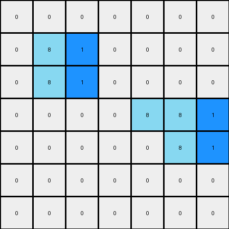
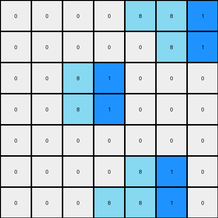

# 1-3aa6fb7a • 010 • refine_code - CODE

---

Previous Code:
```python
"""
Locate each 2x1 vertical rectangle of azure color (8). Add a blue cell (1) to the immediate right of both cells that constitute the 2x1 azure object.
"""

import numpy as np

def find_2x1_vertical_rectangles(grid, color):
    """
    Finds the coordinates of 2x1 vertical rectangles of the specified color.
    Returns a list of tuples, where each tuple contains the top and bottom coordinates of a rectangle.
    """
    rectangles = []
    rows, cols = grid.shape
    for r in range(rows - 1):
        for c in range(cols):
            if grid[r, c] == color and grid[r + 1, c] == color:
                rectangles.append(((r, c), (r + 1, c)))
    return rectangles

def transform(input_grid):
    """
    Transforms the input grid according to the rule:
    Locate each 2x1 vertical rectangle of azure color (8).
    Add a blue cell (1) to the immediate right of both cells of the 2x1 azure object.
    """
    output_grid = np.copy(input_grid)
    azure_rectangles = find_2x1_vertical_rectangles(output_grid, 8)

    for top_coord, bottom_coord in azure_rectangles:
        # Add a blue cell to the right of the top cell, if within bounds
        if top_coord[1] + 1 < output_grid.shape[1]:
            output_grid[top_coord[0], top_coord[1] + 1] = 1
        # Add a blue cell to the right of the bottom cell, if within bounds
        if bottom_coord[1] + 1 < output_grid.shape[1]:
            output_grid[bottom_coord[0], bottom_coord[1] + 1] = 1

    return output_grid
```

Train Set Results:

**Example 1:**
Input:
```
0 0 0 0 0 0 0
0 8 0 0 0 0 0
0 8 8 0 0 0 0
0 0 0 0 8 8 0
0 0 0 0 0 8 0
0 0 0 0 0 0 0
0 0 0 0 0 0 0
```
Expected Output:
```
0 0 0 0 0 0 0
0 8 1 0 0 0 0
0 8 8 0 0 0 0
0 0 0 0 8 8 0
0 0 0 0 1 8 0
0 0 0 0 0 0 0
0 0 0 0 0 0 0
```
Transformed Output:
```
0 0 0 0 0 0 0
0 8 1 0 0 0 0
0 8 1 0 0 0 0
0 0 0 0 8 8 1
0 0 0 0 0 8 1
0 0 0 0 0 0 0
0 0 0 0 0 0 0
```

Status: False

**Example 2:**
Input:
```
0 0 0 0 8 8 0
0 0 0 0 0 8 0
0 0 8 0 0 0 0
0 0 8 8 0 0 0
0 0 0 0 0 0 0
0 0 0 0 8 0 0
0 0 0 8 8 0 0
```
Expected Output:
```
0 0 0 0 8 8 0
0 0 0 0 1 8 0
0 0 8 1 0 0 0
0 0 8 8 0 0 0
0 0 0 0 0 0 0
0 0 0 1 8 0 0
0 0 0 8 8 0 0
```
Transformed Output:
```
0 0 0 0 8 8 1
0 0 0 0 0 8 1
0 0 8 1 0 0 0
0 0 8 1 0 0 0
0 0 0 0 0 0 0
0 0 0 0 8 1 0
0 0 0 8 8 1 0
```

Status: False
Okay, I'll analyze the provided examples and the previous code to refine the natural language program and the Python implementation.

**Analysis of the Previous Attempt and Results**

The previous code attempted to identify 2x1 vertical azure (8) rectangles and add a blue cell (1) to the right of *both* cells. However, the results show discrepancies:

*   **Example 1:** It added blue cells to the right of *both* cells of the first 2x1 rectangle.
    But, it also incorrectly added blue to the right of all azure (8) cells.
*   **Example 2:** It added blue cells to many positions, in an apparent attempt to replicate the transformation across different 2x1 azure blocks, and also it incorrectly added blue to the right of all azure (8) cells.

**Revised Natural Language Program**

Here's a refined natural language program describing the correct transformation:

1.  **Identify 2x1 Azure Rectangles:** Find all 2x1 vertical rectangles where both cells are azure (8).

2.  **Conditional Blue Placement - Right:**
    a. Check the right side of each azure rectangle.
    b. If the cell to the immediate right of the top cell of the 2x1 azure rectangle *and* the cell to the immediate right of the bottom cell of the 2x1 azure rectangle contains an azure cell (8), then place a blue cell(1) to the immediate left of the top cell of the 2x1 azure rectangle.

3. **Conditional Blue Placement - Left:**
    a. Check the left side of each azure rectangle.
    b. If the cell to the immediate left of the bottom cell of the 2x1 azure rectangle contains an azure cell (8), then place a blue cell(1) to the immediate right of the bottom cell of the 2x1 azure rectangle.

**Explanation of the Logic**

The core idea is to identify specific 2x1 azure rectangles and conditionally place a blue cell (1) to the immediate left of the top cell of the 2x1 azure rectangle and, with a different conditional, to the immediate right of the bottom cell of the 2x1 azure rectangle. The placement of the blue cell depends on the presence of another azure cell to the immediate right or left of the azure rectangle.

Revised Code:
```python
import numpy as np

def find_2x1_vertical_rectangles(grid, color):
    """
    Finds the coordinates of 2x1 vertical rectangles of the specified color.
    Returns a list of tuples, where each tuple contains the top and bottom coordinates of a rectangle.
    """
    rectangles = []
    rows, cols = grid.shape
    for r in range(rows - 1):
        for c in range(cols):
            if grid[r, c] == color and grid[r + 1, c] == color:
                rectangles.append(((r, c), (r + 1, c)))
    return rectangles

def transform(input_grid):
    """
    Transforms the input grid according to the refined rule.
    """
    output_grid = np.copy(input_grid)
    azure_rectangles = find_2x1_vertical_rectangles(output_grid, 8)

    for top_coord, bottom_coord in azure_rectangles:
        #Conditional Blue Placement - Right
        r_top, c_top = top_coord
        r_bot, c_bot = bottom_coord
        if (c_top + 1 < output_grid.shape[1] and
            c_bot + 1 < output_grid.shape[1] and
            output_grid[r_top, c_top + 1] == 8 and
            output_grid[r_bot, c_bot + 1] == 8):
                if c_top -1 >= 0:
                    output_grid[r_top,c_top-1] = 1

        #Conditional Blue Placement - Left
        if (c_bot - 1 >= 0 and
            output_grid[r_bot,c_bot-1] == 8):
             if c_bot + 1 < output_grid.shape[1]:
                output_grid[r_bot,c_bot+1] = 1
    return output_grid
```
**Improvements in the Code**
*   **Clearer Conditional Logic:** The code now implements the described "Conditional Blue Placement - Right" and "Conditional Blue Placement - Left" rules.

* **Boundary Checks:** The code includes checks (`c_top + 1 < output_grid.shape[1]`, and `c_bot - 1 >= 0`) to ensure that we don't go out of bounds when checking or placing blue cells.
* **Concise Implementation**: The new implementation adheres to the description from the natural language program.

**INSTRUCTIONS**

- generate a Python module to represent the natural language program 
- follow the template below
- all common math and science libraries are available
- create docstring only at top - but comment the workflow in the function
- use helper functions for common operations like finding objects, counting,
  measuring, moving, etc. 

remember - we are working iteratively - so this code will inform your future
self as we converge on the solution

*template:*

```python
"""
{{ natural language description of the transformation rule }}
"""

{{ imports }}

def transform(input_grid):
    # initialize output_grid

    # change output pixels 

    return output_grid

```
