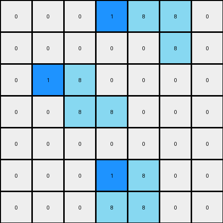

# 1-3aa6fb7a • 008 • refine_code - NLP

---


Previous Code:
```python
"""
The output preserves the azure colored objects and adds a blue pixel adjacent to each azure object, to the left of its top-left corner.
"""

import numpy as np

def find_objects(grid, color):
    objects = []
    visited = set()

    def is_valid(r, c):
        return 0 <= r < grid.shape[0] and 0 <= c < grid.shape[1]

    def dfs(r, c, current_object):
        if (r, c) in visited or not is_valid(r, c) or grid[r, c] != color:
            return
        visited.add((r, c))
        current_object.append((r, c))
        dfs(r + 1, c, current_object)
        dfs(r - 1, c, current_object)
        dfs(r, c + 1, current_object)
        dfs(r, c - 1, current_object)

    for r in range(grid.shape[0]):
        for c in range(grid.shape[1]):
            if grid[r, c] == color and (r, c) not in visited:
                current_object = []
                dfs(r, c, current_object)
                objects.append(current_object)
    return objects

def transform(input_grid):
    # initialize output_grid
    output_grid = np.copy(input_grid)
    
    # find azure objects
    azure_objects = find_objects(input_grid, 8)

    # add blue pixels
    for obj in azure_objects:
        # sort object coordinates to find top-left
        sorted_obj = sorted(obj, key=lambda x: (x[0], x[1]))
        top_left = sorted_obj[0]

        #Add to the left of top left corner
        if top_left[1] - 1 >= 0:
            output_grid[top_left[0], top_left[1] - 1] = 1

    return output_grid
```

Train Set Results:

**Example 1:**
Input:
```
0 0 0 0 0 0 0
0 8 0 0 0 0 0
0 8 8 0 0 0 0
0 0 0 0 8 8 0
0 0 0 0 0 8 0
0 0 0 0 0 0 0
0 0 0 0 0 0 0
```
Expected Output:
```
0 0 0 0 0 0 0
0 8 1 0 0 0 0
0 8 8 0 0 0 0
0 0 0 0 8 8 0
0 0 0 0 1 8 0
0 0 0 0 0 0 0
0 0 0 0 0 0 0
```
Transformed Output:
```
0 0 0 0 0 0 0
1 8 0 0 0 0 0
0 8 8 0 0 0 0
0 0 0 1 8 8 0
0 0 0 0 0 8 0
0 0 0 0 0 0 0
0 0 0 0 0 0 0
```

Status: False

**Example 2:**
Input:
```
0 0 0 0 8 8 0
0 0 0 0 0 8 0
0 0 8 0 0 0 0
0 0 8 8 0 0 0
0 0 0 0 0 0 0
0 0 0 0 8 0 0
0 0 0 8 8 0 0
```
Expected Output:
```
0 0 0 0 8 8 0
0 0 0 0 1 8 0
0 0 8 1 0 0 0
0 0 8 8 0 0 0
0 0 0 0 0 0 0
0 0 0 1 8 0 0
0 0 0 8 8 0 0
```
Transformed Output:
```
0 0 0 1 8 8 0
0 0 0 0 0 8 0
0 1 8 0 0 0 0
0 0 8 8 0 0 0
0 0 0 0 0 0 0
0 0 0 1 8 0 0
0 0 0 8 8 0 0
```

Status: False

**Instructions**

- Describe in natural language the step-by-step transformation observed between the input and output grids.
- Focus on identifying objects, their properties (predicates), and the actions performed on them.
- Be as clear and concise as possible, providing a complete description of the transformation rule.
