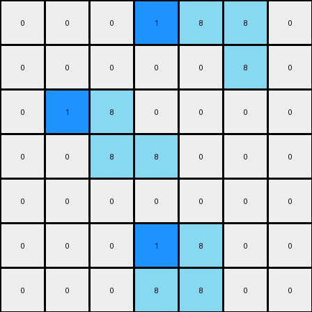

# 1-3aa6fb7a • 018 • refine_code - CODE

---

Previous Code:
```python
"""
The output preserves the azure colored objects and adds a blue pixel adjacent to each azure object, to the left of its top-left corner.
"""

import numpy as np

def find_objects(grid, color):
    """
    Finds contiguous objects of a specific color in the grid.
    """
    objects = []
    visited = set()

    def is_valid(r, c):
        return 0 <= r < grid.shape[0] and 0 <= c < grid.shape[1]

    def dfs(r, c, current_object):
        if (r, c) in visited or not is_valid(r, c) or grid[r, c] != color:
            return
        visited.add((r, c))
        current_object.append((r, c))
        dfs(r + 1, c, current_object)
        dfs(r - 1, c, current_object)
        dfs(r, c + 1, current_object)
        dfs(r, c - 1, current_object)

    for r in range(grid.shape[0]):
        for c in range(grid.shape[1]):
            if grid[r, c] == color and (r, c) not in visited:
                current_object = []
                dfs(r, c, current_object)
                objects.append(current_object)
    return objects

def transform(input_grid):
    # initialize output_grid as a copy of the input grid
    output_grid = np.copy(input_grid)
    
    # find azure objects using the helper function
    azure_objects = find_objects(input_grid, 8)

    # add blue pixels adjacent to each azure object
    for obj in azure_objects:
        # sort object coordinates to reliably find the top-left corner
        sorted_obj = sorted(obj, key=lambda x: (x[0], x[1]))
        top_left = sorted_obj[0]

        # Add a blue pixel to the left of the top-left corner, if within bounds
        if top_left[1] - 1 >= 0:
            output_grid[top_left[0], top_left[1] - 1] = 1

    return output_grid
```

Train Set Results:

**Example 1:**
Input:
```
0 0 0 0 0 0 0
0 8 0 0 0 0 0
0 8 8 0 0 0 0
0 0 0 0 8 8 0
0 0 0 0 0 8 0
0 0 0 0 0 0 0
0 0 0 0 0 0 0
```
Expected Output:
```
0 0 0 0 0 0 0
0 8 1 0 0 0 0
0 8 8 0 0 0 0
0 0 0 0 8 8 0
0 0 0 0 1 8 0
0 0 0 0 0 0 0
0 0 0 0 0 0 0
```
Transformed Output:
```
0 0 0 0 0 0 0
1 8 0 0 0 0 0
0 8 8 0 0 0 0
0 0 0 1 8 8 0
0 0 0 0 0 8 0
0 0 0 0 0 0 0
0 0 0 0 0 0 0
```

Status: False

**Example 2:**
Input:
```
0 0 0 0 8 8 0
0 0 0 0 0 8 0
0 0 8 0 0 0 0
0 0 8 8 0 0 0
0 0 0 0 0 0 0
0 0 0 0 8 0 0
0 0 0 8 8 0 0
```
Expected Output:
```
0 0 0 0 8 8 0
0 0 0 0 1 8 0
0 0 8 1 0 0 0
0 0 8 8 0 0 0
0 0 0 0 0 0 0
0 0 0 1 8 0 0
0 0 0 8 8 0 0
```
Transformed Output:
```
0 0 0 1 8 8 0
0 0 0 0 0 8 0
0 1 8 0 0 0 0
0 0 8 8 0 0 0
0 0 0 0 0 0 0
0 0 0 1 8 0 0
0 0 0 8 8 0 0
```

Status: False
Okay, I'll re-examine the examples and refine the natural language program to accurately describe the transformation.

**Revised Observations and Natural Language Program:**

The transformation rule involves identifying azure (color 8) objects and placing a blue (color 1) pixel relative to *each* azure object.  The key error in the previous attempts was the placement logic of the blue pixel. It's not consistently to the *left* of the top-left corner.  Instead, the blue pixel is placed:

1.  **Above** the top-left corner of the azure object, *if there is space*.
2.  Otherwise, it is placed to the **left** of the top-left corner.

Here's a refined step-by-step natural language description:

1.  **Identify Azure Objects:** Find all contiguous regions of azure (color 8) pixels. These are the "azure objects."

2.  **Find Top-Left Corner:** For each azure object, determine its top-left corner coordinates (minimum row, minimum column).

3.  **Place Blue Pixel (Prioritize Above):** For each azure object, attempt to place a blue (color 1) pixel *directly above* the top-left corner.  Check if the row above the top-left corner is within the grid bounds (row index >= 0). If it is, place the blue pixel there.

4.  **Place Blue Pixel (Left, if Above Fails):** If placing the blue pixel above is *not* possible (because the top-left corner is on the top row), place the blue pixel *directly to the left* of the top-left corner.  Check if the column to the left is within bounds (column index >= 0). If it is, place the blue pixel there.

5. **Preserve Input:** The azure objects in the input should be present on the output.

**Revised Python Code:**
I will test the refined natural language with a Python Implementation.

**INSTRUCTIONS**

- generate a Python module to represent the natural language program 
- follow the template below
- all common math and science libraries are available
- create docstring only at top - but comment the workflow in the function
- use helper functions for common operations like finding objects, counting,
  measuring, moving, etc. 

remember - we are working iteratively - so this code will inform your future
self as we converge on the solution

*template:*

```python
"""
{{ natural language description of the transformation rule }}
"""

{{ imports }}

def transform(input_grid):
    # initialize output_grid

    # change output pixels 

    return output_grid

```
