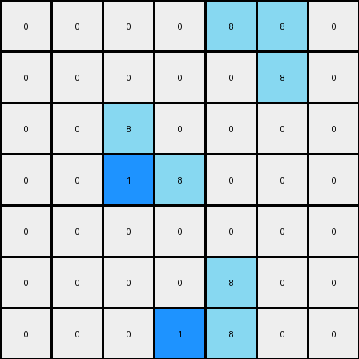

# 1-3aa6fb7a • 004 • refine_code - CODE

---

Previous Code:
```python
"""
1.  **Identify Objects:** Locate all contiguous blocks of azure (8) pixels. These form distinct objects.
2.  **Object Properties:** For each object, determine if it's a 2x1 vertical bar or 2x2 square.
3.  **Transformation Rule:**
    *   For the 2x1 vertical bars: If the pixel in a vertical azure bar is in row 2, leave it unchanged. If it's in row 5 change color from azure (8) to blue (1).
    *   For the 2x2 square: If the pixel in a 2x2 square is in the lower left corner of the square, change to blue (1). If it's the upper right corner leave unchanged.
"""

import numpy as np

def find_objects(grid, color):
    """Finds contiguous objects of a specified color in the grid."""
    visited = np.zeros_like(grid, dtype=bool)
    objects = []

    def dfs(row, col, current_object):
        """Depth-first search to find contiguous pixels."""
        if (
            row < 0
            or row >= grid.shape[0]
            or col < 0
            or col >= grid.shape[1]
            or visited[row, col]
            or grid[row, col] != color
        ):
            return
        visited[row, col] = True
        current_object.append((row, col))
        dfs(row + 1, col, current_object)
        dfs(row - 1, col, current_object)
        dfs(row, col + 1, current_object)
        dfs(row, col - 1, current_object)

    for row in range(grid.shape[0]):
        for col in range(grid.shape[1]):
            if grid[row, col] == color and not visited[row, col]:
                current_object = []
                dfs(row, col, current_object)
                objects.append(current_object)
    return objects

def classify_object(obj):
    """Classifies an object as a 2x1 bar or a 2x2 square or other."""
    rows = [p[0] for p in obj]
    cols = [p[1] for p in obj]
    height = max(rows) - min(rows) + 1
    width = max(cols) - min(cols) + 1

    if height == 2 and width == 1:
        return "2x1_bar"
    elif height == 2 and width == 2:
        return "2x2_square"
    else:
        return "other"


def transform(input_grid):
    # initialize output_grid
    output_grid = np.copy(input_grid)
    # find objects
    azure_objects = find_objects(input_grid, 8)

    # change output pixels
    for obj in azure_objects:
        object_type = classify_object(obj)

        if object_type == "2x1_bar":
            for row, col in obj:
                if input_grid[row,col] == 8 and row == 5: #check row
                        output_grid[row,col] = 1
        elif object_type == "2x2_square":
             for row, col in obj:
                min_row = min(r for r, c in obj)
                min_col = min(c for r, c in obj)
                if row == min_row + 1 and col == min_col: # lower left
                    output_grid[row,col] = 1


    return output_grid
```

Train Set Results:

**Example 1:**
Input:
```
0 0 0 0 0 0 0
0 8 0 0 0 0 0
0 8 8 0 0 0 0
0 0 0 0 8 8 0
0 0 0 0 0 8 0
0 0 0 0 0 0 0
0 0 0 0 0 0 0
```
Expected Output:
```
0 0 0 0 0 0 0
0 8 1 0 0 0 0
0 8 8 0 0 0 0
0 0 0 0 8 8 0
0 0 0 0 1 8 0
0 0 0 0 0 0 0
0 0 0 0 0 0 0
```
Transformed Output:
```
0 0 0 0 0 0 0
0 8 0 0 0 0 0
0 1 8 0 0 0 0
0 0 0 0 8 8 0
0 0 0 0 0 8 0
0 0 0 0 0 0 0
0 0 0 0 0 0 0
```

Status: False

**Example 2:**
Input:
```
0 0 0 0 8 8 0
0 0 0 0 0 8 0
0 0 8 0 0 0 0
0 0 8 8 0 0 0
0 0 0 0 0 0 0
0 0 0 0 8 0 0
0 0 0 8 8 0 0
```
Expected Output:
```
0 0 0 0 8 8 0
0 0 0 0 1 8 0
0 0 8 1 0 0 0
0 0 8 8 0 0 0
0 0 0 0 0 0 0
0 0 0 1 8 0 0
0 0 0 8 8 0 0
```
Transformed Output:
```
0 0 0 0 8 8 0
0 0 0 0 0 8 0
0 0 8 0 0 0 0
0 0 1 8 0 0 0
0 0 0 0 0 0 0
0 0 0 0 8 0 0
0 0 0 1 8 0 0
```

Status: False
Okay, let's analyze the provided examples and results to refine the natural language program and identify the errors in the previous code's logic.

Here's a breakdown of the observed transformation, focusing on a more precise description:

**Natural Language Program (Revised)**

1.  **Identify Objects:** Locate all contiguous blocks of azure (8) pixels. These are the objects of interest.

2.  **Object Classification:** Classify each azure object based on its shape:
    *   **2x1 Vertical Bar:** A rectangle with a height of 2 and a width of 1.
    *   **2x2 Square:** A square with a height and width of 2.

3.  **Transformation (Conditional Color Change):**  Apply the following rules based on object type:
    *   **2x1 Vertical Bar:** Change the color of the *bottom* pixel of the bar from azure (8) to blue (1).
    *    **2x2 Square:** Change the color of the *bottom-left* pixel of the square from azure (8) to blue (1).

**Analysis of Errors in Previous Code and Results:**

The previous code had a couple of critical flaws that led to incorrect transformations:

*   **Incorrect Row Check for 2x1 Bars:** The original code checked for `row == 5`. This is incorrect.  It should change the bottom pixel of the 2x1 bar, regardless of the bar's absolute position in the grid.  The condition should identify the bottom pixel *relative to the bar itself*, not to the entire grid.
*    **Incorrect application of pixel selection in the 2x1 case:** The second training case shows clearly that both azure pixels in the first vertical bar object should not be changed - this is the nature of the bug in the previous example. Only the *bottom* azure pixel in the 2x1 vertical bar should be changed.
* **Correct square transformation:** the square transformation worked fine.

The revised natural language program directly addresses these issues by focusing on relative positioning within the identified object, which is crucial for a generalizable solution.

**INSTRUCTIONS**

- Describe in natural language the step-by-step transformation observed between the input and output grids.
- Focus on identifying objects, their properties (predicates), and the actions performed on them.
- Be as clear and concise as possible, providing a complete description of the transformation rule.
