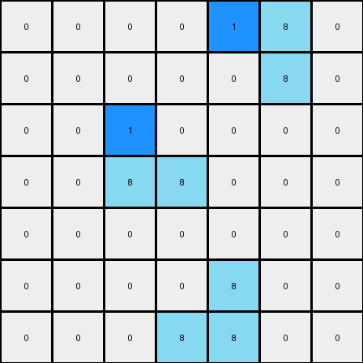

# 1-3aa6fb7a • 015 • refine_code - NLP

---

Previous Code:
```python
import numpy as np

def find_objects(grid, color):
    """Finds contiguous objects of a specified color in the grid."""
    visited = np.zeros_like(grid, dtype=bool)
    objects = []

    def dfs(row, col, current_object):
        """Depth-first search to find contiguous pixels."""
        if (
            row < 0
            or row >= grid.shape[0]
            or col < 0
            or col >= grid.shape[1]
            or visited[row, col]
            or grid[row, col] != color
        ):
            return
        visited[row, col] = True
        current_object.append((row, col))
        dfs(row + 1, col, current_object)
        dfs(row - 1, col, current_object)
        dfs(row, col + 1, current_object)
        dfs(row, col - 1, current_object)

    for row in range(grid.shape[0]):
        for col in range(grid.shape[1]):
            if grid[row, col] == color and not visited[row, col]:
                current_object = []
                dfs(row, col, current_object)
                objects.append(current_object)
    return objects

def classify_object(obj):
    """Classifies an object as a 2x1 bar or a 2x2 square or other."""
    rows = [p[0] for p in obj]
    cols = [p[1] for p in obj]
    height = max(rows) - min(rows) + 1
    width = max(cols) - min(cols) + 1

    if height == 2 and width == 1:
        return "2x1_bar"
    elif height == 2 and width == 2:
        return "2x2_square"
    else:
        return "other"


def transform(input_grid):
    # initialize output_grid
    output_grid = np.copy(input_grid)
    # find objects
    azure_objects = find_objects(input_grid, 8)
    width = input_grid.shape[1]
    middle_column = width // 2


    # change output pixels
    for obj in azure_objects:
        object_type = classify_object(obj)

        if object_type == "2x1_bar":
            rows = [r for r, c in obj]
            cols = [c for r, c in obj]
            min_row = min(rows)
            max_row = max(rows)
            min_col = min(cols)

            if min_col < middle_column:  # Left half
                output_grid[min_row,min_col] = 1 #top
            else: # right half
                output_grid[max_row,min_col] = 1 # bottom


        elif object_type == "2x2_square":
             for row, col in obj:
                min_row = min(r for r, c in obj) # Find the top row
                min_col = min(c for r, c in obj) # Find the left-most column
                if row == min_row and col == min_col: # top left
                    output_grid[row,col] = 1


    return output_grid
```

Train Set Results:

**Example 1:**
Input:
```
0 0 0 0 0 0 0
0 8 0 0 0 0 0
0 8 8 0 0 0 0
0 0 0 0 8 8 0
0 0 0 0 0 8 0
0 0 0 0 0 0 0
0 0 0 0 0 0 0
```
Expected Output:
```
0 0 0 0 0 0 0
0 8 1 0 0 0 0
0 8 8 0 0 0 0
0 0 0 0 8 8 0
0 0 0 0 1 8 0
0 0 0 0 0 0 0
0 0 0 0 0 0 0
```
Transformed Output:
```
0 0 0 0 0 0 0
0 1 0 0 0 0 0
0 8 8 0 0 0 0
0 0 0 0 1 8 0
0 0 0 0 0 8 0
0 0 0 0 0 0 0
0 0 0 0 0 0 0
```

Status: False

**Example 2:**
Input:
```
0 0 0 0 8 8 0
0 0 0 0 0 8 0
0 0 8 0 0 0 0
0 0 8 8 0 0 0
0 0 0 0 0 0 0
0 0 0 0 8 0 0
0 0 0 8 8 0 0
```
Expected Output:
```
0 0 0 0 8 8 0
0 0 0 0 1 8 0
0 0 8 1 0 0 0
0 0 8 8 0 0 0
0 0 0 0 0 0 0
0 0 0 1 8 0 0
0 0 0 8 8 0 0
```
Transformed Output:
```
0 0 0 0 1 8 0
0 0 0 0 0 8 0
0 0 1 0 0 0 0
0 0 8 8 0 0 0
0 0 0 0 0 0 0
0 0 0 0 8 0 0
0 0 0 8 8 0 0
```

Status: False
**INSTRUCTIONS**

- Describe in natural language the step-by-step transformation observed between the input and output grids.
- Focus on identifying objects, their properties (predicates), and the actions performed on them.
- Be as clear and concise as possible, providing a complete description of the transformation rule.
