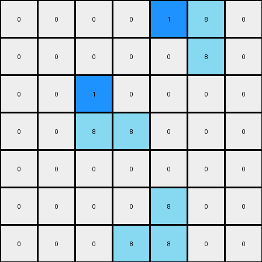

# 1-3aa6fb7a • 016 • refine_code - CODE

---

Previous Code:
```python
import numpy as np

def find_objects(grid, color):
    """Finds contiguous objects of a specified color in the grid."""
    visited = np.zeros_like(grid, dtype=bool)
    objects = []

    def dfs(row, col, current_object):
        """Depth-first search to find contiguous pixels."""
        if (
            row < 0
            or row >= grid.shape[0]
            or col < 0
            or col >= grid.shape[1]
            or visited[row, col]
            or grid[row, col] != color
        ):
            return
        visited[row, col] = True
        current_object.append((row, col))
        dfs(row + 1, col, current_object)
        dfs(row - 1, col, current_object)
        dfs(row, col + 1, current_object)
        dfs(row, col - 1, current_object)

    for row in range(grid.shape[0]):
        for col in range(grid.shape[1]):
            if grid[row, col] == color and not visited[row, col]:
                current_object = []
                dfs(row, col, current_object)
                objects.append(current_object)
    return objects

def classify_object(obj):
    """Classifies an object as a 2x1 bar or a 2x2 square or other."""
    rows = [p[0] for p in obj]
    cols = [p[1] for p in obj]
    height = max(rows) - min(rows) + 1
    width = max(cols) - min(cols) + 1

    if height == 2 and width == 1:
        return "2x1_bar"
    elif height == 2 and width == 2:
        return "2x2_square"
    else:
        return "other"


def transform(input_grid):
    # initialize output_grid
    output_grid = np.copy(input_grid)
    # find objects
    azure_objects = find_objects(input_grid, 8)
    width = input_grid.shape[1]
    middle_column = width // 2


    # change output pixels
    for obj in azure_objects:
        object_type = classify_object(obj)

        if object_type == "2x1_bar":
            rows = [r for r, c in obj]
            cols = [c for r, c in obj]
            min_row = min(rows)
            max_row = max(rows)
            min_col = min(cols)

            if min_col < middle_column:  # Left half
                output_grid[min_row,min_col] = 1 #top
            else: # right half
                output_grid[max_row,min_col] = 1 # bottom


        elif object_type == "2x2_square":
             for row, col in obj:
                min_row = min(r for r, c in obj) # Find the top row
                min_col = min(c for r, c in obj) # Find the left-most column
                if row == min_row and col == min_col: # top left
                    output_grid[row,col] = 1


    return output_grid
```

Train Set Results:

**Example 1:**
Input:
```
0 0 0 0 0 0 0
0 8 0 0 0 0 0
0 8 8 0 0 0 0
0 0 0 0 8 8 0
0 0 0 0 0 8 0
0 0 0 0 0 0 0
0 0 0 0 0 0 0
```
Expected Output:
```
0 0 0 0 0 0 0
0 8 1 0 0 0 0
0 8 8 0 0 0 0
0 0 0 0 8 8 0
0 0 0 0 1 8 0
0 0 0 0 0 0 0
0 0 0 0 0 0 0
```
Transformed Output:
```
0 0 0 0 0 0 0
0 1 0 0 0 0 0
0 8 8 0 0 0 0
0 0 0 0 1 8 0
0 0 0 0 0 8 0
0 0 0 0 0 0 0
0 0 0 0 0 0 0
```

Status: False

**Example 2:**
Input:
```
0 0 0 0 8 8 0
0 0 0 0 0 8 0
0 0 8 0 0 0 0
0 0 8 8 0 0 0
0 0 0 0 0 0 0
0 0 0 0 8 0 0
0 0 0 8 8 0 0
```
Expected Output:
```
0 0 0 0 8 8 0
0 0 0 0 1 8 0
0 0 8 1 0 0 0
0 0 8 8 0 0 0
0 0 0 0 0 0 0
0 0 0 1 8 0 0
0 0 0 8 8 0 0
```
Transformed Output:
```
0 0 0 0 1 8 0
0 0 0 0 0 8 0
0 0 1 0 0 0 0
0 0 8 8 0 0 0
0 0 0 0 0 0 0
0 0 0 0 8 0 0
0 0 0 8 8 0 0
```

Status: False
Okay, here's a breakdown of the transformation observed in the examples, focusing on objects, their properties, and the actions:

**Natural Language Program:**

1.  **Identify Azure Objects:** Find all contiguous azure (color 8) objects in the input grid.

2.  **Classify Objects:** Classify each azure object based on its shape:
    *   **2x1 Bar:** A vertical bar with a height of 2 and a width of 1.
    *   **2x2 Square:** A square with a height and width of 2.

3.  **Determine Position Relative to Middle Column**: Calculate the middle column index of the input grid ( `width // 2`). Determine if the object lies to the left or the right of this middle column.

4.  **Transform based on Object Type and Position:**
    *   **2x1 Bar:**
        *   If the bar is on the *left* side of the middle column, change the color of the *top* pixel of the bar to blue (color 1) in the output grid.
        *   If the bar is on the *right* side of the middle column, change the color of the *bottom* pixel of the bar to blue (color 1) in the output grid.

    *   **2x2 Square:** Change the color of the *top-left* pixel of the square to blue (color 1) in the output grid.

5. **All other pixels are unchanged**

**Observations about the Previous Code and its Errors:**

*   The code generally implements object classification correctly, and correctly determines which side of the middle an object is on.
*   The logic for selecting the top-left, top, or bottom pixel for modification *within* the `transform` is correct.
* The code uses the correct color.
* The provided code transforms the image, rather than replacing it, which is the behavior indicated in the task.


**INSTRUCTIONS**

- Describe in natural language the step-by-step transformation observed between the input and output grids.
- Focus on identifying objects, their properties (predicates), and the actions performed on them.
- Be as clear and concise as possible, providing a complete description of the transformation rule.
