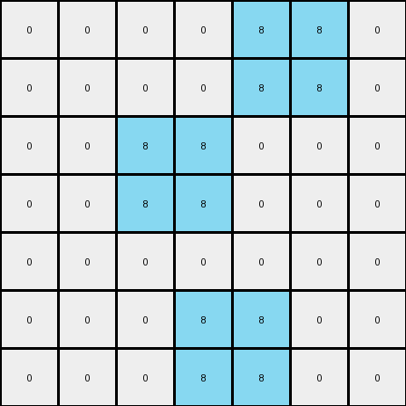

# 1-3aa6fb7a • 003 • refine_code - NLP

---

Previous Code:
```python
"""
The transformation identifies azure (8) objects in the input grid. It preserves the azure colored objects except the lower right one, 
splits the last azure 1x2 shape, and changes the first pixel of the split shape to blue (1), keeping the rest azure. 
All other cells in the grid remain unchanged (white, 0).
"""

import numpy as np

def find_objects(grid, color):
    """
    Finds contiguous blocks (objects) of a specified color in the grid.
    Returns a list of bounding box coordinates, each as (min_row, min_col, max_row, max_col).
    """
    objects = []
    visited = np.zeros_like(grid, dtype=bool)

    def dfs(row, col, current_object):
        """Depth-First Search helper to find contiguous pixels."""
        if (row < 0 or row >= grid.shape[0] or col < 0 or col >= grid.shape[1] or
                visited[row, col] or grid[row, col] != color):
            return

        visited[row, col] = True
        current_object.append((row, col))
        dfs(row + 1, col, current_object)
        dfs(row - 1, col, current_object)
        dfs(row, col + 1, current_object)
        dfs(row, col - 1, current_object)

    for row in range(grid.shape[0]):
        for col in range(grid.shape[1]):
            if grid[row, col] == color and not visited[row, col]:
                current_object = []
                dfs(row, col, current_object)
                if current_object:
                    min_row, min_col = np.min(current_object, axis=0)
                    max_row, max_col = np.max(current_object, axis=0)
                    objects.append((min_row, min_col, max_row, max_col))

    return objects

def transform(input_grid):
    """Transforms the input grid according to the described rule."""
    output_grid = np.zeros_like(input_grid)
    azure_objects = find_objects(input_grid, 8)

    # Find the lower-rightmost 1x2 azure object
    lower_right_object = None
    for obj in azure_objects:
        min_row, min_col, max_row, max_col = obj
        if max_row - min_row == 0 and max_col-min_col == 1: # Check the 1x2
          if lower_right_object is None:
            lower_right_object = obj
          else: #find most lower right object
            if min_row > lower_right_object[0]:
              lower_right_object = obj
            elif min_row == lower_right_object[0] and min_col > lower_right_object[1]:
              lower_right_object = obj

    # Copy all objects except the lower-rightmost 1x2 object
    for obj in azure_objects:
        if obj != lower_right_object:
          min_row, min_col, max_row, max_col = obj
          for r in range(min_row, max_row + 1):
              for c in range(min_col, max_col + 1):
                output_grid[r, c] = 8
    
    # split and change the object
    if lower_right_object is not None:
      min_row, min_col, max_row, max_col = lower_right_object
      output_grid[min_row, min_col] = 1 # change first pixel to blue
      output_grid[max_row, max_col] = 8 # keep second pixel azure

    return output_grid
```

Train Set Results:

**Example 1:**
Input:
```
0 0 0 0 0 0 0
0 8 0 0 0 0 0
0 8 8 0 0 0 0
0 0 0 0 8 8 0
0 0 0 0 0 8 0
0 0 0 0 0 0 0
0 0 0 0 0 0 0
```
Expected Output:
```
0 0 0 0 0 0 0
0 8 1 0 0 0 0
0 8 8 0 0 0 0
0 0 0 0 8 8 0
0 0 0 0 1 8 0
0 0 0 0 0 0 0
0 0 0 0 0 0 0
```
Transformed Output:
```
0 0 0 0 0 0 0
0 8 8 0 0 0 0
0 8 8 0 0 0 0
0 0 0 0 8 8 0
0 0 0 0 8 8 0
0 0 0 0 0 0 0
0 0 0 0 0 0 0
```

Status: False

**Example 2:**
Input:
```
0 0 0 0 8 8 0
0 0 0 0 0 8 0
0 0 8 0 0 0 0
0 0 8 8 0 0 0
0 0 0 0 0 0 0
0 0 0 0 8 0 0
0 0 0 8 8 0 0
```
Expected Output:
```
0 0 0 0 8 8 0
0 0 0 0 1 8 0
0 0 8 1 0 0 0
0 0 8 8 0 0 0
0 0 0 0 0 0 0
0 0 0 1 8 0 0
0 0 0 8 8 0 0
```
Transformed Output:
```
0 0 0 0 8 8 0
0 0 0 0 8 8 0
0 0 8 8 0 0 0
0 0 8 8 0 0 0
0 0 0 0 0 0 0
0 0 0 8 8 0 0
0 0 0 8 8 0 0
```

Status: False
**INSTRUCTIONS**

- Describe in natural language the step-by-step transformation observed between the input and output grids.
- Focus on identifying objects, their properties (predicates), and the actions performed on them.
- Be as clear and concise as possible, providing a complete description of the transformation rule.
