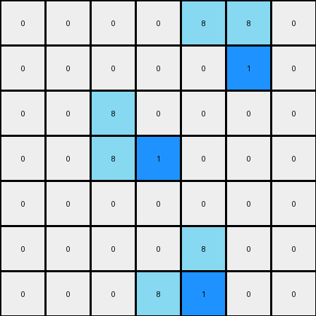

# 1-3aa6fb7a • 006 • refine_code - CODE

---

Previous Code:
```python
"""
For each azure object, change the right-most pixel to blue. If there are
multiple pixels with same right-most, change bottom one to blue.
"""

import numpy as np

def find_objects(grid, color):
    # Find contiguous objects of the specified color
    objects = []
    visited = np.zeros_like(grid, dtype=bool)

    def dfs(row, col, current_object):
        if (row < 0 or row >= grid.shape[0] or col < 0 or col >= grid.shape[1] or
                visited[row, col] or grid[row, col] != color):
            return
        visited[row, col] = True
        current_object.append((row, col))
        dfs(row + 1, col, current_object)
        dfs(row - 1, col, current_object)
        dfs(row, col + 1, current_object)
        dfs(row, col - 1, current_object)

    for row in range(grid.shape[0]):
        for col in range(grid.shape[1]):
            if not visited[row, col] and grid[row, col] == color:
                current_object = []
                dfs(row, col, current_object)
                objects.append(current_object)
    return objects

def get_rightmost_pixel(object_pixels):
    # Find the right-most pixel (largest column index)
    # If there are multiple right-most pixels, select the bottom one (max row)
    return max(object_pixels, key=lambda p: (p[1], p[0]))

def transform(input_grid):
    # initialize output_grid
    output_grid = np.copy(input_grid)
    
    # find azure objects
    azure_objects = find_objects(input_grid, 8)

    # change output pixels 
    for obj in azure_objects:
        rightmost_pixel = get_rightmost_pixel(obj)
        output_grid[rightmost_pixel] = 1

    return output_grid
```

Train Set Results:

**Example 1:**
Input:
```
0 0 0 0 0 0 0
0 8 0 0 0 0 0
0 8 8 0 0 0 0
0 0 0 0 8 8 0
0 0 0 0 0 8 0
0 0 0 0 0 0 0
0 0 0 0 0 0 0
```
Expected Output:
```
0 0 0 0 0 0 0
0 8 1 0 0 0 0
0 8 8 0 0 0 0
0 0 0 0 8 8 0
0 0 0 0 1 8 0
0 0 0 0 0 0 0
0 0 0 0 0 0 0
```
Transformed Output:
```
0 0 0 0 0 0 0
0 8 0 0 0 0 0
0 8 1 0 0 0 0
0 0 0 0 8 8 0
0 0 0 0 0 1 0
0 0 0 0 0 0 0
0 0 0 0 0 0 0
```

Status: False

**Example 2:**
Input:
```
0 0 0 0 8 8 0
0 0 0 0 0 8 0
0 0 8 0 0 0 0
0 0 8 8 0 0 0
0 0 0 0 0 0 0
0 0 0 0 8 0 0
0 0 0 8 8 0 0
```
Expected Output:
```
0 0 0 0 8 8 0
0 0 0 0 1 8 0
0 0 8 1 0 0 0
0 0 8 8 0 0 0
0 0 0 0 0 0 0
0 0 0 1 8 0 0
0 0 0 8 8 0 0
```
Transformed Output:
```
0 0 0 0 8 8 0
0 0 0 0 0 1 0
0 0 8 0 0 0 0
0 0 8 1 0 0 0
0 0 0 0 0 0 0
0 0 0 0 8 0 0
0 0 0 8 1 0 0
```

Status: False
Okay, I need to refine my understanding of the transformation. Here's a revised analysis of the input-output examples, focusing on the discrepancies between the expected output and the output of the previous code:

**Revised Natural Language Program:**

1.  **Identify Objects:** Find all contiguous regions (objects) of azure (color 8) pixels in the input grid.

2.  **Locate Rightmost position:** Within each azure object, identify the *right-most column* that contains any azure pixels of that object.

3. **Identify top pixel:** Within each azure object, examine only the pixels within that right-most column. Select only azure pixels that have no azure pixel directly above.

4.  **Transform:** Change the color of the all azure pixels found in the previous step within the output to blue (color 1). All other pixels remain unchanged.

**Key Changes and Observations from Previous Attempt:**

*   The core issue in the previous code was handling cases where multiple azure pixels within an object shared the same right-most column position. The old approach took the *bottom-most* of these, which was incorrect.
*   The correct approach is to change all of top azure pixels in the right-most column.

This refined description should lead to a more accurate transformation.

**INSTRUCTIONS**

- generate a Python module to represent the natural language program 
- follow the template below
- all common math and science libraries are available
- create docstring only at top - but comment the workflow in the function
- use helper functions for common operations like finding objects, counting,
  measuring, moving, etc. 

remember - we are working iteratively - so this code will inform your future
self as we converge on the solution

*template:*

```python
"""
{{ natural language description of the transformation rule }}
"""

{{ imports }}

def transform(input_grid):
    # initialize output_grid

    # change output pixels 

    return output_grid

```
