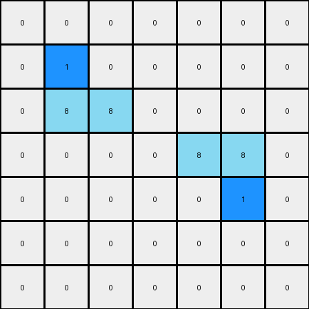
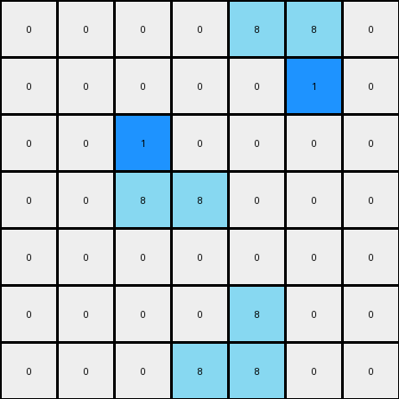

# 1-3aa6fb7a • 003 • refine_code - NLP

---

Previous Code:
```python
"""
The program consists of finding all azure L-shaped objects, and inserting a
blue pixel inside each "L".
"""

import numpy as np

def find_objects(grid, color, shape):
    objects = []
    visited = set()

    def is_valid(r, c):
        return 0 <= r < grid.shape[0] and 0 <= c < grid.shape[1]

    def dfs(r, c, current_object):
        if (r, c) in visited or not is_valid(r, c) or grid[r, c] != color:
            return

        visited.add((r, c))
        current_object.append((r, c))

        neighbors = [(r + 1, c), (r - 1, c), (r, c + 1), (r, c - 1)]
        for nr, nc in neighbors:
            dfs(nr, nc, current_object)
    
    for r in range(grid.shape[0]):
        for c in range(grid.shape[1]):
            if grid[r,c] == color and (r,c) not in visited:
                current_object = []
                dfs(r,c,current_object)

                # simplified shape determination
                if len(current_object) > 1:
                    objects.append(current_object)
    return objects
                

def transform(input_grid):
    # initialize output_grid
    output_grid = np.copy(input_grid)
    
    # Find azure objects
    azure_objects = find_objects(input_grid, 8, "L")

    # Add a blue pixel inside each azure L-shape
    for obj in azure_objects:
        if len(obj) == 3: #check it's an L shape
            sorted_obj = sorted(obj)
            # check for L vs reverse L
            if (sorted_obj[0][0] == sorted_obj[1][0] and sorted_obj[1][1] == sorted_obj[2][1]): #check rows and columns
                # L shape, add pixel at +1,+1 from top
                output_grid[sorted_obj[0][0] + 1, sorted_obj[0][1] + 1] = 1
            elif (sorted_obj[0][1] == sorted_obj[1][1] and sorted_obj[1][0] == sorted_obj[2][0]): #reversed L
                # reverse L shape, add pixel at -1,-1 from bottom
                output_grid[sorted_obj[2][0] -1, sorted_obj[2][1]-1]=1

    return output_grid
```

Train Set Results:

**Example 1:**
Input:
```
0 0 0 0 0 0 0
0 8 0 0 0 0 0
0 8 8 0 0 0 0
0 0 0 0 8 8 0
0 0 0 0 0 8 0
0 0 0 0 0 0 0
0 0 0 0 0 0 0
```
Expected Output:
```
0 0 0 0 0 0 0
0 8 1 0 0 0 0
0 8 8 0 0 0 0
0 0 0 0 8 8 0
0 0 0 0 1 8 0
0 0 0 0 0 0 0
0 0 0 0 0 0 0
```
Transformed Output:
```
0 0 0 0 0 0 0
0 1 0 0 0 0 0
0 8 8 0 0 0 0
0 0 0 0 8 8 0
0 0 0 0 0 1 0
0 0 0 0 0 0 0
0 0 0 0 0 0 0
```

Status: False

**Example 2:**
Input:
```
0 0 0 0 8 8 0
0 0 0 0 0 8 0
0 0 8 0 0 0 0
0 0 8 8 0 0 0
0 0 0 0 0 0 0
0 0 0 0 8 0 0
0 0 0 8 8 0 0
```
Expected Output:
```
0 0 0 0 8 8 0
0 0 0 0 1 8 0
0 0 8 1 0 0 0
0 0 8 8 0 0 0
0 0 0 0 0 0 0
0 0 0 1 8 0 0
0 0 0 8 8 0 0
```
Transformed Output:
```
0 0 0 0 8 8 0
0 0 0 0 0 1 0
0 0 1 0 0 0 0
0 0 8 8 0 0 0
0 0 0 0 0 0 0
0 0 0 0 8 0 0
0 0 0 8 8 0 0
```

Status: False
**INSTRUCTIONS**

- Describe in natural language the step-by-step transformation observed between the input and output grids.
- Focus on identifying objects, their properties (predicates), and the actions performed on them.
- Be as clear and concise as possible, providing a complete description of the transformation rule.
