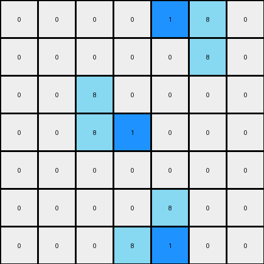

# 1-3aa6fb7a • 003 • refine_code - NLP

---


Previous Code:
```python
"""
The transformation rule involves changing one particular azure pixel of each separate object to blue, the selected pixel is the second from the top on the vertical line segment and in the 'L', the second pixel going from top-right to bottom-left.
"""

import numpy as np

def find_objects(grid):
    """
    Identifies distinct objects in the grid.
    Returns a list of objects, where each object is a list of (row, col) coordinates.
    """
    objects = []
    visited = set()
    rows, cols = grid.shape

    def is_valid(r, c):
        return 0 <= r < rows and 0 <= c < cols

    def dfs(r, c, current_object):
        if (r, c) in visited or not is_valid(r, c) or grid[r, c] == 0:
            return
        visited.add((r, c))
        current_object.append((r, c))
        for dr, dc in [(0, 1), (1, 0), (0, -1), (-1, 0)]:
            dfs(r + dr, c + dc, current_object)

    for r in range(rows):
        for c in range(cols):
            if grid[r, c] != 0 and (r, c) not in visited:
                current_object = []
                dfs(r, c, current_object)
                objects.append(current_object)
    return objects

def transform(input_grid):
    """
    Transforms the input grid according to the rule:
    One azure pixel changes to blue in each object.
    -   For a vertical line, it's the second pixel from the top.
    -   For an L-shape, it's the second pixel from the top-right to bottom-left.
    """
    output_grid = np.copy(input_grid)
    objects = find_objects(input_grid)

    for obj in objects:
        if len(obj) > 1: # Ensure that object contain sufficient number of pixels
            #Sort the object based on different shapes, for example vertical or L shape
            sorted_obj_vertical = sorted(obj, key=lambda x: x[0]) # Sort by row (for vertical line)
            sorted_obj_l_shape = sorted(obj, key=lambda x: (-x[0], x[1])) #Sort by antidiagonal

            #Check for vertical line
            is_vertical = all(sorted_obj_vertical[i][1] == sorted_obj_vertical[0][1] for i in range(1,len(sorted_obj_vertical)))
            if is_vertical and len(sorted_obj_vertical) >=2:
                r, c = sorted_obj_vertical[1]  # Second pixel from the top
                output_grid[r, c] = 1
            #Check for L Shape
            elif len(sorted_obj_l_shape) >= 2:
                r, c = sorted_obj_l_shape[1]
                output_grid[r,c] = 1

    return output_grid
```

Train Set Results:

**Example 1:**
Input:
```
0 0 0 0 0 0 0
0 8 0 0 0 0 0
0 8 8 0 0 0 0
0 0 0 0 8 8 0
0 0 0 0 0 8 0
0 0 0 0 0 0 0
0 0 0 0 0 0 0
```
Expected Output:
```
0 0 0 0 0 0 0
0 8 1 0 0 0 0
0 8 8 0 0 0 0
0 0 0 0 8 8 0
0 0 0 0 1 8 0
0 0 0 0 0 0 0
0 0 0 0 0 0 0
```
Transformed Output:
```
0 0 0 0 0 0 0
0 8 0 0 0 0 0
0 8 1 0 0 0 0
0 0 0 0 1 8 0
0 0 0 0 0 8 0
0 0 0 0 0 0 0
0 0 0 0 0 0 0
```

Status: False

**Example 2:**
Input:
```
0 0 0 0 8 8 0
0 0 0 0 0 8 0
0 0 8 0 0 0 0
0 0 8 8 0 0 0
0 0 0 0 0 0 0
0 0 0 0 8 0 0
0 0 0 8 8 0 0
```
Expected Output:
```
0 0 0 0 8 8 0
0 0 0 0 1 8 0
0 0 8 1 0 0 0
0 0 8 8 0 0 0
0 0 0 0 0 0 0
0 0 0 1 8 0 0
0 0 0 8 8 0 0
```
Transformed Output:
```
0 0 0 0 1 8 0
0 0 0 0 0 8 0
0 0 8 0 0 0 0
0 0 8 1 0 0 0
0 0 0 0 0 0 0
0 0 0 0 8 0 0
0 0 0 8 1 0 0
```

Status: False

**INSTRUCTIONS**

- Describe in natural language the step-by-step transformation observed between the input and output grids.
- Focus on identifying objects, their properties (predicates), and the actions performed on them.
- Be as clear and concise as possible, providing a complete description of the transformation rule.
