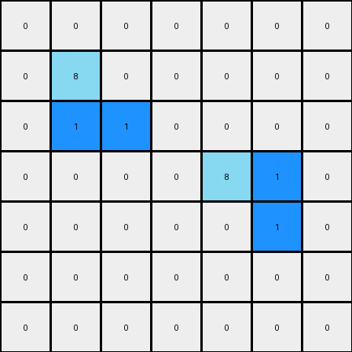
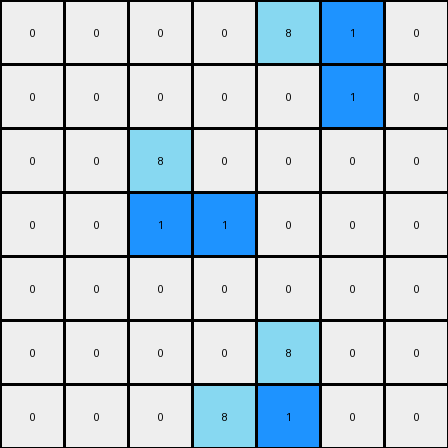

# 1-3aa6fb7a • 006 • refine_code - CODE

---

Previous Code:
```python
"""
The transformation rule involves identifying azure (8) objects and changing the color of one specific azure pixel within each object to blue (1). The selection of the pixel to change depends on the shape of the object:

1.  **Object Identification:** Find all distinct objects (connected components) in the input grid.
2.  **Object Filtering:**  Focus only on objects made of azure (8) pixels.
3.  **Shape Analysis and Pixel Selection:** For each azure object:
    *   **Vertical Line Segment:** If the object forms a vertical line segment (all pixels in the same column), change the *second* azure pixel from the *top* to blue.
    *   **Horizontal Line Segment:** If the object forms a horizontal line segment (all pixels in the same row), change the *second* azure pixel from the *left* to blue.
    *   **'L' shape Segment:** An 'L' shape is considered to have both a vertical and horizontal line component. Apply selection rules as above, prioritizing the vertical segment if present.
    *   **Other Shapes:** If an object can form several possible segments, apply selection rules to each segments.

4.  **Output:** The output grid is a copy of the input grid with the identified pixel color changes.
"""

import numpy as np

def find_objects(grid):
    """
    Identifies distinct objects in the grid.
    Returns a list of objects, where each object is a list of (row, col) coordinates.
    """
    objects = []
    visited = set()
    rows, cols = grid.shape

    def is_valid(r, c):
        return 0 <= r < rows and 0 <= c < cols

    def dfs(r, c, current_object):
        if (r, c) in visited or not is_valid(r, c) or grid[r, c] == 0:
            return
        visited.add((r, c))
        current_object.append((r, c))
        for dr, dc in [(0, 1), (1, 0), (0, -1), (-1, 0)]:
            dfs(r + dr, c + dc, current_object)

    for r in range(rows):
        for c in range(cols):
            if grid[r, c] != 0 and (r, c) not in visited:
                current_object = []
                dfs(r, c, current_object)
                objects.append(current_object)
    return objects

def transform(input_grid):
    """
    Transforms the input grid according to the described rules.
    """
    output_grid = np.copy(input_grid)
    objects = find_objects(input_grid)

    for obj in objects:
        # Filter for azure objects
        if any(input_grid[r, c] != 8 for r, c in obj):
            continue

        if len(obj) > 1:  # Need at least 2 pixels to have a "second" pixel
            # Check for vertical line segments
            cols = [c for r, c in obj]
            if len(set(cols)) == 1:  # All pixels in the same column
                rows = sorted([r for r, c in obj])
                if len(rows) >= 2:
                    output_grid[rows[1], cols[0]] = 1  # Second from top
                continue #move to the next object after processing

            # Check for horizontal line segments
            rows = [r for r, c in obj]
            if len(set(rows)) == 1:  # All pixels in the same row
                cols = sorted([c for r, c in obj])
                if len(cols) >= 2:
                    output_grid[rows[0], cols[1]] = 1  # Second from left
                continue #move to the next object after processing

            # Handle L shape and other segments - prioritizing vertical
            rows = sorted(list(set([r for r,c in obj]))) #unique and sorted row
            for row in rows:
                segment = [(r,c) for r, c in obj if r == row]
                if len(segment) >1:
                    cols = sorted([c for r, c in segment])
                    output_grid[row, cols[1]] = 1

            cols = sorted(list(set([c for r,c in obj])))
            for col in cols:
                segment = [(r,c) for r, c in obj if c == col]
                if len(segment) > 1:
                    rows = sorted([r for r, c in segment])
                    output_grid[rows[1],col] = 1
    return output_grid
```

Train Set Results:

**Example 1:**
Input:
```
0 0 0 0 0 0 0
0 8 0 0 0 0 0
0 8 8 0 0 0 0
0 0 0 0 8 8 0
0 0 0 0 0 8 0
0 0 0 0 0 0 0
0 0 0 0 0 0 0
```
Expected Output:
```
0 0 0 0 0 0 0
0 8 1 0 0 0 0
0 8 8 0 0 0 0
0 0 0 0 8 8 0
0 0 0 0 1 8 0
0 0 0 0 0 0 0
0 0 0 0 0 0 0
```
Transformed Output:
```
0 0 0 0 0 0 0
0 8 0 0 0 0 0
0 1 1 0 0 0 0
0 0 0 0 8 1 0
0 0 0 0 0 1 0
0 0 0 0 0 0 0
0 0 0 0 0 0 0
```

Status: False

**Example 2:**
Input:
```
0 0 0 0 8 8 0
0 0 0 0 0 8 0
0 0 8 0 0 0 0
0 0 8 8 0 0 0
0 0 0 0 0 0 0
0 0 0 0 8 0 0
0 0 0 8 8 0 0
```
Expected Output:
```
0 0 0 0 8 8 0
0 0 0 0 1 8 0
0 0 8 1 0 0 0
0 0 8 8 0 0 0
0 0 0 0 0 0 0
0 0 0 1 8 0 0
0 0 0 8 8 0 0
```
Transformed Output:
```
0 0 0 0 8 1 0
0 0 0 0 0 1 0
0 0 8 0 0 0 0
0 0 1 1 0 0 0
0 0 0 0 0 0 0
0 0 0 0 8 0 0
0 0 0 8 1 0 0
```

Status: False
Okay, here's a breakdown of the observed transformation, focusing on objects, their properties, and the actions:

**Natural Language Program: Dreamer Phase**

1.  **Object Identification and Classification:** The program first identifies all contiguous regions (objects) of azure (color 8) pixels in the input grid.

2.  **Object Segmentation:** Each azure object is further analyzed to identify horizontal and vertical line segments. The crucial insight here is that segments are treated *separately* even within the same object. It is not about the overall object shape (like "L"), but about identifying *all* possible straight line segments *within* each object.

3.  **Segment Transformation - Vertical:** Within *each* identified vertical line segment of azure pixels, the *second* azure pixel from the *top* is changed to blue (color 1).

4.  **Segment Transformation - Horizontal:** Within *each* identified horizontal line segment of azure pixels, the *second* azure pixel from the *left* is changed to blue (color 1).

5. **Priority & Overlapping segments**: If a pixel belongs to both a horizontal and vertical segment, it may get considered multiple times for color change in separate steps. The important change here is that we process by vertical segments *and then* by horizontal, not choosing between them.

6.  **Output:** The final output grid is the result of applying these segment-level transformations to a copy of the input grid.

**Key Differences from Previous Attempts & Explaining Failures**

The previous attempts failed because:
*   They didn't fully distinguish and separate horizontal/vertical segment, but used the overall shape of an object.
*   They tried to handle the transformation at "object" level rather than at each "segment" level, leading to the misapplication on L-shaped or more complex azure objects.

The core idea is treating straight-line *segments* as the fundamental units of transformation, *not* entire connected objects. This refined approach handles the "L" shapes and other combinations of segments correctly.

**INSTRUCTIONS**

- generate a Python module to represent the natural language program 
- follow the template below
- all common math and science libraries are available
- create docstring only at top - but comment the workflow in the function
- use helper functions for common operations like finding objects, counting,
  measuring, moving, etc. 

remember - we are working iteratively - so this code will inform your future
self as we converge on the solution

*template:*

```python
"""
{{ natural language description of the transformation rule }}
"""

{{ imports }}

def transform(input_grid):
    # initialize output_grid

    # change output pixels 

    return output_grid

```
