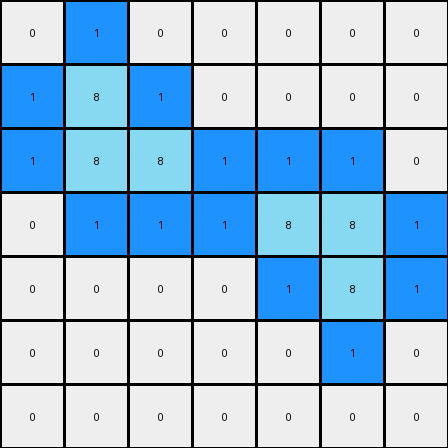

# 1-3aa6fb7a • 005 • refine_code - NLP

---


Previous Code:
```python
"""
The transformation rule is to add blue pixels in white cells that are adjacent to azure pixels, where those azure pixels also have adjacent azure neighbors, but not in the same direction, thus forming a bridge or link.
"""

import numpy as np

def is_valid(r, c, rows, cols):
    return 0 <= r < rows and 0 <= c < cols

def get_adjacent_neighbors(r, c, rows, cols):
    neighbors = []
    for dr, dc in [(0, 1), (0, -1), (1, 0), (-1, 0)]:
        nr, nc = r + dr, c + dc
        if is_valid(nr, nc, rows, cols):
            neighbors.append((nr, nc))
    return neighbors

def get_all_neighbors(r, c, rows, cols):
     neighbors = []
     for dr in [-1, 0, 1]:
         for dc in [-1, 0, 1]:
             if dr == 0 and dc == 0:
                 continue
             nr, nc = r + dr, c + dc
             if is_valid(nr, nc, rows, cols):
                neighbors.append((nr,nc))
     return neighbors
    

def transform(input_grid):
    output_grid = np.copy(input_grid)
    rows, cols = input_grid.shape

    # Iterate through all cells
    for r in range(rows):
        for c in range(cols):
            # Check if the current cell is white
            if input_grid[r, c] == 0:
                adjacent_neighbors = get_adjacent_neighbors(r, c, rows, cols)
                azure_neighbors = [(nr, nc) for nr, nc in adjacent_neighbors if output_grid[nr, nc] == 8]

                if azure_neighbors:
                    for ar, ac in azure_neighbors:
                        all_neighbors_of_azure = get_all_neighbors(ar, ac, rows, cols)
                        azure_neighbors_of_azure = [(nr, nc) for nr, nc in all_neighbors_of_azure if output_grid[nr,nc] == 8]
                        
                        if azure_neighbors_of_azure:
                            output_grid[r,c] = 1
                            break


    return output_grid
```

Train Set Results:

**Example 1:**
Input:
```
0 0 0 0 0 0 0
0 8 0 0 0 0 0
0 8 8 0 0 0 0
0 0 0 0 8 8 0
0 0 0 0 0 8 0
0 0 0 0 0 0 0
0 0 0 0 0 0 0
```
Expected Output:
```
0 0 0 0 0 0 0
0 8 1 0 0 0 0
0 8 8 0 0 0 0
0 0 0 0 8 8 0
0 0 0 0 1 8 0
0 0 0 0 0 0 0
0 0 0 0 0 0 0
```
Transformed Output:
```
0 1 0 0 0 0 0
1 8 1 0 0 0 0
1 8 8 1 1 1 0
0 1 1 1 8 8 1
0 0 0 0 1 8 1
0 0 0 0 0 1 0
0 0 0 0 0 0 0
```

Status: False

**Example 2:**
Input:
```
0 0 0 0 8 8 0
0 0 0 0 0 8 0
0 0 8 0 0 0 0
0 0 8 8 0 0 0
0 0 0 0 0 0 0
0 0 0 0 8 0 0
0 0 0 8 8 0 0
```
Expected Output:
```
0 0 0 0 8 8 0
0 0 0 0 1 8 0
0 0 8 1 0 0 0
0 0 8 8 0 0 0
0 0 0 0 0 0 0
0 0 0 1 8 0 0
0 0 0 8 8 0 0
```
Transformed Output:
```
0 0 0 1 8 8 1
0 0 1 0 1 8 1
0 1 8 1 0 1 0
0 1 8 8 1 0 0
0 0 1 1 1 0 0
0 0 0 1 8 1 0
0 0 1 8 8 1 0
```

Status: False

**INSTRUCTIONS**

- Describe in natural language the step-by-step transformation observed between the input and output grids.
- Focus on identifying objects, their properties (predicates), and the actions performed on them.
- Be as clear and concise as possible, providing a complete description of the transformation rule.
