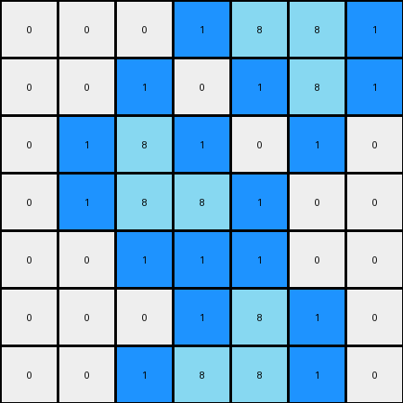

# 1-3aa6fb7a • 006 • refine_code - CODE

---

Previous Code:
```python
"""
The transformation rule is to add blue pixels in white cells that are adjacent to azure pixels, where those azure pixels also have adjacent azure neighbors, but not in the same direction, thus forming a bridge or link.
"""

import numpy as np

def is_valid(r, c, rows, cols):
    return 0 <= r < rows and 0 <= c < cols

def get_adjacent_neighbors(r, c, rows, cols):
    neighbors = []
    for dr, dc in [(0, 1), (0, -1), (1, 0), (-1, 0)]:
        nr, nc = r + dr, c + dc
        if is_valid(nr, nc, rows, cols):
            neighbors.append((nr, nc))
    return neighbors

def get_all_neighbors(r, c, rows, cols):
     neighbors = []
     for dr in [-1, 0, 1]:
         for dc in [-1, 0, 1]:
             if dr == 0 and dc == 0:
                 continue
             nr, nc = r + dr, c + dc
             if is_valid(nr, nc, rows, cols):
                neighbors.append((nr,nc))
     return neighbors
    

def transform(input_grid):
    output_grid = np.copy(input_grid)
    rows, cols = input_grid.shape

    # Iterate through all cells
    for r in range(rows):
        for c in range(cols):
            # Check if the current cell is white
            if input_grid[r, c] == 0:
                adjacent_neighbors = get_adjacent_neighbors(r, c, rows, cols)
                azure_neighbors = [(nr, nc) for nr, nc in adjacent_neighbors if output_grid[nr, nc] == 8]

                if azure_neighbors:
                    for ar, ac in azure_neighbors:
                        all_neighbors_of_azure = get_all_neighbors(ar, ac, rows, cols)
                        azure_neighbors_of_azure = [(nr, nc) for nr, nc in all_neighbors_of_azure if output_grid[nr,nc] == 8]
                        
                        if azure_neighbors_of_azure:
                            output_grid[r,c] = 1
                            break


    return output_grid
```

Train Set Results:

**Example 1:**
Input:
```
0 0 0 0 0 0 0
0 8 0 0 0 0 0
0 8 8 0 0 0 0
0 0 0 0 8 8 0
0 0 0 0 0 8 0
0 0 0 0 0 0 0
0 0 0 0 0 0 0
```
Expected Output:
```
0 0 0 0 0 0 0
0 8 1 0 0 0 0
0 8 8 0 0 0 0
0 0 0 0 8 8 0
0 0 0 0 1 8 0
0 0 0 0 0 0 0
0 0 0 0 0 0 0
```
Transformed Output:
```
0 1 0 0 0 0 0
1 8 1 0 0 0 0
1 8 8 1 1 1 0
0 1 1 1 8 8 1
0 0 0 0 1 8 1
0 0 0 0 0 1 0
0 0 0 0 0 0 0
```

Status: False

**Example 2:**
Input:
```
0 0 0 0 8 8 0
0 0 0 0 0 8 0
0 0 8 0 0 0 0
0 0 8 8 0 0 0
0 0 0 0 0 0 0
0 0 0 0 8 0 0
0 0 0 8 8 0 0
```
Expected Output:
```
0 0 0 0 8 8 0
0 0 0 0 1 8 0
0 0 8 1 0 0 0
0 0 8 8 0 0 0
0 0 0 0 0 0 0
0 0 0 1 8 0 0
0 0 0 8 8 0 0
```
Transformed Output:
```
0 0 0 1 8 8 1
0 0 1 0 1 8 1
0 1 8 1 0 1 0
0 1 8 8 1 0 0
0 0 1 1 1 0 0
0 0 0 1 8 1 0
0 0 1 8 8 1 0
```

Status: False
Okay, let's analyze the transformation rule based on the provided input and expected output examples, and the failures of the previous code.

Here's a breakdown of the observed transformation, focusing on a more precise description:

**Natural Language Program:**

1.  **Identify Target Cells:** The transformation focuses on white (0) cells.

2.  **Azure Neighbor Condition:** A white cell is a candidate for change *only if* it is directly adjacent (horizontally or vertically, not diagonally) to at least one azure (8) cell.

3.  **"Bridging" Azure Condition:** The adjacent azure cell(s) must, themselves, have *at least one other* azure neighbor.

4. **Directionality Condition** The adjacent azure cell must connect to the other azure cells in *two different directions*. Note, these do *not* have to be orthogonal, ie, the azure cells could have diagonal connections.

5.  **Transformation:** If *all* the above conditions are met, change the white cell to blue (1).

**Key Improvements in Understanding and Description:**

*   **Specificity of Adjacency:** Emphasizing horizontal/vertical adjacency for the initial white/azure connection, but any adjacency for the connection between azure pixels is critical. The previous attempts did not correctly apply the adjacency rules.
*   **"Bridging" Concept:** The core idea is that the azure pixels form a "bridge" or "link" of at least two connected azure pixels. The white pixel fills in a gap *next to* this bridge. The previous code didn't correctly define how long the "bridge" must be.
* **Directionality** - two azure cells is not sufficient, they must be connected in different directions

The previous code was too broad in its application of blue pixels. It placed them near *any* neighboring azure, not just those with other neighboring azures. It also incorrectly considered diagonal adjacency between the white starting cell and the azure neighbor.

The updated natural language program now describes a set of conditions, that, if all are met, trigger a single operation (changing the white cell to blue).

**INSTRUCTIONS**

- generate a Python module to represent the natural language program 
- follow the template below
- all common math and science libraries are available
- create docstring only at top - but comment the workflow in the function
- use helper functions for common operations like finding objects, counting,
  measuring, moving, etc. 

remember - we are working iteratively - so this code will inform your future
self as we converge on the solution

*template:*

```python
"""
{{ natural language description of the transformation rule }}
"""

{{ imports }}

def transform(input_grid):
    # initialize output_grid

    # change output pixels 

    return output_grid

```
