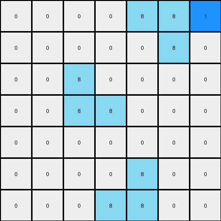

# 1-3aa6fb7a • 005 • refine_code - NLP

---

Previous Code:
```python
"""
This transformation identifies azure objects and adds a blue pixel inside of them.
"""

import numpy as np

def find_objects(grid, color):
    objects = []
    visited = np.zeros_like(grid, dtype=bool)

    def dfs(row, col, current_object):
        if (
            row < 0
            or row >= grid.shape[0]
            or col < 0
            or col >= grid.shape[1]
            or visited[row, col]
            or grid[row, col] != color
        ):
            return

        visited[row, col] = True
        current_object.append((row, col))
        dfs(row + 1, col, current_object)
        dfs(row - 1, col, current_object)
        dfs(row, col + 1, current_object)
        dfs(row, col - 1, current_object)

    for row in range(grid.shape[0]):
        for col in range(grid.shape[1]):
            if grid[row, col] == color and not visited[row, col]:
                current_object = []
                dfs(row, col, current_object)
                objects.append(current_object)
    return objects

def is_mirrored_L(object_pixels):
    if len(object_pixels) != 4:
        return False

    rows = [p[0] for p in object_pixels]
    cols = [p[1] for p in object_pixels]

    min_row, max_row = min(rows), max(rows)
    min_col, max_col = min(cols), max(cols)
    
    if max_row - min_row != 1 or max_col - min_col != 1:
       return False

    return True

def transform(input_grid):
    # initialize output_grid
    output_grid = np.copy(input_grid)
    
    # Find azure objects
    azure_objects = find_objects(input_grid, 8)  # 8 is for azure
    
    # Modify the first object (vertical line)
    if len(azure_objects) >= 1:
      first_object = azure_objects[0]
      if len(first_object) > 1:
          first_object.sort()
          row = first_object[1][0]
          col = first_object[1][1]          
          output_grid[row,col+1] = 1

    #Modify the second object if exist
    if len(azure_objects) >= 2:
        second_object = azure_objects[1]
        #check the shape of the second object is a mirrored L shape
        if is_mirrored_L(second_object):
            second_object.sort()
            row = second_object[0][0]
            col = second_object[0][1]

            output_grid[row+1,col] = 1
    
    # change output pixels 

    return output_grid
```

Train Set Results:

**Example 1:**
Input:
```
0 0 0 0 0 0 0
0 8 0 0 0 0 0
0 8 8 0 0 0 0
0 0 0 0 8 8 0
0 0 0 0 0 8 0
0 0 0 0 0 0 0
0 0 0 0 0 0 0
```
Expected Output:
```
0 0 0 0 0 0 0
0 8 1 0 0 0 0
0 8 8 0 0 0 0
0 0 0 0 8 8 0
0 0 0 0 1 8 0
0 0 0 0 0 0 0
0 0 0 0 0 0 0
```
Transformed Output:
```
0 0 0 0 0 0 0
0 8 0 0 0 0 0
0 8 1 0 0 0 0
0 0 0 0 8 8 0
0 0 0 0 0 8 0
0 0 0 0 0 0 0
0 0 0 0 0 0 0
```

Status: False

**Example 2:**
Input:
```
0 0 0 0 8 8 0
0 0 0 0 0 8 0
0 0 8 0 0 0 0
0 0 8 8 0 0 0
0 0 0 0 0 0 0
0 0 0 0 8 0 0
0 0 0 8 8 0 0
```
Expected Output:
```
0 0 0 0 8 8 0
0 0 0 0 1 8 0
0 0 8 1 0 0 0
0 0 8 8 0 0 0
0 0 0 0 0 0 0
0 0 0 1 8 0 0
0 0 0 8 8 0 0
```
Transformed Output:
```
0 0 0 0 8 8 1
0 0 0 0 0 8 0
0 0 8 0 0 0 0
0 0 8 8 0 0 0
0 0 0 0 0 0 0
0 0 0 0 8 0 0
0 0 0 8 8 0 0
```

Status: False
**INSTRUCTIONS**

- Describe in natural language the step-by-step transformation observed between the input and output grids.
- Focus on identifying objects, their properties (predicates), and the actions performed on them.
- Be as clear and concise as possible, providing a complete description of the transformation rule.
