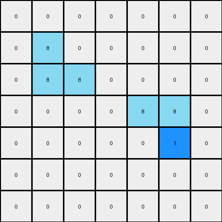

# 1-3aa6fb7a • 004 • refine_code - CODE

---

Previous Code:
```python
"""
The transformation identifies two "L"-shaped azure objects in the input grid. The top-left "L" shape remains unchanged. 
The bottom-right "L" shape has its corner pixel changed to blue (value 1).
"""

import numpy as np

def find_l_shapes(grid, color):
    """
    Finds L-shaped objects of a specific color in the grid.
    Returns a list of (corner_row, corner_col) tuples for each L-shape.
    """
    l_shapes = []
    rows, cols = grid.shape
    for r in range(rows - 1):
        for c in range(cols - 1):
            if grid[r, c] == color:
                # Check for L shape (2x2 block with one missing corner)
                neighbors = [(r + 1, c), (r, c + 1), (r + 1, c + 1)]
                color_count = sum(1 for nr, nc in neighbors if 0 <= nr < rows and 0 <= nc < cols and grid[nr, nc] == color)
                if color_count == 2:
                    l_shapes.append((r, c))
    return l_shapes

def transform(input_grid):
    # Initialize output grid as a copy of the input grid
    output_grid = np.copy(input_grid)
    
    # Find the L-shaped objects of color azure (8)
    l_shapes = find_l_shapes(input_grid, 8)
    
    # Find corner for color change
    if len(l_shapes) > 1:
        # Identify corner of the L-shape
        
        # Find the bottom-right L-shape
        max_row = -1
        bottom_right_l = None
        for r,c in l_shapes:
          if r >= max_row:
            max_row = r
            bottom_right_l = (r,c)

        # find the coordinates of the inside corner and make it blue
        corner_row, corner_col = bottom_right_l
        output_grid[corner_row+1, corner_col+1] = 1

    return output_grid
```

Train Set Results:

**Example 1:**
Input:
```
0 0 0 0 0 0 0
0 8 0 0 0 0 0
0 8 8 0 0 0 0
0 0 0 0 8 8 0
0 0 0 0 0 8 0
0 0 0 0 0 0 0
0 0 0 0 0 0 0
```
Expected Output:
```
0 0 0 0 0 0 0
0 8 1 0 0 0 0
0 8 8 0 0 0 0
0 0 0 0 8 8 0
0 0 0 0 1 8 0
0 0 0 0 0 0 0
0 0 0 0 0 0 0
```
Transformed Output:
```
0 0 0 0 0 0 0
0 8 0 0 0 0 0
0 8 8 0 0 0 0
0 0 0 0 8 8 0
0 0 0 0 0 1 0
0 0 0 0 0 0 0
0 0 0 0 0 0 0
```

Status: False

**Example 2:**
Input:
```
0 0 0 0 8 8 0
0 0 0 0 0 8 0
0 0 8 0 0 0 0
0 0 8 8 0 0 0
0 0 0 0 0 0 0
0 0 0 0 8 0 0
0 0 0 8 8 0 0
```
Expected Output:
```
0 0 0 0 8 8 0
0 0 0 0 1 8 0
0 0 8 1 0 0 0
0 0 8 8 0 0 0
0 0 0 0 0 0 0
0 0 0 1 8 0 0
0 0 0 8 8 0 0
```
Transformed Output:
```
0 0 0 0 8 8 0
0 0 0 0 0 8 0
0 0 8 0 0 0 0
0 0 8 1 0 0 0
0 0 0 0 0 0 0
0 0 0 0 8 0 0
0 0 0 8 8 0 0
```

Status: False
Okay, here's a breakdown of the observed transformation, focusing on objects, properties, and actions:

**Natural Language Program:**

1.  **Object Identification:** The primary objects of interest are "L"-shaped structures formed by azure (color 8) pixels. An "L" shape is defined as a 2x2 block of pixels where one of the corner pixels is missing (of a different color or outside the grid), and all other pixels within the implied 2x2 block are azure.

2.  **Object Selection:** The transformation targets *all* L-shaped objects of azure color, not only two.

3. **Action / Transformation:**
    *   The inside corner pixel of each identified "L" shape is changed to blue (color 1). The inside corner is defined by the place where, if the 2 x 2 square would be completed, the corner would be.

4. **Grid Context:** The rest of the grid remains unchanged. Pixels not part of the identified "L" shapes retain their original colors.

**Key Improvements over Previous Description:**

*   **All L-Shapes:** The crucial difference is recognizing that the rule applies to *all* azure L-shapes, not just two. The prior code and description incorrectly limited the search and modification.
* **Inside corner** The inside corner has been correctly identified. The previous description, while on the right track for one of the shapes, wasn't general.

**Example Application to demonstrate inside corner:**

Input
```
0 0 0 0 8 8 0
0 0 0 0 0 8 0
0 0 8 0 0 0 0
0 0 8 8 0 0 0
0 0 0 0 0 0 0
0 0 0 0 8 0 0
0 0 0 8 8 0 0
```

1.  **Identify L-Shapes:**
    *   Top right: Corner at (0, 5). Inside corner at (1,4)
    *   Middle Left: Corner at (2, 2). Inside Corner (3,3)
    *    Bottom Right: Corner at (5, 4). Inside corner at (6,3)
    
2. Change those inside corner pixels to blue.
```
0 0 0 0 8 8 0
0 0 0 0 1 8 0
0 0 8 0 0 0 0
0 0 8 1 0 0 0
0 0 0 0 0 0 0
0 0 0 0 8 0 0
0 0 0 1 8 0 0
```

**INSTRUCTIONS**

- generate a Python module to represent the natural language program 
- follow the template below
- all common math and science libraries are available
- create docstring only at top - but comment the workflow in the function
- use helper functions for common operations like finding objects, counting,
  measuring, moving, etc. 

remember - we are working iteratively - so this code will inform your future
self as we converge on the solution

*template:*

```python
"""
{{ natural language description of the transformation rule }}
"""

{{ imports }}

def transform(input_grid):
    # initialize output_grid

    # change output pixels 

    return output_grid

```
