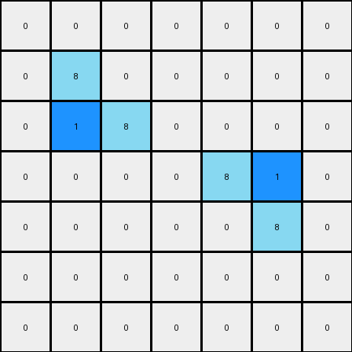
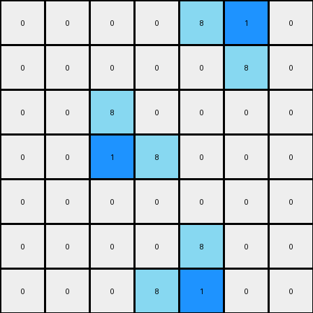

# 1-3aa6fb7a • 005 • refine_code - NLP

---


Previous Code:
```python
"""
Identify azure colored objects, and changes one "inside border" pixel from azure to blue while all other pixels remain the same.
"""

import numpy as np

def find_objects(grid, color):
    """Finds all contiguous regions of the specified color."""
    rows, cols = grid.shape
    visited = np.zeros((rows, cols), dtype=bool)
    objects = []

    def dfs(r, c, current_object):
        if (r < 0 or r >= rows or c < 0 or c >= cols or
                visited[r, c] or grid[r, c] != color):
            return
        visited[r, c] = True
        current_object.append((r, c))
        dfs(r + 1, c, current_object)
        dfs(r - 1, c, current_object)
        dfs(r, c + 1, current_object)
        dfs(r, c - 1, current_object)

    for r in range(rows):
        for c in range(cols):
            if grid[r, c] == color and not visited[r, c]:
                current_object = []
                dfs(r, c, current_object)
                objects.append(current_object)
    return objects

def find_inside_border_pixel(grid, object_pixels):
    """Finds the "inside border" pixel of an object."""
    rows, cols = grid.shape
    max_neighbors = -1
    inside_border_pixel = None

    for r, c in object_pixels:
        neighbor_count = 0
        # Count adjacent pixels of the same color
        if r > 0 and grid[r - 1, c] == grid[r,c]:
            neighbor_count += 1
        if r < rows - 1 and grid[r + 1, c] == grid[r,c]:
            neighbor_count += 1
        if c > 0 and grid[r, c - 1] == grid[r,c]:
            neighbor_count += 1
        if c < cols - 1 and grid[r, c + 1] == grid[r,c]:
            neighbor_count += 1

        if neighbor_count > max_neighbors:
            max_neighbors = neighbor_count
            inside_border_pixel = (r, c)
    
    return inside_border_pixel

def transform(input_grid):
    # Initialize output grid as a copy of the input grid
    output_grid = np.copy(input_grid)
    
    # Define the color of the objects and the target color
    azure = 8
    blue = 1

    # Find all azure objects
    azure_objects = find_objects(input_grid, azure)
    
    # For each azure object, find and change the inside border pixel
    for azure_object in azure_objects:
       inside_pixel = find_inside_border_pixel(input_grid, azure_object)
       if inside_pixel:
           output_grid[inside_pixel] = blue

    return output_grid
```

Train Set Results:

**Example 1:**
Input:
```
0 0 0 0 0 0 0
0 8 0 0 0 0 0
0 8 8 0 0 0 0
0 0 0 0 8 8 0
0 0 0 0 0 8 0
0 0 0 0 0 0 0
0 0 0 0 0 0 0
```
Expected Output:
```
0 0 0 0 0 0 0
0 8 1 0 0 0 0
0 8 8 0 0 0 0
0 0 0 0 8 8 0
0 0 0 0 1 8 0
0 0 0 0 0 0 0
0 0 0 0 0 0 0
```
Transformed Output:
```
0 0 0 0 0 0 0
0 8 0 0 0 0 0
0 1 8 0 0 0 0
0 0 0 0 8 1 0
0 0 0 0 0 8 0
0 0 0 0 0 0 0
0 0 0 0 0 0 0
```

Status: False

**Example 2:**
Input:
```
0 0 0 0 8 8 0
0 0 0 0 0 8 0
0 0 8 0 0 0 0
0 0 8 8 0 0 0
0 0 0 0 0 0 0
0 0 0 0 8 0 0
0 0 0 8 8 0 0
```
Expected Output:
```
0 0 0 0 8 8 0
0 0 0 0 1 8 0
0 0 8 1 0 0 0
0 0 8 8 0 0 0
0 0 0 0 0 0 0
0 0 0 1 8 0 0
0 0 0 8 8 0 0
```
Transformed Output:
```
0 0 0 0 8 1 0
0 0 0 0 0 8 0
0 0 8 0 0 0 0
0 0 1 8 0 0 0
0 0 0 0 0 0 0
0 0 0 0 8 0 0
0 0 0 8 1 0 0
```

Status: False

**INSTRUCTIONS**

- Describe in natural language the step-by-step transformation observed between the input and output grids.
- Focus on identifying objects, their properties (predicates), and the actions performed on them.
- Be as clear and concise as possible, providing a complete description of the transformation rule.
