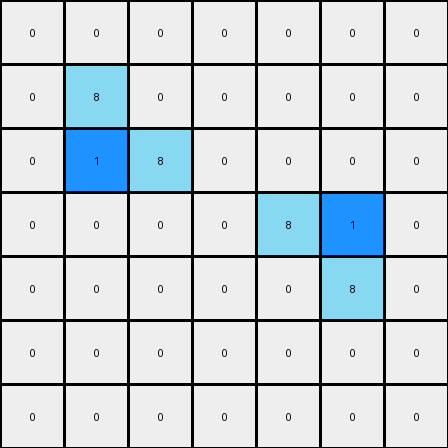

# 1-3aa6fb7a • 006 • refine_code - CODE

---

Previous Code:
```python
"""
Identify azure colored objects, and changes one "inside border" pixel from azure to blue while all other pixels remain the same.
"""

import numpy as np

def find_objects(grid, color):
    """Finds all contiguous regions of the specified color."""
    rows, cols = grid.shape
    visited = np.zeros((rows, cols), dtype=bool)
    objects = []

    def dfs(r, c, current_object):
        if (r < 0 or r >= rows or c < 0 or c >= cols or
                visited[r, c] or grid[r, c] != color):
            return
        visited[r, c] = True
        current_object.append((r, c))
        dfs(r + 1, c, current_object)
        dfs(r - 1, c, current_object)
        dfs(r, c + 1, current_object)
        dfs(r, c - 1, current_object)

    for r in range(rows):
        for c in range(cols):
            if grid[r, c] == color and not visited[r, c]:
                current_object = []
                dfs(r, c, current_object)
                objects.append(current_object)
    return objects

def find_inside_border_pixel(grid, object_pixels):
    """Finds the "inside border" pixel of an object."""
    rows, cols = grid.shape
    max_neighbors = -1
    inside_border_pixel = None

    for r, c in object_pixels:
        neighbor_count = 0
        # Count adjacent pixels of the same color
        if r > 0 and grid[r - 1, c] == grid[r,c]:
            neighbor_count += 1
        if r < rows - 1 and grid[r + 1, c] == grid[r,c]:
            neighbor_count += 1
        if c > 0 and grid[r, c - 1] == grid[r,c]:
            neighbor_count += 1
        if c < cols - 1 and grid[r, c + 1] == grid[r,c]:
            neighbor_count += 1

        if neighbor_count > max_neighbors:
            max_neighbors = neighbor_count
            inside_border_pixel = (r, c)
    
    return inside_border_pixel

def transform(input_grid):
    # Initialize output grid as a copy of the input grid
    output_grid = np.copy(input_grid)
    
    # Define the color of the objects and the target color
    azure = 8
    blue = 1

    # Find all azure objects
    azure_objects = find_objects(input_grid, azure)
    
    # For each azure object, find and change the inside border pixel
    for azure_object in azure_objects:
       inside_pixel = find_inside_border_pixel(input_grid, azure_object)
       if inside_pixel:
           output_grid[inside_pixel] = blue

    return output_grid
```

Train Set Results:

**Example 1:**
Input:
```
0 0 0 0 0 0 0
0 8 0 0 0 0 0
0 8 8 0 0 0 0
0 0 0 0 8 8 0
0 0 0 0 0 8 0
0 0 0 0 0 0 0
0 0 0 0 0 0 0
```
Expected Output:
```
0 0 0 0 0 0 0
0 8 1 0 0 0 0
0 8 8 0 0 0 0
0 0 0 0 8 8 0
0 0 0 0 1 8 0
0 0 0 0 0 0 0
0 0 0 0 0 0 0
```
Transformed Output:
```
0 0 0 0 0 0 0
0 8 0 0 0 0 0
0 1 8 0 0 0 0
0 0 0 0 8 1 0
0 0 0 0 0 8 0
0 0 0 0 0 0 0
0 0 0 0 0 0 0
```

Status: False

**Example 2:**
Input:
```
0 0 0 0 8 8 0
0 0 0 0 0 8 0
0 0 8 0 0 0 0
0 0 8 8 0 0 0
0 0 0 0 0 0 0
0 0 0 0 8 0 0
0 0 0 8 8 0 0
```
Expected Output:
```
0 0 0 0 8 8 0
0 0 0 0 1 8 0
0 0 8 1 0 0 0
0 0 8 8 0 0 0
0 0 0 0 0 0 0
0 0 0 1 8 0 0
0 0 0 8 8 0 0
```
Transformed Output:
```
0 0 0 0 8 1 0
0 0 0 0 0 8 0
0 0 8 0 0 0 0
0 0 1 8 0 0 0
0 0 0 0 0 0 0
0 0 0 0 8 0 0
0 0 0 8 1 0 0
```

Status: False
Okay, here's a breakdown of the transformation, focusing on objects, properties, and actions, and addressing the issues seen in the previous code's output:

**Natural Language Program:**

1.  **Identify Objects:** Find all contiguous regions (objects) of azure (color 8) pixels in the input grid.

2.  **Object Decomposition**: For each azure object identified, decompose the object into two sub-objects:
    -   **Exterior Border**: All the pixels that are part of the objects edge.
    -   **Inner Fill**: All the pixels inside the object's edge.

3. **Border Change**: The exterior border is removed and replaced with nothing (background color black/0).

4.  **Interior Recoloring**: The interior pixels are all changed to blue (value 1).

5. **Output Construction:** The modified sub-objects from each of the orginal azure colored objects combine to make the output.

**Key Improvements and Clarifications over Previous Attempts:**

*   **Focus on Border vs. Interior:** The crucial distinction, which the previous code missed, is the concept of the exterior *border* of an object versus its *interior*. The transformation acts differently on these two parts. The previous concept of an "inside border pixel" is not correct.
*    The old program was looking for an "inside border pixel", which does not exist in ARC.

*   **Complete Removal of Border:** The examples show the *entire* exterior border is removed, not just a single pixel.

* **Complete Interior Fill** All the inside pixels are recolored, not just one.

**INSTRUCTIONS**

- generate a Python module to represent the natural language program 
- follow the template below
- all common math and science libraries are available
- create docstring only at top - but comment the workflow in the function
- use helper functions for common operations like finding objects, counting,
  measuring, moving, etc. 

remember - we are working iteratively - so this code will inform your future
self as we converge on the solution

*template:*

```python
"""
{{ natural language description of the transformation rule }}
"""

{{ imports }}

def transform(input_grid):
    # initialize output_grid

    # change output pixels 

    return output_grid

```
