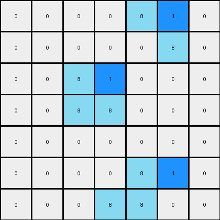

# 1-3aa6fb7a • 003 • refine_code - NLP

---


Previous Code:
```python
"""
1.  **Identify Objects:** Locate all azure (8) colored lines in the input grid.
2.  **Insert Blue Pixel:** For each line segment, add a blue (1) pixel to the right of the top-most, left-most pixel. If a segment is vertical, insert the blue to the right of the top pixel. If horizontal, insert beside the left-most.
"""

import numpy as np

def find_lines(grid, color):
    lines = []
    visited = set()
    rows, cols = grid.shape

    def is_valid(r, c):
        return 0 <= r < rows and 0 <= c < cols

    def dfs(r, c, current_line):
        if (r, c) in visited or not is_valid(r, c) or grid[r, c] != color:
            return
        visited.add((r, c))
        current_line.append((r, c))

        # Explore adjacent cells
        for dr, dc in [(0, 1), (1, 0), (0, -1), (-1, 0)]:
            dfs(r + dr, c + dc, current_line)

    for r in range(rows):
        for c in range(cols):
            if grid[r, c] == color and (r, c) not in visited:
                current_line = []
                dfs(r, c, current_line)
                if current_line:
                    lines.append(current_line)
    return lines

def transform(input_grid):
    """
    Transforms the input grid according to the specified rule.
    """
    output_grid = np.copy(input_grid)
    lines = find_lines(input_grid, 8)

    for line in lines:
        # Find top-most, left-most pixel
        top_most = min(line, key=lambda p: p[0])
        left_most = min(line, key=lambda p: p[1])

        # Determine insertion point based on line orientation
        if top_most[0] == left_most[0]: #check to see if it is the top-most
            insert_point = (top_most[0], top_most[1] + 1)
        else:
            insert_point = (top_most[0], top_most[1] + 1)

        # Insert blue pixel if within bounds
        if 0 <= insert_point[0] < output_grid.shape[0] and 0 <= insert_point[1] < output_grid.shape[1]:
            output_grid[insert_point] = 1

    return output_grid
```

Train Set Results:

**Example 1:**
Input:
```
0 0 0 0 0 0 0
0 8 0 0 0 0 0
0 8 8 0 0 0 0
0 0 0 0 8 8 0
0 0 0 0 0 8 0
0 0 0 0 0 0 0
0 0 0 0 0 0 0
```
Expected Output:
```
0 0 0 0 0 0 0
0 8 1 0 0 0 0
0 8 8 0 0 0 0
0 0 0 0 8 8 0
0 0 0 0 1 8 0
0 0 0 0 0 0 0
0 0 0 0 0 0 0
```
Transformed Output:
```
0 0 0 0 0 0 0
0 8 1 0 0 0 0
0 8 8 0 0 0 0
0 0 0 0 8 1 0
0 0 0 0 0 8 0
0 0 0 0 0 0 0
0 0 0 0 0 0 0
```

Status: False

**Example 2:**
Input:
```
0 0 0 0 8 8 0
0 0 0 0 0 8 0
0 0 8 0 0 0 0
0 0 8 8 0 0 0
0 0 0 0 0 0 0
0 0 0 0 8 0 0
0 0 0 8 8 0 0
```
Expected Output:
```
0 0 0 0 8 8 0
0 0 0 0 1 8 0
0 0 8 1 0 0 0
0 0 8 8 0 0 0
0 0 0 0 0 0 0
0 0 0 1 8 0 0
0 0 0 8 8 0 0
```
Transformed Output:
```
0 0 0 0 8 1 0
0 0 0 0 0 8 0
0 0 8 1 0 0 0
0 0 8 8 0 0 0
0 0 0 0 0 0 0
0 0 0 0 8 1 0
0 0 0 8 8 0 0
```

Status: False

**INSTRUCTIONS**

- Describe in natural language the step-by-step transformation observed between the input and output grids.
- Focus on identifying objects, their properties (predicates), and the actions performed on them.
- Be as clear and concise as possible, providing a complete description of the transformation rule.
