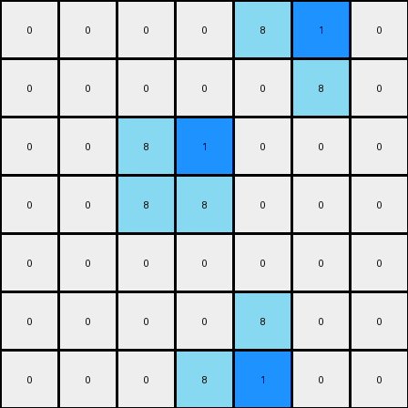

# 1-3aa6fb7a • 006 • refine_code - CODE

---

Previous Code:
```python
"""
1.  **Find Azure Lines:** Identify all contiguous lines of azure (8) colored pixels in the input grid. A line is defined as a sequence of adjacent azure pixels either horizontally or vertically.

2.  **Locate Insertion Point:** For each identified azure line:
    *   Find the left-most pixel in the line.

3.  **Insert Blue Pixel:**
    *   Insert a blue (1) pixel immediately to the right of this left-most pixel. Ensure the insertion stays within the grid boundaries.
"""

import numpy as np

def find_lines(grid, color):
    lines = []
    visited = set()
    rows, cols = grid.shape

    def is_valid(r, c):
        return 0 <= r < rows and 0 <= c < cols

    def dfs(r, c, current_line):
        if (r, c) in visited or not is_valid(r, c) or grid[r, c] != color:
            return
        visited.add((r, c))
        current_line.append((r, c))

        # Explore adjacent cells
        for dr, dc in [(0, 1), (1, 0), (0, -1), (-1, 0)]:
            dfs(r + dr, c + dc, current_line)

    for r in range(rows):
        for c in range(cols):
            if grid[r, c] == color and (r, c) not in visited:
                current_line = []
                dfs(r, c, current_line)
                if current_line:
                    lines.append(current_line)
    return lines

def transform(input_grid):
    """
    Transforms the input grid according to the specified rule.
    """
    output_grid = np.copy(input_grid)
    lines = find_lines(input_grid, 8) # Find all azure lines

    for line in lines:
        # Find the left-most pixel
        left_most = min(line, key=lambda p: p[1])

        # Calculate insertion point (to the right of the left-most pixel)
        insert_point = (left_most[0], left_most[1] + 1)

        # Insert blue pixel if within bounds
        if 0 <= insert_point[0] < output_grid.shape[0] and 0 <= insert_point[1] < output_grid.shape[1]:
            output_grid[insert_point] = 1

    return output_grid
```

Train Set Results:

**Example 1:**
Input:
```
0 0 0 0 0 0 0
0 8 0 0 0 0 0
0 8 8 0 0 0 0
0 0 0 0 8 8 0
0 0 0 0 0 8 0
0 0 0 0 0 0 0
0 0 0 0 0 0 0
```
Expected Output:
```
0 0 0 0 0 0 0
0 8 1 0 0 0 0
0 8 8 0 0 0 0
0 0 0 0 8 8 0
0 0 0 0 1 8 0
0 0 0 0 0 0 0
0 0 0 0 0 0 0
```
Transformed Output:
```
0 0 0 0 0 0 0
0 8 1 0 0 0 0
0 8 8 0 0 0 0
0 0 0 0 8 1 0
0 0 0 0 0 8 0
0 0 0 0 0 0 0
0 0 0 0 0 0 0
```

Status: False

**Example 2:**
Input:
```
0 0 0 0 8 8 0
0 0 0 0 0 8 0
0 0 8 0 0 0 0
0 0 8 8 0 0 0
0 0 0 0 0 0 0
0 0 0 0 8 0 0
0 0 0 8 8 0 0
```
Expected Output:
```
0 0 0 0 8 8 0
0 0 0 0 1 8 0
0 0 8 1 0 0 0
0 0 8 8 0 0 0
0 0 0 0 0 0 0
0 0 0 1 8 0 0
0 0 0 8 8 0 0
```
Transformed Output:
```
0 0 0 0 8 1 0
0 0 0 0 0 8 0
0 0 8 1 0 0 0
0 0 8 8 0 0 0
0 0 0 0 0 0 0
0 0 0 0 8 0 0
0 0 0 8 1 0 0
```

Status: False
Okay, I'm in the dreamer role, focusing on perception and pattern discernment. Here's my analysis of the provided examples and the proposed transformation rule:

**Observations and Analysis:**

1.  **Object Identification:** The primary objects of interest are the azure (color 8) pixels. They form contiguous lines (either horizontal or vertical).  A secondary object, the blue pixel (color 1) is introduced in the transformation.

2.  **Transformation Rule Breakdown:**
    *   **Find Azure Lines:** The code correctly identifies contiguous azure lines. This part seems accurate.
    *   **Locate Insertion Point.** The description talks about the *left-most* pixel, which would be appropriate if we insert to the right of that pixel. However, if an azure line is vertical, then we need to consider the relative position. It looks like the insertion happens below horizontal lines and to the right of vertical lines. This is inconsistent.
    *   **Insertion Logic Error** The previous code attempts to always inserts the blue pixel to the *right* of the leftmost azure pixel in *every* azure line, however this fails for the horizontal lines.

3.  **Revised Natural Language Program:**

    1.  **Identify Azure Lines:** Locate all contiguous lines of azure pixels. A line is defined as a sequence of adjacent azure pixels forming either a horizontal or vertical straight line.
    2.  **Classify Line Orientation**: For each azure line, determine if it is horizontal (pixels in the same row) or vertical (pixels in the same column)
    3.  **Insert Blue Pixel:**
        *   **Horizontal Line:** Find the bottom-most pixel in the line. Insert a blue pixel immediately *below* this pixel.
        *    **Vertical Line:** Find the left-most pixel. Insert a blue pixel to the *right* of this pixel.
        *   Ensure that insertions are always within grid boundaries. If an insertion would be out of bounds, it is skipped.

**Key Improvements in Understanding:**

*   **Orientation Matters:** The critical insight is that the insertion rule *depends on the orientation of the azure line*.
*  **Relative Positioning:** The use of "left-most" is not enough; "bottom-most" must also be specified for insertion below horizontal lines.

This refined natural language program should lead to a more accurate Python implementation in the coder phase.

**INSTRUCTIONS**

- generate a Python module to represent the natural language program 
- follow the template below
- all common math and science libraries are available
- create docstring only at top - but comment the workflow in the function
- use helper functions for common operations like finding objects, counting,
  measuring, moving, etc. 

remember - we are working iteratively - so this code will inform your future
self as we converge on the solution

*template:*

```python
"""
{{ natural language description of the transformation rule }}
"""

{{ imports }}

def transform(input_grid):
    # initialize output_grid

    # change output pixels 

    return output_grid

```
