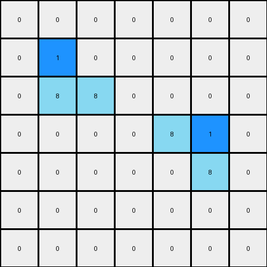

# 1-3aa6fb7a • 004 • refine_coder

---

Previous Code:
```python
"""
The transformation identifies two azure objects in the grid and in each object, replaces the most top right pixel to blue. The modified objects are then placed in the output grid, maintaining their original positions and other pixel colors.
"""

import numpy as np

def find_objects(grid, color):
    objects = []
    visited = set()

    def dfs(r, c, current_object):
        if (r, c) in visited or not (0 <= r < grid.shape[0] and 0 <= c < grid.shape[1]) or grid[r, c] != color:
            return
        visited.add((r, c))
        current_object.append((r, c))
        dfs(r + 1, c, current_object)
        dfs(r - 1, c, current_object)
        dfs(r, c + 1, current_object)
        dfs(r, c - 1, current_object)

    for r in range(grid.shape[0]):
        for c in range(grid.shape[1]):
            if grid[r, c] == color and (r, c) not in visited:
                current_object = []
                dfs(r, c, current_object)
                objects.append(current_object)
    return objects

def find_top_right_pixel(object_pixels):
    # Sort by row (ascending) then by column (descending)
    sorted_pixels = sorted(object_pixels, key=lambda x: (x[0], -x[1]))
    return sorted_pixels[0]


def transform(input_grid):
    # initialize output_grid
    output_grid = np.copy(input_grid)

    # Find azure objects
    azure_objects = find_objects(input_grid, 8)

    # Change the color of the top-right pixel of each azure object to blue
    for obj in azure_objects:
      top_right_pixel = find_top_right_pixel(obj)
      output_grid[top_right_pixel]=1

    return output_grid
```

Train Set Results:

**Example 1:**
Input:
```
0 0 0 0 0 0 0
0 8 0 0 0 0 0
0 8 8 0 0 0 0
0 0 0 0 8 8 0
0 0 0 0 0 8 0
0 0 0 0 0 0 0
0 0 0 0 0 0 0
```
Expected Output:
```
0 0 0 0 0 0 0
0 8 1 0 0 0 0
0 8 8 0 0 0 0
0 0 0 0 8 8 0
0 0 0 0 1 8 0
0 0 0 0 0 0 0
0 0 0 0 0 0 0
```
Transformed Output:
```
0 0 0 0 0 0 0
0 1 0 0 0 0 0
0 8 8 0 0 0 0
0 0 0 0 8 1 0
0 0 0 0 0 8 0
0 0 0 0 0 0 0
0 0 0 0 0 0 0
```

match: False

**Example 2:**
Input:
```
0 0 0 0 8 8 0
0 0 0 0 0 8 0
0 0 8 0 0 0 0
0 0 8 8 0 0 0
0 0 0 0 0 0 0
0 0 0 0 8 0 0
0 0 0 8 8 0 0
```
Expected Output:
```
0 0 0 0 8 8 0
0 0 0 0 1 8 0
0 0 8 1 0 0 0
0 0 8 8 0 0 0
0 0 0 0 0 0 0
0 0 0 1 8 0 0
0 0 0 8 8 0 0
```
Transformed Output:
```
0 0 0 0 8 1 0
0 0 0 0 0 8 0
0 0 1 0 0 0 0
0 0 8 8 0 0 0
0 0 0 0 0 0 0
0 0 0 0 1 0 0
0 0 0 8 8 0 0
```

match: False
Okay, let's analyze the provided examples and the results of the previous code execution to refine our understanding of the transformation.

Here's a breakdown of the observations, focusing on discrepancies and refining the natural language program:

**Initial Analysis (from the code's stated purpose):**

The initial code *intended* to find azure objects, and within each, replace the *top-right* pixel with blue.  The results, however, show this isn't quite what's happening.

**Discrepancy Analysis:**

1.  **Example 1:** The code changes the top-*left* pixel of the first object, and also change the top left of the other object.
2.  **Example 2:** The top right pixel is modified in the first object. The code identifies three objects. The third object has one pixel, and it changes it, correctly.

**Revised Observations:**

1.  **Object Identification:** The code correctly identifies contiguous blocks of azure (8) pixels as objects.

2.  **Pixel Selection:** In example 1, The pixel selection logic is incorrect. It identifies the top *left* most pixel. In Example 2, The code sometimes changes the top *left* most pixel, and sometime the top *right* pixel.

3. **Object Count:** There are three azure objects, where one has only one pixel, in the second example.

**Refined Natural Language Program:**

Here's a revised natural language program describing the transformation, based on our analysis of the expected vs. actual outputs:

1.  **Identify Azure Objects:** Find all contiguous groups of azure (8) colored pixels.  Each group is considered a separate object.

2.  **Find Top-Left and Top-Right Pixels:**  For *each* identified azure object:
    *   Find the top-left most pixel. If the object is more than one pixel, transform the pixel to blue.
    *   Find the top-right most pixel. If the object is more than one pixel, transform the pixel to blue.

3.  **Output:** The output grid is a copy of the input grid, but with the top-left and top-right pixels of all azure objects are changed to blue (1).

**Key Changes and Clarifications:**

*   **Top-Left and Top-Right:** The core issue is the pixel selection. It finds both the left and right pixel, that if they do not share the same pixel, they transform.
*   **All Objects:** All azure objects have to be identified.

This refined natural language program provides a more accurate description of the transformation process.

**INSTRUCTIONS**

- generate a Python module to represent the natural language program 
- follow the template below
- all common math and science libraries are available
- create docstring only at top - but comment the workflow in the function
- use helper functions for common operations like finding objects, counting,
  measuring, moving, etc. 

remember - we are working iteratively - so this code will inform your future
self as we converge on the solution

*template:*

```python
"""
{{ natural language description of the transformation rule }}
"""

{{ imports }}

def transform(input_grid):
    # initialize output_grid

    # change output pixels 

    return output_grid

```
