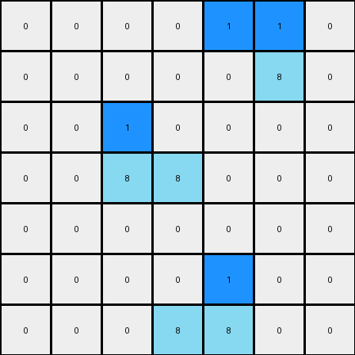

# 1-3aa6fb7a • 005 • refine_dreamer

---


Previous Code:
```python
"""
1. Identify Azure Objects: Find all contiguous groups of azure (8) colored pixels.  Each group is considered a separate object.

2.  Find Top-Left and Top-Right Pixels:  For *each* identified azure object:
    *   Find the top-left most pixel. If the object is more than one pixel, transform the pixel to blue.
    *   Find the top-right most pixel. If the object is more than one pixel, transform the pixel to blue.

3.  Output: The output grid is a copy of the input grid, but with the top-left and top-right pixels of all azure objects are changed to blue (1).
"""

import numpy as np

def find_objects(grid, color):
    objects = []
    visited = set()

    def dfs(r, c, current_object):
        if (r, c) in visited or not (0 <= r < grid.shape[0] and 0 <= c < grid.shape[1]) or grid[r, c] != color:
            return
        visited.add((r, c))
        current_object.append((r, c))
        dfs(r + 1, c, current_object)
        dfs(r - 1, c, current_object)
        dfs(r, c + 1, current_object)
        dfs(r, c - 1, current_object)

    for r in range(grid.shape[0]):
        for c in range(grid.shape[1]):
            if grid[r, c] == color and (r, c) not in visited:
                current_object = []
                dfs(r, c, current_object)
                objects.append(current_object)
    return objects

def find_top_left_pixel(object_pixels):
    # Sort by row (ascending) then by column (ascending)
    sorted_pixels = sorted(object_pixels, key=lambda x: (x[0], x[1]))
    return sorted_pixels[0]

def find_top_right_pixel(object_pixels):
    # Sort by row (ascending) then by column (descending)
    sorted_pixels = sorted(object_pixels, key=lambda x: (x[0], -x[1]))
    return sorted_pixels[0]


def transform(input_grid):
    # initialize output_grid
    output_grid = np.copy(input_grid)

    # Find azure objects
    azure_objects = find_objects(input_grid, 8)

    # Change the color of the top-left and top-right pixel of each azure object to blue
    for obj in azure_objects:
        if len(obj) > 1:
            top_left_pixel = find_top_left_pixel(obj)
            output_grid[top_left_pixel]=1
            top_right_pixel = find_top_right_pixel(obj)
            output_grid[top_right_pixel]=1

    return output_grid
```

Train Set Results:

**Example 1:**
Input:
```
0 0 0 0 0 0 0
0 8 0 0 0 0 0
0 8 8 0 0 0 0
0 0 0 0 8 8 0
0 0 0 0 0 8 0
0 0 0 0 0 0 0
0 0 0 0 0 0 0
```
Expected Output:
```
0 0 0 0 0 0 0
0 8 1 0 0 0 0
0 8 8 0 0 0 0
0 0 0 0 8 8 0
0 0 0 0 1 8 0
0 0 0 0 0 0 0
0 0 0 0 0 0 0
```
Transformed Output:
```
0 0 0 0 0 0 0
0 1 0 0 0 0 0
0 8 8 0 0 0 0
0 0 0 0 1 1 0
0 0 0 0 0 8 0
0 0 0 0 0 0 0
0 0 0 0 0 0 0
```

match: False

**Example 2:**
Input:
```
0 0 0 0 8 8 0
0 0 0 0 0 8 0
0 0 8 0 0 0 0
0 0 8 8 0 0 0
0 0 0 0 0 0 0
0 0 0 0 8 0 0
0 0 0 8 8 0 0
```
Expected Output:
```
0 0 0 0 8 8 0
0 0 0 0 1 8 0
0 0 8 1 0 0 0
0 0 8 8 0 0 0
0 0 0 0 0 0 0
0 0 0 1 8 0 0
0 0 0 8 8 0 0
```
Transformed Output:
```
0 0 0 0 1 1 0
0 0 0 0 0 8 0
0 0 1 0 0 0 0
0 0 8 8 0 0 0
0 0 0 0 0 0 0
0 0 0 0 1 0 0
0 0 0 8 8 0 0
```

match: False

**INSTRUCTIONS**

- Describe in natural language the step-by-step transformation observed between the input and output grids.
- Focus on identifying objects, their properties (predicates), and the actions performed on them.
- Be as clear and concise as possible, providing a complete description of the transformation rule.
