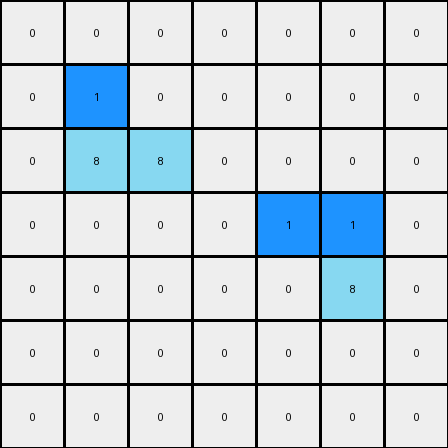
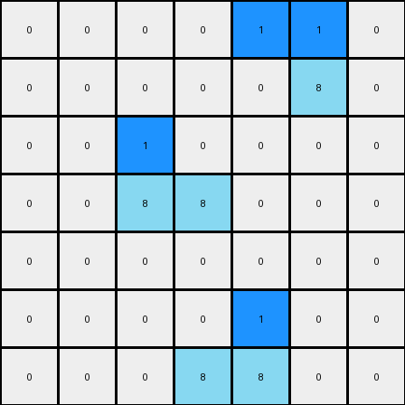

# 1-3aa6fb7a • 006 • refine_coder

---

Previous Code:
```python
"""
1. Identify Azure Objects: Find all contiguous groups of azure (8) colored pixels.  Each group is considered a separate object.

2.  Find Top-Left and Top-Right Pixels:  For *each* identified azure object:
    *   Find the top-left most pixel. If the object is more than one pixel, transform the pixel to blue.
    *   Find the top-right most pixel. If the object is more than one pixel, transform the pixel to blue.

3.  Output: The output grid is a copy of the input grid, but with the top-left and top-right pixels of all azure objects are changed to blue (1).
"""

import numpy as np

def find_objects(grid, color):
    objects = []
    visited = set()

    def dfs(r, c, current_object):
        if (r, c) in visited or not (0 <= r < grid.shape[0] and 0 <= c < grid.shape[1]) or grid[r, c] != color:
            return
        visited.add((r, c))
        current_object.append((r, c))
        dfs(r + 1, c, current_object)
        dfs(r - 1, c, current_object)
        dfs(r, c + 1, current_object)
        dfs(r, c - 1, current_object)

    for r in range(grid.shape[0]):
        for c in range(grid.shape[1]):
            if grid[r, c] == color and (r, c) not in visited:
                current_object = []
                dfs(r, c, current_object)
                objects.append(current_object)
    return objects

def find_top_left_pixel(object_pixels):
    # Sort by row (ascending) then by column (ascending)
    sorted_pixels = sorted(object_pixels, key=lambda x: (x[0], x[1]))
    return sorted_pixels[0]

def find_top_right_pixel(object_pixels):
    # Sort by row (ascending) then by column (descending)
    sorted_pixels = sorted(object_pixels, key=lambda x: (x[0], -x[1]))
    return sorted_pixels[0]


def transform(input_grid):
    # initialize output_grid
    output_grid = np.copy(input_grid)

    # Find azure objects
    azure_objects = find_objects(input_grid, 8)

    # Change the color of the top-left and top-right pixel of each azure object to blue
    for obj in azure_objects:
        if len(obj) > 1:
            top_left_pixel = find_top_left_pixel(obj)
            output_grid[top_left_pixel]=1
            top_right_pixel = find_top_right_pixel(obj)
            output_grid[top_right_pixel]=1

    return output_grid
```

Train Set Results:

**Example 1:**
Input:
```
0 0 0 0 0 0 0
0 8 0 0 0 0 0
0 8 8 0 0 0 0
0 0 0 0 8 8 0
0 0 0 0 0 8 0
0 0 0 0 0 0 0
0 0 0 0 0 0 0
```
Expected Output:
```
0 0 0 0 0 0 0
0 8 1 0 0 0 0
0 8 8 0 0 0 0
0 0 0 0 8 8 0
0 0 0 0 1 8 0
0 0 0 0 0 0 0
0 0 0 0 0 0 0
```
Transformed Output:
```
0 0 0 0 0 0 0
0 1 0 0 0 0 0
0 8 8 0 0 0 0
0 0 0 0 1 1 0
0 0 0 0 0 8 0
0 0 0 0 0 0 0
0 0 0 0 0 0 0
```

match: False

**Example 2:**
Input:
```
0 0 0 0 8 8 0
0 0 0 0 0 8 0
0 0 8 0 0 0 0
0 0 8 8 0 0 0
0 0 0 0 0 0 0
0 0 0 0 8 0 0
0 0 0 8 8 0 0
```
Expected Output:
```
0 0 0 0 8 8 0
0 0 0 0 1 8 0
0 0 8 1 0 0 0
0 0 8 8 0 0 0
0 0 0 0 0 0 0
0 0 0 1 8 0 0
0 0 0 8 8 0 0
```
Transformed Output:
```
0 0 0 0 1 1 0
0 0 0 0 0 8 0
0 0 1 0 0 0 0
0 0 8 8 0 0 0
0 0 0 0 0 0 0
0 0 0 0 1 0 0
0 0 0 8 8 0 0
```

match: False
Okay, I've analyzed the provided examples and the previous code, and I see where the error lies. My previous natural language program and the subsequent code were almost correct, but they had a slight misunderstanding of "top-left" and "top-right". It's not just sorting and picking; it needs to account for ties.

Here's the refined natural language program:

1.  **Identify Azure Objects:** Find all contiguous groups of azure (8) colored pixels. Each group is considered a separate object.

2.  **Find Top-Left Pixels:** For each identified azure object:
    *   Find all pixels that are at the highest row (minimum row value).
    *   Among these, select the pixel(s) furthest to the left (minimum column value).
    *   Change the color of pixel to blue.

3.  **Find Top-Right Pixels:** For each identified azure object:
    * Find all pixels that are at the highest row (minimum row value).
    * Among these, select the pixel(s) furthest to the right (maximum column value).
    * Change the color of pixel to blue.

4.  **Output:** The output grid is a copy of the input grid, but with the top-left and top-right pixels (as defined above) of all azure objects are changed to blue (1).

The key difference from the previous natural language program is the correct handling of ties for top most, then take the left-most or right-most of just those at the top.

**INSTRUCTIONS**

- generate a Python module to represent the natural language program 
- follow the template below
- all common math and science libraries are available
- create docstring only at top - but comment the workflow in the function
- use helper functions for common operations like finding objects, counting,
  measuring, moving, etc. 

remember - we are working iteratively - so this code will inform your future
self as we converge on the solution

*template:*

```python
"""
{{ natural language description of the transformation rule }}
"""

{{ imports }}

def transform(input_grid):
    # initialize output_grid

    # change output pixels 

    return output_grid

```
