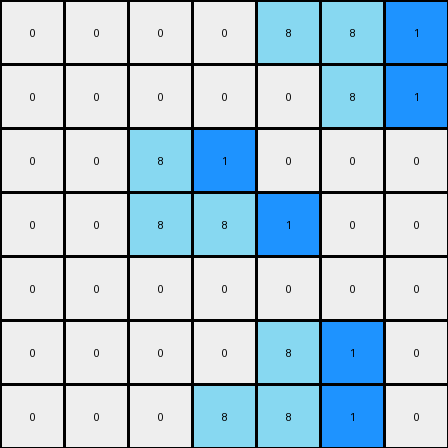

# 1-3aa6fb7a • 006 • refine_coder

---

Previous Code:
```python
"""
Iterate through each pixel of the input grid.
Identify all azure (8) pixels.
For each azure pixel, check if there is an adjacent azure pixel to its immediate right.
If there is *no* azure pixel to the immediate right, place a blue (1) pixel in the cell immediately to the right of the current azure pixel.
All other pixels remain unchanged.
"""

import numpy as np

def transform(input_grid):
    # Initialize output grid as a copy of the input grid
    output_grid = np.copy(input_grid)
    rows, cols = input_grid.shape

    # Iterate through each pixel of the input grid
    for r in range(rows):
        for c in range(cols):
            # Check if the current pixel is azure (8)
            if input_grid[r, c] == 8:
                # Check for adjacent azure pixel to the right
                if c + 1 >= cols or input_grid[r, c + 1] != 8:
                    # Add a blue (1) pixel to the right if no azure neighbor
                    if c + 1 < cols:
                        output_grid[r, c + 1] = 1

    return output_grid
```

Train Set Results:

## Example 1:**

Input:
```
0 0 0 0 0 0 0
0 8 0 0 0 0 0
0 8 8 0 0 0 0
0 0 0 0 8 8 0
0 0 0 0 0 8 0
0 0 0 0 0 0 0
0 0 0 0 0 0 0
```
Expected Output:
```
0 0 0 0 0 0 0
0 8 1 0 0 0 0
0 8 8 0 0 0 0
0 0 0 0 8 8 0
0 0 0 0 1 8 0
0 0 0 0 0 0 0
0 0 0 0 0 0 0
```
Transformed Output:
```
0 0 0 0 0 0 0
0 8 1 0 0 0 0
0 8 8 1 0 0 0
0 0 0 0 8 8 1
0 0 0 0 0 8 1
0 0 0 0 0 0 0
0 0 0 0 0 0 0
```

match: False
pixels_off: 4
size_correct: True
color_palette_correct: True
correct_pixel_counts: False

## Example 2:**

Input:
```
0 0 0 0 8 8 0
0 0 0 0 0 8 0
0 0 8 0 0 0 0
0 0 8 8 0 0 0
0 0 0 0 0 0 0
0 0 0 0 8 0 0
0 0 0 8 8 0 0
```
Expected Output:
```
0 0 0 0 8 8 0
0 0 0 0 1 8 0
0 0 8 1 0 0 0
0 0 8 8 0 0 0
0 0 0 0 0 0 0
0 0 0 1 8 0 0
0 0 0 8 8 0 0
```
Transformed Output:
```
0 0 0 0 8 8 1
0 0 0 0 0 8 1
0 0 8 1 0 0 0
0 0 8 8 1 0 0
0 0 0 0 0 0 0
0 0 0 0 8 1 0
0 0 0 8 8 1 0
```

match: False
pixels_off: 7
size_correct: True
color_palette_correct: True
correct_pixel_counts: False
Here's an analysis of the provided information and a plan to refine the natural language program:

**General Assessment:**

The initial natural language program and the generated code were on the right track, focusing on azure (8) pixels and their right-hand neighbors. However, the code incorrectly added blue (1) pixels *after* any azure pixel that wasn't followed by another azure pixel. The examples reveal a more specific rule: a blue pixel is placed to the *left* of a *sequence* of azure pixels, but only if the azure sequence is at the edge of the grid or is next to a 0, and the blue pixel replaces a 0. The original code also incorrectly appended a blue pixel in cases where the sequence of azure was not adjancent to zero or an edge.

**Strategy:**

1.  **Analyze all examples:** Carefully examine all input/output pairs, not just the first one, to identify the *complete* rule.
2.  **Refine the rule:** Revise the natural language program to accurately describe the placement of the blue pixel *before* a sequence of azure pixels, not after isolated azure pixels.
3.  **Consider edge cases:** Specifically address how the rule applies at the edges of the grid, since this seems to be part of the logic.
4.  **Update the logic:** Adjust from an "append" to a "prepend and only if adjacent to a 0 or an edge" strategy.

**Example Metrics and Analysis:**

Here's a breakdown of each example, focusing on azure pixel sequences and their context:

**Example 1:**

*   **Input:**
    ```
    0 0 0 0 0 0 0
    0 8 0 0 0 0 0
    0 8 8 0 0 0 0
    0 0 0 0 8 8 0
    0 0 0 0 0 8 0
    0 0 0 0 0 0 0
    0 0 0 0 0 0 0
    ```
*   **Expected Output:**
    ```
    0 0 0 0 0 0 0
    0 8 1 0 0 0 0
    0 8 8 0 0 0 0
    0 0 0 0 8 8 0
    0 0 0 0 1 8 0
    0 0 0 0 0 0 0
    0 0 0 0 0 0 0
    ```

*    Analysis
    *   Row 2: `0 8 0` becomes `0 8 0`. The program should insert `1` to the *left* of the 8 if there is a zero to replace
    *   Row 3: `0 8 8 0` remains unchanged. The 8s are adjacent, and no insertion is needed.
    *   Row 4: `0 0 0 0 8 8 0`. remains unchanged.
    *  Row 5: `0 0 0 0 0 8 0`. The program should insert `1` to the *left* of the 8.

**Example 2:**

*   **Input:**
    ```
    0 0 0 0 8 8 0
    0 0 0 0 0 8 0
    0 0 8 0 0 0 0
    0 0 8 8 0 0 0
    0 0 0 0 0 0 0
    0 0 0 0 8 0 0
    0 0 0 8 8 0 0
    ```
*   **Expected Output:**
    ```
    0 0 0 0 8 8 0
    0 0 0 0 1 8 0
    0 0 8 1 0 0 0
    0 0 8 8 0 0 0
    0 0 0 0 0 0 0
    0 0 0 1 8 0 0
    0 0 0 8 8 0 0
    ```

*    Analysis
    *   Row 1:  `0 0 0 0 8 8 0` - no change.
    *   Row 2: `0 0 0 0 0 8 0` becomes `0 0 0 0 1 8 0`.  Blue is inserted to the *left* of the azure, replacing a zero.
    *   Row 3: `0 0 8 0 0 0 0` becomes `0 0 8 1 0 0 0` - incorrect - should insert to the left.
    *  Row 4 and 7, no change
    *  Row 6, `0 0 0 0 8 0 0`, The program should insert `1` to the *left* of the 8.

**YAML Facts:**

```yaml
objects:
  - color: azure (8)
    type: pixel_sequence
    properties:
      length: variable  # Length of the contiguous sequence of azure pixels
      left_neighbor: [0, other]  # The color of the pixel immediately to the left (0 or edge)
      right_neighbor: [any] # The color to the right (any color is possible)

actions:
  - name: insert_blue
    condition: "object.left_neighbor == 0" #if sequence is next to a 0
    preposition: "before"
    target: object #target is a "sequence" not a single pixel
    properties:
      color: blue (1)
      relative_position: "replaces left_neighbor"

```

**Natural Language Program:**

1.  **Identify Azure Sequences:** Find all contiguous horizontal sequences of azure (8) pixels.
2.  **Check Left Neighbor:** For each azure sequence, examine the pixel immediately to its left.
3.  **Conditional Insertion:** If the left neighbor is a 0, replace that 0 with a blue (1) pixel. If at the left edge, do not insert anything.
4. **All Other Pixels:** All pixels that are not azure, or a zero to the left of an azure sequence, remain unchanged.

This revised natural language program accounts for the "prepending" behavior and the edge-case/zero-adjacent condition observed in the examples. It also clarifies that the operation acts on *sequences* of azure pixels, not individual azure pixels in isolation.

**INSTRUCTIONS**

- generate a Python module to represent the natural language program 
- follow the template below
- all common math and science libraries are available
- create docstring only at top - but comment the workflow in the function
- use helper functions for common operations like finding objects, counting,
  measuring, moving, etc. 

remember - we are working iteratively - so this code will inform your future
self as we converge on the solution

*template:*

```python
"""
{{ natural language description of the transformation rule }}
"""

{{ imports }}

def transform(input_grid):
    # initialize output_grid

    # change output pixels 

    return output_grid

```
