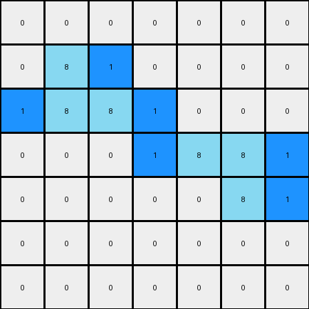

# 1-3aa6fb7a • 004 • refine_coder

---

Previous Code:
```python
"""
Identify all azure (8) pixels in the input grid. For each azure pixel, check if there is an adjacent azure pixel to its right. If not, place a blue (1) pixel to its immediate right. If an azure pixel has an adjacent pixel to its left (r,c-1), a blue pixel is placed directly before that left neighbor.
"""

import numpy as np

def transform(input_grid):
    # Initialize output grid as a copy of the input grid
    output_grid = np.copy(input_grid)
    rows, cols = input_grid.shape

    # Iterate through each pixel of the input grid
    for r in range(rows):
        for c in range(cols):
            # Check if the current pixel is azure (8)
            if input_grid[r, c] == 8:
                # Check for adjacent azure pixel to the right
                if c + 1 < cols and input_grid[r, c + 1] != 8:
                    # Add a blue (1) pixel to the right
                    output_grid[r, c + 1] = 1
                if c+1 < cols and input_grid[r,c+1] == 8 and c > 0:
                  output_grid[r,c-1] = 1

    return output_grid
```

Train Set Results:

## Example 1:**

Input:
```
0 0 0 0 0 0 0
0 8 0 0 0 0 0
0 8 8 0 0 0 0
0 0 0 0 8 8 0
0 0 0 0 0 8 0
0 0 0 0 0 0 0
0 0 0 0 0 0 0
```
Expected Output:
```
0 0 0 0 0 0 0
0 8 1 0 0 0 0
0 8 8 0 0 0 0
0 0 0 0 8 8 0
0 0 0 0 1 8 0
0 0 0 0 0 0 0
0 0 0 0 0 0 0
```
Transformed Output:
```
0 0 0 0 0 0 0
0 8 1 0 0 0 0
1 8 8 1 0 0 0
0 0 0 1 8 8 1
0 0 0 0 0 8 1
0 0 0 0 0 0 0
0 0 0 0 0 0 0
```

match: False
pixels_off: 6
size_correct: True
color_palette_correct: True
correct_pixel_counts: False

## Example 2:**

Input:
```
0 0 0 0 8 8 0
0 0 0 0 0 8 0
0 0 8 0 0 0 0
0 0 8 8 0 0 0
0 0 0 0 0 0 0
0 0 0 0 8 0 0
0 0 0 8 8 0 0
```
Expected Output:
```
0 0 0 0 8 8 0
0 0 0 0 1 8 0
0 0 8 1 0 0 0
0 0 8 8 0 0 0
0 0 0 0 0 0 0
0 0 0 1 8 0 0
0 0 0 8 8 0 0
```
Transformed Output:
```
0 0 0 1 8 8 1
0 0 0 0 0 8 1
0 0 8 1 0 0 0
0 1 8 8 1 0 0
0 0 0 0 0 0 0
0 0 0 0 8 1 0
0 0 1 8 8 1 0
```

match: False
pixels_off: 10
size_correct: True
color_palette_correct: True
correct_pixel_counts: False
Okay, here's a breakdown of the situation and a plan to move forward:

**General Assessment:**

The initial natural language program and the resulting code were too simplistic. While it correctly identified the azure (8) pixels and attempted to place blue (1) pixels, it failed to accurately capture the placement rule. The original logic incorrectly added blue pixels to the *right* in some cases, and *before* a string of adjacent azures, leading to errors in both test cases. The core issue is a misunderstanding of the *conditional placement* of blue pixels relative to *isolated* azure pixels.

**Strategy:**

1.  **Refine the Rule:** The natural language program needs a more precise description of *when* and *where* to place the blue pixels. It's not simply about adjacency, but about the *absence* of an azure neighbor on the *right* side. We need to also eliminate placement of blue pixels *before* strings of azure pixels, since the second test case clearly does not require that.
2.  **Focus on Isolation:** The key seems to be identifying "isolated" azure pixels (those without an azure neighbor to the right).
3.  **Iterative Improvement:** We will update the natural language program, regenerate the code, and test against *all* training examples with each iteration.

**Metrics and Observations (from provided results):**

*   **Example 1:**
    *   `match: False`
    *   `pixels_off: 6`
    *   The code incorrectly added blue pixels to the left of each chain of adjacent azure and one to the right of an azure in a chain.
*   **Example 2:**
    *   `match: False`
    *   `pixels_off: 10`
    *   The code incorrectly added blue pixels to the left of each chain of adjacent azure and one to the right of an azure in a chain..

**YAML Fact Block:**

```yaml
observations:
  - object: azure_pixel
    color: 8
    description: Pixels with the value 8.
    behavior: "Triggers placement of blue pixel based on right-side adjacency."

  - object: blue_pixel
    color: 1
    description: Pixels with the value 1.
    behavior: "Placed to the immediate right of isolated azure pixels."

  - object: other_pixel
    color: "[0, 2, 3, 4, 5, 6, 7, 9]"
    description: "Pixels that are not azure or blue."
    behavior: "Remain unchanged."

  - action: placement
    description: "Adding a blue pixel to the grid."
    condition: "An azure pixel does not have an adjacent azure pixel to its right."
    location: "Immediately to the right of the triggering azure pixel."

  - grid_property: unchanged_background
    description: pixels that are not azure should not change colors
```

**Revised Natural Language Program:**

1.  Iterate through each pixel of the input grid.
2.  Identify all azure (8) pixels.
3.  For each azure pixel, check if there is an adjacent azure pixel to its *immediate right*.
4.  If there is *no* azure pixel to the immediate right, place a blue (1) pixel in the cell immediately to the right of the current azure pixel.
5.  All other pixels remain unchanged.

**INSTRUCTIONS**

- generate a Python module to represent the natural language program 
- follow the template below
- all common math and science libraries are available
- create docstring only at top - but comment the workflow in the function
- use helper functions for common operations like finding objects, counting,
  measuring, moving, etc. 

remember - we are working iteratively - so this code will inform your future
self as we converge on the solution

*template:*

```python
"""
{{ natural language description of the transformation rule }}
"""

{{ imports }}

def transform(input_grid):
    # initialize output_grid

    # change output pixels 

    return output_grid

```
