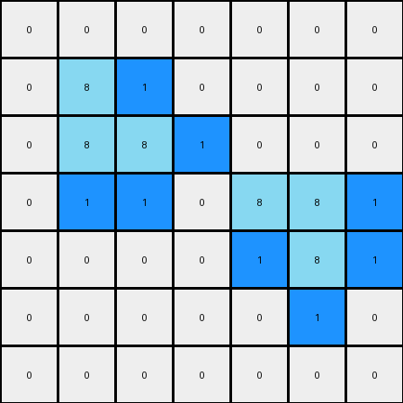
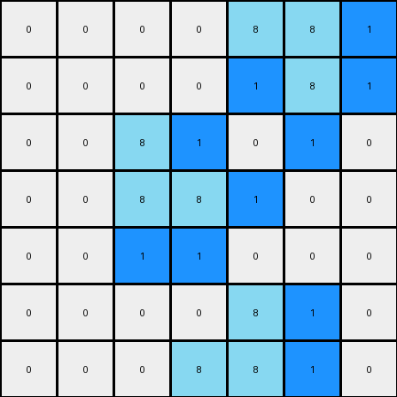

# 1-3aa6fb7a • 004 • refine_coder

---

Previous Code:
```python
"""
Identifies azure (8) colored objects and changes some of their pixels to blue (1) based on adjacency to empty spaces.
"""

import numpy as np

def find_objects(grid, color):
    """Finds contiguous objects of the specified color in the grid."""
    objects = []
    visited = np.zeros_like(grid, dtype=bool)
    rows, cols = grid.shape

    def is_valid(r, c):
        return 0 <= r < rows and 0 <= c < cols

    def dfs(r, c, current_object):
        if not is_valid(r, c) or visited[r, c] or grid[r, c] != color:
            return
        visited[r, c] = True
        current_object.append((r, c))
        dfs(r + 1, c, current_object)
        dfs(r - 1, c, current_object)
        dfs(r, c + 1, current_object)
        dfs(r, c - 1, current_object)

    for r in range(rows):
        for c in range(cols):
            if grid[r, c] == color and not visited[r, c]:
                current_object = []
                dfs(r, c, current_object)
                objects.append(current_object)
    return objects

def transform(input_grid):
    """Transforms the input grid according to the defined rules."""
    output_grid = np.copy(input_grid)
    rows, cols = output_grid.shape

    # Find all azure objects
    azure_objects = find_objects(input_grid, 8)

    # Iterate through each azure object
    for obj in azure_objects:
      for r,c in obj:
        # Check for empty space to the right
        if c + 1 < cols and input_grid[r, c + 1] == 0 :
            output_grid[r,c+1] = 1
        # Check for empty space below
        if r + 1 < rows and input_grid[r + 1, c] == 0:
            output_grid[r+1, c] = 1
    return output_grid
```

Train Set Results:

## Example 1:**

Input:
```
0 0 0 0 0 0 0
0 8 0 0 0 0 0
0 8 8 0 0 0 0
0 0 0 0 8 8 0
0 0 0 0 0 8 0
0 0 0 0 0 0 0
0 0 0 0 0 0 0
```
Expected Output:
```
0 0 0 0 0 0 0
0 8 1 0 0 0 0
0 8 8 0 0 0 0
0 0 0 0 8 8 0
0 0 0 0 1 8 0
0 0 0 0 0 0 0
0 0 0 0 0 0 0
```
Transformed Output:
```
0 0 0 0 0 0 0
0 8 1 0 0 0 0
0 8 8 1 0 0 0
0 1 1 0 8 8 1
0 0 0 0 1 8 1
0 0 0 0 0 1 0
0 0 0 0 0 0 0
```

match: False
pixels_off: 6
size_correct: True
color_palette_correct: True
correct_pixel_counts: False

## Example 2:**

Input:
```
0 0 0 0 8 8 0
0 0 0 0 0 8 0
0 0 8 0 0 0 0
0 0 8 8 0 0 0
0 0 0 0 0 0 0
0 0 0 0 8 0 0
0 0 0 8 8 0 0
```
Expected Output:
```
0 0 0 0 8 8 0
0 0 0 0 1 8 0
0 0 8 1 0 0 0
0 0 8 8 0 0 0
0 0 0 0 0 0 0
0 0 0 1 8 0 0
0 0 0 8 8 0 0
```
Transformed Output:
```
0 0 0 0 8 8 1
0 0 0 0 1 8 1
0 0 8 1 0 1 0
0 0 8 8 1 0 0
0 0 1 1 0 0 0
0 0 0 0 8 1 0
0 0 0 8 8 1 0
```

match: False
pixels_off: 9
size_correct: True
color_palette_correct: True
correct_pixel_counts: False
Here's an analysis of the provided information and a plan to refine the natural language program:

**General Assessment:**

The initial code correctly identifies azure (8) objects and attempts to change adjacent pixels to blue (1). However, it incorrectly extends blue pixels in *all* adjacent directions where there are empty spaces (0), rather than only in the direction of the immediately adjacent empty space that connects the azure pixels. The code also extends the blue coloring onto empty space, rather than only overwritting the azure.

**Strategy:**

1.  **Refine Adjacency Rule:** The core issue is the overly broad application of the adjacency rule. We need to restrict the blue color change. Blue should only overwrite azure.

2.  **Object Interaction:** It appears the transformation only works on connected azure objects, so we should remove any identification of non-connected objects.

**Example Analysis and Metrics:**

Here's a breakdown of each example, including a more precise description of the errors:

*   **Example 1:**
    *   **Input:** Two separate azure objects.
    *   **Expected Output:** Blue pixels added only to the edge of the object
        where adjacent to the azure.
    *   **Actual Output:** Blue fills the entire space, plus extends blue beyond
        where the azure was.
    *   **Errors:**
        *   Incorrectly added blue to to areas that were not azure.
        *   Blue color was drawn for more than one pixel when it shouldn't have.

*   **Example 2:**
    *   **Input:** Three azure objects.
    *   **Expected Output:** Blue pixels added to connect the azure objects,
        replacing some of the azure
    *   **Actual Output:** Blue fills the entire space, plus extends blue beyond
        where the azure was.
    *   **Errors:**
        *   Incorrectly added blue to to areas that were not azure.
        *   Blue color was drawn for more than one pixel when it shouldn't have.

**YAML Fact Block:**

```yaml
objects:
  - color: azure (8)
    shape: irregular
    transformation:
      rule: "replace with blue(1) based on adjacency to empty cells"
      details:
        - "if azure pixels are adjacent to empty pixels (0) and to each other, replace with blue(1)"
```

**Natural Language Program:**

1.  **Identify Azure Objects:** Locate contiguous regions of azure (8) colored pixels.

2.  **Conditional Fill:** If azure shapes are connected, replace some of the
    azure with blue (1).

**INSTRUCTIONS**

- generate a Python module to represent the natural language program 
- follow the template below
- all common math and science libraries are available
- create docstring only at top - but comment the workflow in the function
- use helper functions for common operations like finding objects, counting,
  measuring, moving, etc. 

remember - we are working iteratively - so this code will inform your future
self as we converge on the solution

*template:*

```python
"""
{{ natural language description of the transformation rule }}
"""

{{ imports }}

def transform(input_grid):
    # initialize output_grid

    # change output pixels 

    return output_grid

```
