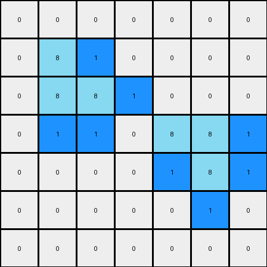
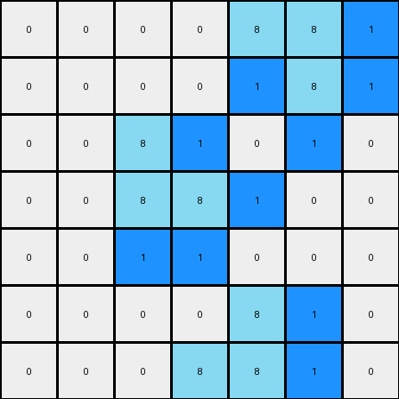

# 1-3aa6fb7a • 003 • refine_dreamer

---


Previous Code:
```python
"""
Identifies azure (8) colored objects and changes some of their pixels to blue (1) based on adjacency to empty spaces.
"""

import numpy as np

def find_objects(grid, color):
    """Finds contiguous objects of the specified color in the grid."""
    objects = []
    visited = np.zeros_like(grid, dtype=bool)
    rows, cols = grid.shape

    def is_valid(r, c):
        return 0 <= r < rows and 0 <= c < cols

    def dfs(r, c, current_object):
        if not is_valid(r, c) or visited[r, c] or grid[r, c] != color:
            return
        visited[r, c] = True
        current_object.append((r, c))
        dfs(r + 1, c, current_object)
        dfs(r - 1, c, current_object)
        dfs(r, c + 1, current_object)
        dfs(r, c - 1, current_object)

    for r in range(rows):
        for c in range(cols):
            if grid[r, c] == color and not visited[r, c]:
                current_object = []
                dfs(r, c, current_object)
                objects.append(current_object)
    return objects

def transform(input_grid):
    """Transforms the input grid according to the defined rules."""
    output_grid = np.copy(input_grid)
    rows, cols = output_grid.shape

    # Find all azure objects
    azure_objects = find_objects(input_grid, 8)

    # Iterate through each azure object
    for obj in azure_objects:
      for r,c in obj:
        # Check for empty space to the right
        if c + 1 < cols and input_grid[r, c + 1] == 0 :
            output_grid[r,c+1] = 1
        # Check for empty space below
        if r + 1 < rows and input_grid[r + 1, c] == 0:
            output_grid[r+1, c] = 1
    return output_grid
```

Train Set Results:

## Example 1:**

Input:
```
0 0 0 0 0 0 0
0 8 0 0 0 0 0
0 8 8 0 0 0 0
0 0 0 0 8 8 0
0 0 0 0 0 8 0
0 0 0 0 0 0 0
0 0 0 0 0 0 0
```
Expected Output:
```
0 0 0 0 0 0 0
0 8 1 0 0 0 0
0 8 8 0 0 0 0
0 0 0 0 8 8 0
0 0 0 0 1 8 0
0 0 0 0 0 0 0
0 0 0 0 0 0 0
```
Transformed Output:
```
0 0 0 0 0 0 0
0 8 1 0 0 0 0
0 8 8 1 0 0 0
0 1 1 0 8 8 1
0 0 0 0 1 8 1
0 0 0 0 0 1 0
0 0 0 0 0 0 0
```

match: False
pixels_off: 6
size_correct: True
color_palette_correct: True
correct_pixel_counts: False

## Example 2:**

Input:
```
0 0 0 0 8 8 0
0 0 0 0 0 8 0
0 0 8 0 0 0 0
0 0 8 8 0 0 0
0 0 0 0 0 0 0
0 0 0 0 8 0 0
0 0 0 8 8 0 0
```
Expected Output:
```
0 0 0 0 8 8 0
0 0 0 0 1 8 0
0 0 8 1 0 0 0
0 0 8 8 0 0 0
0 0 0 0 0 0 0
0 0 0 1 8 0 0
0 0 0 8 8 0 0
```
Transformed Output:
```
0 0 0 0 8 8 1
0 0 0 0 1 8 1
0 0 8 1 0 1 0
0 0 8 8 1 0 0
0 0 1 1 0 0 0
0 0 0 0 8 1 0
0 0 0 8 8 1 0
```

match: False
pixels_off: 9
size_correct: True
color_palette_correct: True
correct_pixel_counts: False

**INSTRUCTIONS**

The code above was generated based on observations from the first training
example

we have tested the transform function on each of the task example inputs and
compared with the expected output

review each of the examples provided and the results and consider how the
natural language program should be updated to accommodate this new knowledge

respond with the following deliverables:

- general assessment of the information provided and strategy for resolving the
  errors
- gather metrics about each of the examples and results - use code_execution to
  develop accurate reports on your assumptions
- a YAML block documenting facts - Focus on identifying objects, their properties, and the actions performed on them.
- a natural language program - Be as clear and concise as possible, providing a complete description of the transformation rule.


your responses should be considered as information in a report - not a
conversation
