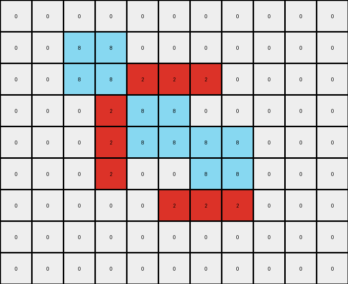

# 5-150deff5 • 002 • example_1 - CODE

---

**input**
```
0 0 0 0 0 0 0 0 0 0 0
0 0 5 5 0 0 0 0 0 0 0
0 0 5 5 5 5 5 0 0 0 0
0 0 0 5 5 5 0 0 0 0 0
0 0 0 5 5 5 5 5 0 0 0
0 0 0 5 0 0 5 5 0 0 0
0 0 0 0 0 5 5 5 0 0 0
0 0 0 0 0 0 0 0 0 0 0
0 0 0 0 0 0 0 0 0 0 0
```


**output**
```
0 0 0 0 0 0 0 0 0 0 0
0 0 8 8 0 0 0 0 0 0 0
0 0 8 8 2 2 2 0 0 0 0
0 0 0 2 8 8 0 0 0 0 0
0 0 0 2 8 8 8 8 0 0 0
0 0 0 2 0 0 8 8 0 0 0
0 0 0 0 0 2 2 2 0 0 0
0 0 0 0 0 0 0 0 0 0 0
0 0 0 0 0 0 0 0 0 0 0
```



Okay, here's my assessment of the provided input-output example and a plan for figuring out the transformation rule.

**General Assessment:**

The input and output grids are of the same dimensions (11x9). The input grid contains a single object made of gray (5) pixels, while the output grid contains two objects, one made of azure (8) and one of red (2) pixels, replacing the gray one. The transformation seems to involve a change of color and potentially splitting of the object based on its shape or surrounding pixels. The background (0, white) remains unchanged. My strategy will involve first accurately identifying the gray object in the input, then analyzing its shape and position to infer how it's transformed into the azure and red objects in the output.

**Metrics and Observations (using code):**

I'll use python to get some key metrics, then construct a YAML to contain structured observations


*code_execution:*
```python
import numpy as np

input_grid = np.array([
    [0, 0, 0, 0, 0, 0, 0, 0, 0, 0, 0],
    [0, 0, 5, 5, 0, 0, 0, 0, 0, 0, 0],
    [0, 0, 5, 5, 5, 5, 5, 0, 0, 0, 0],
    [0, 0, 0, 5, 5, 5, 0, 0, 0, 0, 0],
    [0, 0, 0, 5, 5, 5, 5, 5, 0, 0, 0],
    [0, 0, 0, 5, 0, 0, 5, 5, 0, 0, 0],
    [0, 0, 0, 0, 0, 5, 5, 5, 0, 0, 0],
    [0, 0, 0, 0, 0, 0, 0, 0, 0, 0, 0],
    [0, 0, 0, 0, 0, 0, 0, 0, 0, 0, 0]
])

output_grid = np.array([
    [0, 0, 0, 0, 0, 0, 0, 0, 0, 0, 0],
    [0, 0, 8, 8, 0, 0, 0, 0, 0, 0, 0],
    [0, 0, 8, 8, 2, 2, 2, 0, 0, 0, 0],
    [0, 0, 0, 2, 8, 8, 0, 0, 0, 0, 0],
    [0, 0, 0, 2, 8, 8, 8, 8, 0, 0, 0],
    [0, 0, 0, 2, 0, 0, 8, 8, 0, 0, 0],
    [0, 0, 0, 0, 0, 2, 2, 2, 0, 0, 0],
    [0, 0, 0, 0, 0, 0, 0, 0, 0, 0, 0],
    [0, 0, 0, 0, 0, 0, 0, 0, 0, 0, 0]
])

def get_object_coordinates(grid, color):
    coords = np.where(grid == color)
    return list(zip(coords[0], coords[1]))

input_gray_coords = get_object_coordinates(input_grid, 5)
output_azure_coords = get_object_coordinates(output_grid, 8)
output_red_coords = get_object_coordinates(output_grid, 2)

print(f'{input_gray_coords=}')
print(f'{output_azure_coords=}')
print(f'{output_red_coords=}')


```

*code_execution_result:*
outcome: 1
```
input_gray_coords=[(np.int64(1), np.int64(2)), (np.int64(1), np.int64(3)), (np.int64(2), np.int64(2)), (np.int64(2), np.int64(3)), (np.int64(2), np.int64(4)), (np.int64(2), np.int64(5)), (np.int64(2), np.int64(6)), (np.int64(3), np.int64(3)), (np.int64(3), np.int64(4)), (np.int64(3), np.int64(5)), (np.int64(4), np.int64(3)), (np.int64(4), np.int64(4)), (np.int64(4), np.int64(5)), (np.int64(4), np.int64(6)), (np.int64(4), np.int64(7)), (np.int64(5), np.int64(3)), (np.int64(5), np.int64(6)), (np.int64(5), np.int64(7)), (np.int64(6), np.int64(5)), (np.int64(6), np.int64(6)), (np.int64(6), np.int64(7))]
output_azure_coords=[(np.int64(1), np.int64(2)), (np.int64(1), np.int64(3)), (np.int64(2), np.int64(2)), (np.int64(2), np.int64(3)), (np.int64(3), np.int64(4)), (np.int64(3), np.int64(5)), (np.int64(4), np.int64(4)), (np.int64(4), np.int64(5)), (np.int64(4), np.int64(6)), (np.int64(4), np.int64(7)), (np.int64(5), np.int64(6)), (np.int64(5), np.int64(7))]
output_red_coords=[(np.int64(2), np.int64(4)), (np.int64(2), np.int64(5)), (np.int64(2), np.int64(6)), (np.int64(3), np.int64(3)), (np.int64(4), np.int64(3)), (np.int64(5), np.int64(3)), (np.int64(6), np.int64(5)), (np.int64(6), np.int64(6)), (np.int64(6), np.int64(7))]

```
**YAML Documentation:**


```yaml
input:
  grid_size: [11, 9]
  objects:
    gray_object:
      color: gray (5)
      shape: irregular
      coordinates:  [(1, 2), (1, 3), (2, 2), (2, 3), (2, 4), (2, 5), (2, 6), (3, 3), (3, 4), (3, 5), (4, 3), (4, 4), (4, 5), (4, 6), (4, 7), (5, 3), (5, 6), (5, 7), (6, 5), (6, 6), (6, 7)]
      bounding_box:
        top_left: [1, 2]
        bottom_right: [6, 7]

output:
  grid_size: [11, 9]
  objects:
    azure_object:
      color: azure (8)
      shape: irregular
      coordinates: [(1, 2), (1, 3), (2, 2), (2, 3), (3, 4), (3, 5), (4, 4), (4, 5), (4, 6), (4, 7), (5, 6), (5, 7)]
      bounding_box:
          top_left: [1,2]
          bottom_right: [5,7]
    red_object:
      color: red (2)
      shape: irregular
      coordinates: [(2, 4), (2, 5), (2, 6), (3, 3), (4, 3), (5, 3), (6, 5), (6, 6), (6, 7)]
      bounding_box:
          top_left: [2,3]
          bottom_right: [6,7]

transformation:
  type: color_change_and_split
  input_object: gray_object
  output_objects: [azure_object, red_object]

```


**Natural Language Program:**

1.  **Identify the Gray Object:** Locate the contiguous block of gray (5) pixels in the input grid.
2.  **Split and recolor:**
    *   The gray pixels in the top two rows that are part of the gray object, change them to azure (8).
    *   From the third row down, find pixels that have a gray pixel directly above them, change them to azure(8).
    *   Change all of the remaining gray pixels to red (2).


**INSTRUCTIONS**

- generate a Python module to represent the natural language program 
- follow the template below
- all common math and science libraries are available
- create docstring only at top - but comment the workflow in the function
- use helper functions for common operations like finding objects, counting,
  measuring, moving, etc. 

remember - we are working iteratively - so this code will inform your future
self as we converge on the solution

*template:*

```python
"""
{ natural language description of the transformation rule }
"""

{ imports }

def transform(input_grid):
    # initialize output_grid

    # change output pixels 

    return output_grid

```
