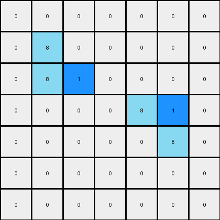

# 1-3aa6fb7a • 003 • refine_dreamer

---


Previous Code:
```python
"""
The task is to identify connected regions of azure pixels (color 8).  For each such region:

1.  Find all azure pixels within the region that satisfy *both* of these conditions:
    *   The pixel is *immediately to the right* of another azure pixel in the same region (i.e., has an azure pixel to its left).
    *   The pixel is adjacent (horizontally, vertically, or diagonally) to at least one white pixel (color 0).
2.  If there are any pixels satisfying both conditions in a region, choose *one* of them and change its color to blue (color 1). If multiple pixels satisfy the condition, the choice of which one to change doesn't seem to be specified by this single example, but for now, let's assume we just pick the first one we find. If no pixel satisfies both conditions in a region, do not change any pixels in that region.

Apply this process to each connected azure region in the input grid to produce the output grid.
"""

import numpy as np

def get_neighbors(grid, row, col):
    """Get the neighbors of a pixel, including diagonals."""
    rows, cols = grid.shape
    neighbors = []
    for i in range(max(0, row - 1), min(rows, row + 2)):
        for j in range(max(0, col - 1), min(cols, col + 2)):
            if (i, j) != (row, col):
                neighbors.append((i, j))
    return neighbors

def find_azure_regions(grid):
    """Find connected regions of azure (8) pixels."""
    rows, cols = grid.shape
    visited = set()
    regions = []

    def dfs(row, col, current_region):
        """Depth-first search to find connected components."""
        if (row, col) in visited or grid[row, col] != 8:
            return
        visited.add((row, col))
        current_region.append((row, col))

        for r, c in get_neighbors(grid, row, col):
          dfs(r,c, current_region)

    for row in range(rows):
        for col in range(cols):
            if grid[row, col] == 8 and (row, col) not in visited:
                current_region = []
                dfs(row, col, current_region)
                regions.append(current_region)
    return regions

def transform(input_grid):
    """Transforms the input grid according to the specified rule."""
    output_grid = np.copy(input_grid)
    azure_regions = find_azure_regions(input_grid)

    for region in azure_regions:
        target_pixel = None
        for row, col in region:
            # Check if the pixel is to the right of another azure pixel
            if (row, col - 1) in region:
                # Check if the pixel is adjacent to a white pixel
                neighbors = get_neighbors(input_grid, row, col)
                for r, c in neighbors:
                    if input_grid[r, c] == 0:
                        target_pixel = (row, col)
                        break  # Stop after finding the first suitable pixel
            if target_pixel:
                break  # Stop after finding a suitable pixel in the region

        if target_pixel:
            output_grid[target_pixel] = 1

    return output_grid
```

Train Set Results:

## Example 1:**

Input:
```
0 0 0 0 0 0 0
0 8 0 0 0 0 0
0 8 8 0 0 0 0
0 0 0 0 8 8 0
0 0 0 0 0 8 0
0 0 0 0 0 0 0
0 0 0 0 0 0 0
```
Expected Output:
```
0 0 0 0 0 0 0
0 8 1 0 0 0 0
0 8 8 0 0 0 0
0 0 0 0 8 8 0
0 0 0 0 1 8 0
0 0 0 0 0 0 0
0 0 0 0 0 0 0
```
Transformed Output:
```
0 0 0 0 0 0 0
0 8 0 0 0 0 0
0 8 1 0 0 0 0
0 0 0 0 8 1 0
0 0 0 0 0 8 0
0 0 0 0 0 0 0
0 0 0 0 0 0 0
```

match: False
pixels_off: 4
size_correct: True
color_palette_correct: True
correct_pixel_counts: False

## Example 2:**

Input:
```
0 0 0 0 8 8 0
0 0 0 0 0 8 0
0 0 8 0 0 0 0
0 0 8 8 0 0 0
0 0 0 0 0 0 0
0 0 0 0 8 0 0
0 0 0 8 8 0 0
```
Expected Output:
```
0 0 0 0 8 8 0
0 0 0 0 1 8 0
0 0 8 1 0 0 0
0 0 8 8 0 0 0
0 0 0 0 0 0 0
0 0 0 1 8 0 0
0 0 0 8 8 0 0
```
Transformed Output:
```
0 0 0 0 8 1 0
0 0 0 0 0 8 0
0 0 8 0 0 0 0
0 0 8 1 0 0 0
0 0 0 0 0 0 0
0 0 0 0 8 0 0
0 0 0 8 1 0 0
```

match: False
pixels_off: 6
size_correct: True
color_palette_correct: True
correct_pixel_counts: False

**INSTRUCTIONS**

The code above was generated based on observations from the first training
example

we have tested the transform function on each of the task example inputs and
compared with the expected output

review each of the examples provided and the results and consider how the
natural language program should be updated to accommodate this new knowledge

respond with the following deliverables:

- general assessment of the information provided and strategy for resolving the
  errors
- gather metrics about each of the examples and results - use code_execution to
  develop accurate reports on your assumptions
- a YAML block documenting facts - Focus on identifying objects, their properties, and the actions performed on them.
- a natural language program - Be as clear and concise as possible, providing a complete description of the transformation rule.


your responses should be considered as information in a report - not a
conversation
