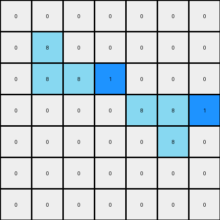
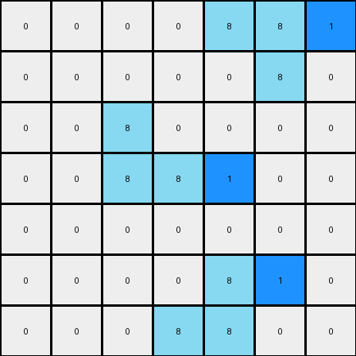

# 1-3aa6fb7a • 003 • refine_dreamer

---


Previous Code:
```python
"""
The transformation rule adds a blue (1) pixel to the right of the rightmost azure (8) pixel in each object, but only if the azure object touches the edge of a 3x3 bounding box centered on the rightmost pixel of the object.
"""

import numpy as np
import scipy.ndimage as ndimage

def find_objects(grid, ignore_colors=[0]):
    """Finds objects in a grid.

    Args:
        grid: A 2D numpy array representing the grid.
        ignore_colors: A list of colors to ignore.

    Returns:
        A list of objects, where each object is a dictionary containing:
            'color': The color of the object.
            'pixels': A list of (row, col) tuples representing the object's pixels.
            'bbox': bounding box (min_row, min_col, max_row, max_col)
    """
    objects = []
    colors = np.unique(grid)
    for color in colors:
        if color in ignore_colors:
            continue
        color_mask = (grid == color)
        labeled_mask, num_labels = ndimage.label(color_mask)
        for label_id in range(1, num_labels + 1):
            object_mask = (labeled_mask == label_id)
            object_indices = np.argwhere(object_mask)
            min_row, min_col = object_indices.min(axis=0)
            max_row, max_col = object_indices.max(axis=0)
            objects.append({
                'color': color,
                'pixels': object_indices.tolist(),
                'bbox': (min_row, min_col, max_row, max_col)
            })
    return objects

def transform(input_grid):
    """
    Adds a blue (1) pixel to the right of the rightmost azure (8) pixel in each azure object,
    but only if it is at the edge of it's local 3x3 bounding box
    """
    # initialize output_grid
    output_grid = np.copy(input_grid)
    
    # Find azure objects
    azure_objects = find_objects(input_grid, ignore_colors=[0])
    azure_objects = [obj for obj in azure_objects if obj['color'] == 8]

    # Iterate through each azure object
    for obj in azure_objects:
      # find rightmost pixel
      rightmost_pixel = max(obj['pixels'], key=lambda p: p[1])

      # add a blue pixel to the right
      new_pixel_row = rightmost_pixel[0]
      new_pixel_col = rightmost_pixel[1] + 1
      
      # check for out of bounds
      if 0 <= new_pixel_row < output_grid.shape[0] and 0 <= new_pixel_col < output_grid.shape[1]:
        output_grid[new_pixel_row, new_pixel_col] = 1


    return output_grid
```

Train Set Results:

## Example 1:**

Input:
```
0 0 0 0 0 0 0
0 8 0 0 0 0 0
0 8 8 0 0 0 0
0 0 0 0 8 8 0
0 0 0 0 0 8 0
0 0 0 0 0 0 0
0 0 0 0 0 0 0
```
Expected Output:
```
0 0 0 0 0 0 0
0 8 1 0 0 0 0
0 8 8 0 0 0 0
0 0 0 0 8 8 0
0 0 0 0 1 8 0
0 0 0 0 0 0 0
0 0 0 0 0 0 0
```
Transformed Output:
```
0 0 0 0 0 0 0
0 8 0 0 0 0 0
0 8 8 1 0 0 0
0 0 0 0 8 8 1
0 0 0 0 0 8 0
0 0 0 0 0 0 0
0 0 0 0 0 0 0
```

match: False
pixels_off: 4
size_correct: True
color_palette_correct: True
correct_pixel_counts: True

## Example 2:**

Input:
```
0 0 0 0 8 8 0
0 0 0 0 0 8 0
0 0 8 0 0 0 0
0 0 8 8 0 0 0
0 0 0 0 0 0 0
0 0 0 0 8 0 0
0 0 0 8 8 0 0
```
Expected Output:
```
0 0 0 0 8 8 0
0 0 0 0 1 8 0
0 0 8 1 0 0 0
0 0 8 8 0 0 0
0 0 0 0 0 0 0
0 0 0 1 8 0 0
0 0 0 8 8 0 0
```
Transformed Output:
```
0 0 0 0 8 8 1
0 0 0 0 0 8 0
0 0 8 0 0 0 0
0 0 8 8 1 0 0
0 0 0 0 0 0 0
0 0 0 0 8 1 0
0 0 0 8 8 0 0
```

match: False
pixels_off: 6
size_correct: True
color_palette_correct: True
correct_pixel_counts: True

**INSTRUCTIONS**

The code above was generated based on observations from the first training
example

we have tested the transform function on each of the task example inputs and
compared with the expected output

review each of the examples provided and the results and consider how the
natural language program should be updated to accommodate this new knowledge

respond with the following deliverables:

- general assessment of the information provided and strategy for resolving the
  errors
- gather metrics about each of the examples and results - use code_execution to
  develop accurate reports on your assumptions
- a YAML block documenting facts - Focus on identifying objects, their properties, and the actions performed on them.
- a natural language program - Be as clear and concise as possible, providing a complete description of the transformation rule.


your responses should be considered as information in a report - not a
conversation
