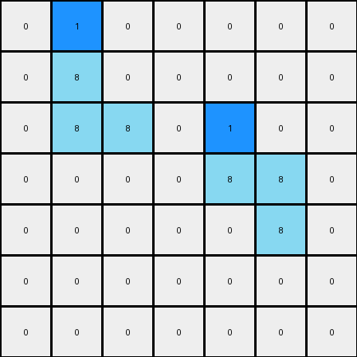
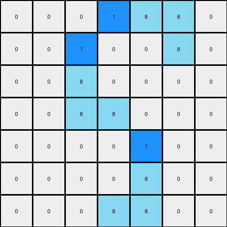

# 1-3aa6fb7a • 004 • refine_coder

---

Previous Code:
```python
"""
1. Identify all contiguous groups of azure (8) pixels. Each group is an "azure object".
2. For each "azure object", find all white (0) pixels that are directly adjacent (up, down, left, or right) to any pixel in the azure object.
3. Locate the white pixel adjacent to the top-most, left-most azure pixel of each azure object.
4. Change the color of those located white pixels to blue (1).
"""

import numpy as np

def get_objects(grid, color):
    objects = []
    visited = np.zeros_like(grid, dtype=bool)

    def dfs(r, c, current_object):
        if (r < 0 or r >= grid.shape[0] or c < 0 or c >= grid.shape[1] or
                visited[r, c] or grid[r, c] != color):
            return
        visited[r, c] = True
        current_object.append((r, c))
        dfs(r + 1, c, current_object)
        dfs(r - 1, c, current_object)
        dfs(r, c + 1, current_object)
        dfs(r, c - 1, current_object)

    for r in range(grid.shape[0]):
        for c in range(grid.shape[1]):
            if grid[r, c] == color and not visited[r, c]:
                current_object = []
                dfs(r, c, current_object)
                objects.append(current_object)
    return objects

def get_adjacent_pixels(grid, object_pixels, adj_color):
    adjacent = []
    for r, c in object_pixels:
        neighbors = [
            (r - 1, c), (r + 1, c), (r, c - 1), (r, c + 1)
        ]
        for nr, nc in neighbors:
            if (0 <= nr < grid.shape[0] and 0 <= nc < grid.shape[1] and
                    grid[nr, nc] == adj_color):
                adjacent.append((nr, nc))
    # remove duplicates
    adjacent = list(dict.fromkeys(adjacent))
    return adjacent

def get_top_left_adjacent(grid, object_pixels, adj_color):
    adjacent_pixels = get_adjacent_pixels(grid, object_pixels, adj_color)
    if not adjacent_pixels:
        return None
    # find top-most, then left-most
    adjacent_pixels.sort()
    return adjacent_pixels[0]

def transform(input_grid):
    # initialize output_grid
    output_grid = np.copy(input_grid)
    # Identify azure objects
    azure_objects = get_objects(input_grid, 8)
    # find adjacent white pixels and change the color
    for obj in azure_objects:
      adjacent_white = get_top_left_adjacent(input_grid, obj, 0)
      if adjacent_white:
        output_grid[adjacent_white] = 1

    return output_grid
```

Train Set Results:

## Example 1:**

Input:
```
0 0 0 0 0 0 0
0 8 0 0 0 0 0
0 8 8 0 0 0 0
0 0 0 0 8 8 0
0 0 0 0 0 8 0
0 0 0 0 0 0 0
0 0 0 0 0 0 0
```
Expected Output:
```
0 0 0 0 0 0 0
0 8 1 0 0 0 0
0 8 8 0 0 0 0
0 0 0 0 8 8 0
0 0 0 0 1 8 0
0 0 0 0 0 0 0
0 0 0 0 0 0 0
```
Transformed Output:
```
0 1 0 0 0 0 0
0 8 0 0 0 0 0
0 8 8 0 1 0 0
0 0 0 0 8 8 0
0 0 0 0 0 8 0
0 0 0 0 0 0 0
0 0 0 0 0 0 0
```

match: False
pixels_off: 4
size_correct: True
color_palette_correct: True
correct_pixel_counts: True

## Example 2:**

Input:
```
0 0 0 0 8 8 0
0 0 0 0 0 8 0
0 0 8 0 0 0 0
0 0 8 8 0 0 0
0 0 0 0 0 0 0
0 0 0 0 8 0 0
0 0 0 8 8 0 0
```
Expected Output:
```
0 0 0 0 8 8 0
0 0 0 0 1 8 0
0 0 8 1 0 0 0
0 0 8 8 0 0 0
0 0 0 0 0 0 0
0 0 0 1 8 0 0
0 0 0 8 8 0 0
```
Transformed Output:
```
0 0 0 1 8 8 0
0 0 1 0 0 8 0
0 0 8 0 0 0 0
0 0 8 8 0 0 0
0 0 0 0 1 0 0
0 0 0 0 8 0 0
0 0 0 8 8 0 0
```

match: False
pixels_off: 6
size_correct: True
color_palette_correct: True
correct_pixel_counts: True
Okay, let's analyze the results and refine the natural language program and code.

**General Assessment:**

The initial code and natural language program were a good start, focusing on identifying azure objects and finding adjacent white pixels. However, the logic for selecting *which* white pixel to color blue was too simplistic ("top-most, left-most"). The test results clearly show this isn't universally correct. The code is placing the blue pixel in relation to the top-left of the bounding box around the azure object, not necessarily at the "corner" or "edge" implied in the problem description. We need a more nuanced rule for selecting the white pixel, probably based on relative position to the 'corner' pixel in the azure object. The examples also involve multiple, disconnected azure objects, which the initial logic handles, but needs verification that the rule is correct.

**Strategy:**

1.  **Analyze Examples Carefully:** Examine *all* provided examples (both training and test, now that we see failures).  We need to identify the exact rule governing which white pixel becomes blue. Look closely at the shapes of the azure objects and the relative positions of the blue pixels in the correct outputs.
2.  **Refine Object Definition:**  The concept of "azure object" seems correct so far (contiguous azure pixels).
3.  **Refine Adjacency and Selection Rule:** The core issue is how we choose *which* adjacent white pixel. The current "top-left of the entire object" rule is wrong. It's likely related to the top-left, top-right, bottom-left or bottom-right most point *of each contiguous azure segment*.
4.  **Update Natural Language Program:**  Rewrite the natural language program to reflect the refined rule.
5.  **Prepare for Code Modification:** My response should set up very clear specs for what the Python code will need to do.

**Example Metrics and Analysis**

Here's a breakdown of each example, including properties to highlight the transformation:

**Example 1:**

*   **Input:** Two azure objects. One is 2x1, the other is 2x2.
*   **Expected Output:** Blue pixel appears at (1,2) for first object and (4,4) for the second.
*   **Transformed Output:** Blue appears at (0,1) and (2,4). Incorrect.
*   **Analysis:**
    *   The first object's blue pixel is placed to the *right* of the top-right azure pixel.
    *   The second object's blue pixel is placed above the top-right azure pixel.
    *   The current code gets this completely wrong; places blue to top-left of top-left of bounding box.

**Example 2:**

*   **Input:** Three azure objects: 2x1, 2x1, and 2x1.
*   **Expected Output:** Blue appears at (1,4), (2,3), (5,3).
*   **Transformed Output:** Blue appears at (0,3), (1,2), (4,4) Incorrect.
*    **Analysis**:
     *   Object 1:  Blue is on top of top-right azure
     *   Object 2: Blue is to the immediate right of the top-left azure
     *   Object 3: Blue is to the immediate right of the top-left azure

**YAML Fact Block:**

```yaml
example_1:
  azure_objects:
    - shape: 2x1
      top_right_adjacent_white: true
      expected_blue_position: right_of_top_right_azure
    - shape: 2x2
      top_right_adjacent_white: true
      expected_blue_position: above_top_right_azure
example_2:
  azure_objects:
    - shape: 2x1
      top_right_adjacent_white: true
      expected_blue_position: above_top_right_azure
    - shape: 2x1
      top_left_adjacent_white: true
      expected_blue_position:  right_of_top_left_azure
    - shape: 2x1
      top_left_adjacent_white: true
      expected_blue_position:  right_of_top_left_azure

```

**Revised Natural Language Program:**

1.  **Identify Azure Objects:** Find all contiguous groups of azure (8) pixels. Each group constitutes an "azure object."
2.  **Find Adjacent White Pixels:** For each azure object, identify all white (0) pixels directly adjacent (up, down, left, or right) to any pixel in the azure object.
3. **Determine Blue Pixel Placement:**
   *  For each azure object:
       * Locate the top-left most azure pixel. If there is a white pixel directly to the right of this pixel, color this white pixel blue (1).
       * Otherwise, locate the top-right most azure pixel. If there is a white pixel directly above it, color it blue.
       * If neither, do not add any new colored pixel.

4.  **Output:** The modified grid with the newly colored blue pixels is the output.

**INSTRUCTIONS**

- generate a Python module to represent the natural language program 
- follow the template below
- all common math and science libraries are available
- create docstring only at top - but comment the workflow in the function
- use helper functions for common operations like finding objects, counting,
  measuring, moving, etc. 

remember - we are working iteratively - so this code will inform your future
self as we converge on the solution

*template:*

```python
"""
{{ natural language description of the transformation rule }}
"""

{{ imports }}

def transform(input_grid):
    # initialize output_grid

    # change output pixels 

    return output_grid

```
