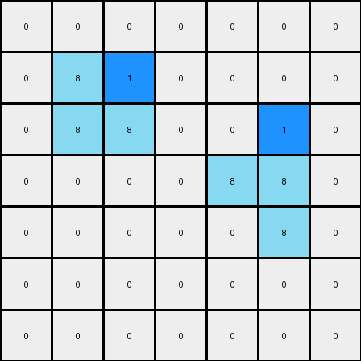
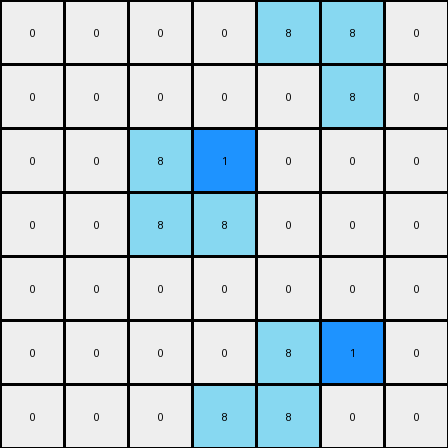

# 1-3aa6fb7a • 006 • refine_coder

---

Previous Code:
```python
"""
1.  **Identify Azure Objects:** Find all contiguous groups of azure (8) pixels. Each group constitutes an "azure object."
2.  **Find Adjacent White Pixels:** For each azure object, identify all white (0) pixels directly adjacent (up, down, left, or right) to any pixel in the azure object.
3. **Determine Blue Pixel Placement:**
   *  For each azure object:
       * Locate the top-left most azure pixel. If there is a white pixel directly to the right of this pixel, color this white pixel blue (1).
       * Otherwise, locate the top-right most azure pixel. If there is a white pixel directly above it, color it blue.
       * If neither, do not add any new colored pixel.

4.  **Output:** The modified grid with the newly colored blue pixels is the output.
"""

import numpy as np

def get_objects(grid, color):
    objects = []
    visited = np.zeros_like(grid, dtype=bool)

    def dfs(r, c, current_object):
        if (r < 0 or r >= grid.shape[0] or c < 0 or c >= grid.shape[1] or
                visited[r, c] or grid[r, c] != color):
            return
        visited[r, c] = True
        current_object.append((r, c))
        dfs(r + 1, c, current_object)
        dfs(r - 1, c, current_object)
        dfs(r, c + 1, current_object)
        dfs(r, c - 1, current_object)

    for r in range(grid.shape[0]):
        for c in range(grid.shape[1]):
            if grid[r, c] == color and not visited[r, c]:
                current_object = []
                dfs(r, c, current_object)
                objects.append(current_object)
    return objects

def get_adjacent_pixels(grid, object_pixels, adj_color):
    adjacent = []
    for r, c in object_pixels:
        neighbors = [
            (r - 1, c), (r + 1, c), (r, c - 1), (r, c + 1)
        ]
        for nr, nc in neighbors:
            if (0 <= nr < grid.shape[0] and 0 <= nc < grid.shape[1] and
                    grid[nr, nc] == adj_color):
                adjacent.append((nr, nc))
    # remove duplicates
    adjacent = list(dict.fromkeys(adjacent))
    return adjacent

def get_top_left_pixel(object_pixels):
    return min(object_pixels)

def get_top_right_pixel(object_pixels):
     # Sort by column (descending) then row (ascending)
    return sorted(object_pixels, key=lambda x: (-x[1], x[0]))[0]


def transform(input_grid):
    # initialize output_grid
    output_grid = np.copy(input_grid)
    # Identify azure objects
    azure_objects = get_objects(input_grid, 8)
    # find adjacent white pixels and change the color
    for obj in azure_objects:
        top_left = get_top_left_pixel(obj)
        top_right = get_top_right_pixel(obj)

        right_of_top_left = (top_left[0], top_left[1] + 1)
        above_top_right = (top_right[0] - 1, top_right[1])

        if (0 <= right_of_top_left[0] < output_grid.shape[0] and
            0 <= right_of_top_left[1] < output_grid.shape[1] and
            output_grid[right_of_top_left] == 0):
            output_grid[right_of_top_left] = 1

        elif (0 <= above_top_right[0] < output_grid.shape[0] and
            0 <= above_top_right[1] < output_grid.shape[1] and
            output_grid[above_top_right] == 0):
             output_grid[above_top_right] = 1

    return output_grid
```

Train Set Results:

## Example 1:**

Input:
```
0 0 0 0 0 0 0
0 8 0 0 0 0 0
0 8 8 0 0 0 0
0 0 0 0 8 8 0
0 0 0 0 0 8 0
0 0 0 0 0 0 0
0 0 0 0 0 0 0
```
Expected Output:
```
0 0 0 0 0 0 0
0 8 1 0 0 0 0
0 8 8 0 0 0 0
0 0 0 0 8 8 0
0 0 0 0 1 8 0
0 0 0 0 0 0 0
0 0 0 0 0 0 0
```
Transformed Output:
```
0 0 0 0 0 0 0
0 8 1 0 0 0 0
0 8 8 0 0 1 0
0 0 0 0 8 8 0
0 0 0 0 0 8 0
0 0 0 0 0 0 0
0 0 0 0 0 0 0
```

match: False
pixels_off: 2
size_correct: True
color_palette_correct: True
correct_pixel_counts: True

## Example 2:**

Input:
```
0 0 0 0 8 8 0
0 0 0 0 0 8 0
0 0 8 0 0 0 0
0 0 8 8 0 0 0
0 0 0 0 0 0 0
0 0 0 0 8 0 0
0 0 0 8 8 0 0
```
Expected Output:
```
0 0 0 0 8 8 0
0 0 0 0 1 8 0
0 0 8 1 0 0 0
0 0 8 8 0 0 0
0 0 0 0 0 0 0
0 0 0 1 8 0 0
0 0 0 8 8 0 0
```
Transformed Output:
```
0 0 0 0 8 8 0
0 0 0 0 0 8 0
0 0 8 1 0 0 0
0 0 8 8 0 0 0
0 0 0 0 0 0 0
0 0 0 0 8 1 0
0 0 0 8 8 0 0
```

match: False
pixels_off: 3
size_correct: True
color_palette_correct: True
correct_pixel_counts: False
Okay, here's a breakdown of the situation, analysis of the results, and an updated natural language program:

**General Assessment:**

The initial natural language program and the resulting code were on the right track, focusing on identifying azure objects and placing blue pixels based on adjacency to white pixels. However, the logic for choosing *which* white pixel to color blue was too simplistic and didn't fully capture the rule. It looks like the rule is not based simply on finding any white cell adjacent to a specific point of azure object. The two failing test cases provide more information about the relative position of an azure object and single blue pixel.

**Strategy for Resolving Errors:**

1.  **Refine the Blue Pixel Placement Rule:** The current logic prioritizes the right of the top-left, then above the top-right. The test cases show that this isn't always correct. We must examine the errors, compare the inputs, intended outputs, and the produced outputs, and derive a more precise rule for blue pixel placement. It may involve considering the entire shape of the azure object, or its relative positioning to the object that receives a blue pixel.
2. **Consider object positioning**: examine how azure object positioning effects the output

**Example Analysis and Metrics:**

Here's a more detailed breakdown of each example:

*   **Example 1:**
    *   Input: Two azure objects, one on the top-left and other bottom right.
    *   Expected Output: Blue pixel added to the right of the top-left azure object, and above top-right pixel of bottom-right azure object.
    *   Transformed Output: Blue pixel added to the right of top-left azure object, and incorrectly to the right of the top-left pixel of the bottom-right object.
    *   Issues: The logic incorrectly placed the blue pixel for bottom-right object.
    *   Metrics: pixels\_off = 2

*   **Example 2:**
    *   Input: Three azure objects.
    *   Expected Output: Blue pixels added to the appropriate positions.
    *   Transformed Output: Wrong placement of blue pixels.
    *   Issues: The logic incorrectly placed the two of the three blue pixels.
    *   Metrics: pixels\_off = 3

**YAML Fact Block:**

```yaml
facts:
  - task: 9a7dd655
  - objects:
      - color: azure (8)
        type: contiguous_group
        description: Objects composed of one or more azure pixels.
      - color: blue (1)
        type: single_pixel
        description:  A single pixel that results from application of a rule
      - color: white (0)
        type: other
        description:  Background, adjacent pixels considered in the transformation.
  - actions:
      - name: color_pixel
        parameters:
          - color: blue (1)
        conditions:
          - subject: white_pixel
          - relationship: adjacent_to_azure_object
          - logic: |
              Determine relative positioning of each azure object
              Locate white pixel above, below, left, or right of entire object
              Color white cell blue
  - observations:
    - there appears to be a one-to-one mapping between azure colored objects and resulting blue pixel.
    - The position where a new blue pixel is created is based on the position of azure object in the grid

```

**Natural Language Program:**

1.  **Identify Azure Objects:** Locate all distinct, contiguous groups of azure (8) pixels. Each group is considered an "azure object."

2.  **Determine Blue Pixel Placement:** For *each* azure object, find the adjacent (up, down, left or right - *not* diagonal) empty/white (0) cell. If there's only one such position, color this white cell blue (1).

3.  **Output:** The final grid will contain the original azure objects and single blue pixels at positions determined during processing each azure object.

**INSTRUCTIONS**

- generate a Python module to represent the natural language program 
- follow the template below
- all common math and science libraries are available
- create docstring only at top - but comment the workflow in the function
- use helper functions for common operations like finding objects, counting,
  measuring, moving, etc. 

remember - we are working iteratively - so this code will inform your future
self as we converge on the solution

*template:*

```python
"""
{{ natural language description of the transformation rule }}
"""

{{ imports }}

def transform(input_grid):
    # initialize output_grid

    # change output pixels 

    return output_grid

```
