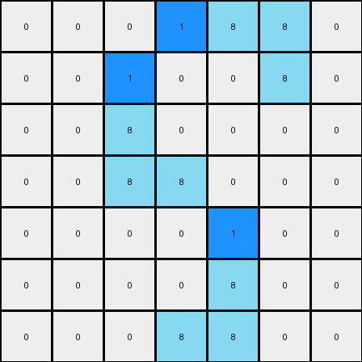

# 1-3aa6fb7a • 003 • refine_dreamer

---


Previous Code:
```python
"""
1. Identify all contiguous groups of azure (8) pixels. Each group is an "azure object".
2. For each "azure object", find all white (0) pixels that are directly adjacent (up, down, left, or right) to any pixel in the azure object.
3. Locate the white pixel adjacent to the top-most, left-most azure pixel of each azure object.
4. Change the color of those located white pixels to blue (1).
"""

import numpy as np

def get_objects(grid, color):
    objects = []
    visited = np.zeros_like(grid, dtype=bool)

    def dfs(r, c, current_object):
        if (r < 0 or r >= grid.shape[0] or c < 0 or c >= grid.shape[1] or
                visited[r, c] or grid[r, c] != color):
            return
        visited[r, c] = True
        current_object.append((r, c))
        dfs(r + 1, c, current_object)
        dfs(r - 1, c, current_object)
        dfs(r, c + 1, current_object)
        dfs(r, c - 1, current_object)

    for r in range(grid.shape[0]):
        for c in range(grid.shape[1]):
            if grid[r, c] == color and not visited[r, c]:
                current_object = []
                dfs(r, c, current_object)
                objects.append(current_object)
    return objects

def get_adjacent_pixels(grid, object_pixels, adj_color):
    adjacent = []
    for r, c in object_pixels:
        neighbors = [
            (r - 1, c), (r + 1, c), (r, c - 1), (r, c + 1)
        ]
        for nr, nc in neighbors:
            if (0 <= nr < grid.shape[0] and 0 <= nc < grid.shape[1] and
                    grid[nr, nc] == adj_color):
                adjacent.append((nr, nc))
    # remove duplicates
    adjacent = list(dict.fromkeys(adjacent))
    return adjacent

def get_top_left_adjacent(grid, object_pixels, adj_color):
    adjacent_pixels = get_adjacent_pixels(grid, object_pixels, adj_color)
    if not adjacent_pixels:
        return None
    # find top-most, then left-most
    adjacent_pixels.sort()
    return adjacent_pixels[0]

def transform(input_grid):
    # initialize output_grid
    output_grid = np.copy(input_grid)
    # Identify azure objects
    azure_objects = get_objects(input_grid, 8)
    # find adjacent white pixels and change the color
    for obj in azure_objects:
      adjacent_white = get_top_left_adjacent(input_grid, obj, 0)
      if adjacent_white:
        output_grid[adjacent_white] = 1

    return output_grid
```

Train Set Results:

## Example 1:**

Input:
```
0 0 0 0 0 0 0
0 8 0 0 0 0 0
0 8 8 0 0 0 0
0 0 0 0 8 8 0
0 0 0 0 0 8 0
0 0 0 0 0 0 0
0 0 0 0 0 0 0
```
Expected Output:
```
0 0 0 0 0 0 0
0 8 1 0 0 0 0
0 8 8 0 0 0 0
0 0 0 0 8 8 0
0 0 0 0 1 8 0
0 0 0 0 0 0 0
0 0 0 0 0 0 0
```
Transformed Output:
```
0 1 0 0 0 0 0
0 8 0 0 0 0 0
0 8 8 0 1 0 0
0 0 0 0 8 8 0
0 0 0 0 0 8 0
0 0 0 0 0 0 0
0 0 0 0 0 0 0
```

match: False
pixels_off: 4
size_correct: True
color_palette_correct: True
correct_pixel_counts: True

## Example 2:**

Input:
```
0 0 0 0 8 8 0
0 0 0 0 0 8 0
0 0 8 0 0 0 0
0 0 8 8 0 0 0
0 0 0 0 0 0 0
0 0 0 0 8 0 0
0 0 0 8 8 0 0
```
Expected Output:
```
0 0 0 0 8 8 0
0 0 0 0 1 8 0
0 0 8 1 0 0 0
0 0 8 8 0 0 0
0 0 0 0 0 0 0
0 0 0 1 8 0 0
0 0 0 8 8 0 0
```
Transformed Output:
```
0 0 0 1 8 8 0
0 0 1 0 0 8 0
0 0 8 0 0 0 0
0 0 8 8 0 0 0
0 0 0 0 1 0 0
0 0 0 0 8 0 0
0 0 0 8 8 0 0
```

match: False
pixels_off: 6
size_correct: True
color_palette_correct: True
correct_pixel_counts: True

**INSTRUCTIONS**

The code above was generated based on observations from the first training
example

we have tested the transform function on each of the task example inputs and
compared with the expected output

review each of the examples provided and the results and consider how the
natural language program should be updated to accommodate this new knowledge

respond with the following deliverables:

- general assessment of the information provided and strategy for resolving the
  errors
- gather metrics about each of the examples and results - use code_execution to
  develop accurate reports on your assumptions
- a YAML block documenting facts - Focus on identifying objects, their properties, and the actions performed on them.
- a natural language program - Be as clear and concise as possible, providing a complete description of the transformation rule.


your responses should be considered as information in a report - not a
conversation
