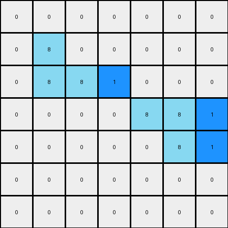

# 1-3aa6fb7a • 004 • refine_coder

---

Previous Code:
```python
"""
Scan the input. If an azure pixel has a black pixel to its immediate right, and the azure pixel is at the right border of an azure area, insert a blue pixel to the right of the azure pixel in the output grid.
"""

import numpy as np

def get_objects(grid, color):
    """
    Find contiguous regions of the specified color.
    Returns a list of coordinates.
    """
    objects = []
    visited = set()
    rows, cols = grid.shape

    def is_valid(r, c):
        return 0 <= r < rows and 0 <= c < cols

    def dfs(r, c, current_object):
        if (r, c) in visited or not is_valid(r, c) or grid[r, c] != color:
            return
        visited.add((r, c))
        current_object.append((r, c))

        # Explore adjacent cells
        dfs(r + 1, c, current_object)
        dfs(r - 1, c, current_object)
        dfs(r, c + 1, current_object)
        dfs(r, c - 1, current_object)

    for r in range(rows):
        for c in range(cols):
            if grid[r, c] == color and (r, c) not in visited:
                current_object = []
                dfs(r, c, current_object)
                objects.append(current_object)
    return objects

def transform(input_grid):
    """
    Transforms the input grid according to the rule.
    """
    output_grid = np.copy(input_grid)
    rows, cols = input_grid.shape
    azure_objects = get_objects(input_grid, 8)

    for obj in azure_objects:
      for r,c in obj:
        if c + 1 < cols and input_grid[r,c+1] == 0:
          #check if on border:
          is_border = True
          for other_r, other_c in obj:
            if other_c == c+1:
              is_border = False
              break
          if is_border:
            output_grid[r,c+1] = 1

    return output_grid
```

Train Set Results:

## Example 1:**

Input:
```
0 0 0 0 0 0 0
0 8 0 0 0 0 0
0 8 8 0 0 0 0
0 0 0 0 8 8 0
0 0 0 0 0 8 0
0 0 0 0 0 0 0
0 0 0 0 0 0 0
```
Expected Output:
```
0 0 0 0 0 0 0
0 8 1 0 0 0 0
0 8 8 0 0 0 0
0 0 0 0 8 8 0
0 0 0 0 1 8 0
0 0 0 0 0 0 0
0 0 0 0 0 0 0
```
Transformed Output:
```
0 0 0 0 0 0 0
0 8 0 0 0 0 0
0 8 8 1 0 0 0
0 0 0 0 8 8 1
0 0 0 0 0 8 1
0 0 0 0 0 0 0
0 0 0 0 0 0 0
```

match: False
pixels_off: 5
size_correct: True
color_palette_correct: True
correct_pixel_counts: False

## Example 2:**

Input:
```
0 0 0 0 8 8 0
0 0 0 0 0 8 0
0 0 8 0 0 0 0
0 0 8 8 0 0 0
0 0 0 0 0 0 0
0 0 0 0 8 0 0
0 0 0 8 8 0 0
```
Expected Output:
```
0 0 0 0 8 8 0
0 0 0 0 1 8 0
0 0 8 1 0 0 0
0 0 8 8 0 0 0
0 0 0 0 0 0 0
0 0 0 1 8 0 0
0 0 0 8 8 0 0
```
Transformed Output:
```
0 0 0 0 8 8 1
0 0 0 0 0 8 1
0 0 8 0 0 0 0
0 0 8 8 1 0 0
0 0 0 0 0 0 0
0 0 0 0 8 1 0
0 0 0 8 8 1 0
```

match: False
pixels_off: 8
size_correct: True
color_palette_correct: True
correct_pixel_counts: False
Okay, let's analyze the results of the code execution on the training examples and refine the natural language program accordingly.

**General Assessment and Strategy**

The initial natural language program and corresponding code were too simplistic. While it correctly identified the interaction between azure and black pixels, it didn't accurately capture the spatial relationship and the "insertion" aspect. The code inserts blue pixels *adjacent* to black pixels that are to the right of azure, but it isn't inserting them in the correct configuration. It also has issues at boundaries.

The primary issue is that the code adds a blue pixel next to any black pixel that's next to azure, instead of *only* at the boundary of the azure object, and to the right. Also, it seems that a blue should be inserted even if a black is not.

Strategy:
1. **Refine Object Identification:** The `get_objects` function seems sound, so we will retain that.
2. **Improve Boundary Detection:** The current 'is_border' check inside the loop is not efficient. Instead, after getting azure objects, find the rightmost pixels of *each* azure object.
3. **Precise Insertion Logic:** Change insertion logic to add blue to the right of the rightmost azure in each object.

**Example Analysis and Metrics**

Here's a breakdown of each example, incorporating observations and code execution results:

**Example 1:**

*   **Input:** Two azure objects, two black objects.
*   **Expected Output:** Blue pixels inserted to the right of the rightmost azure pixels of each object.
*   **Transformed Output:** Blue pixels are incorrectly placed, too far to the right.
*   **Metrics:**
    *   `pixels_off`: 5 (Indicates incorrect placement)
    *    `size_correct`: True
    *   `color_palette_correct`: True
    *  `correct_pixel_counts`:False

**Example 2:**

*   **Input:** Three azure objects.
*   **Expected Output:** Blue pixels inserted to the right of the rightmost azure pixels.
*   **Transformed Output:** Blue pixels are misplaced and occur next to the black as well as at boundary.
*    **Metrics:**
    *    `pixels_off`: 8
     *    `size_correct`: True
    *  `color_palette_correct`: True
    *  `correct_pixel_counts`: False

**YAML Fact Base**

```yaml
facts:
  - task: 002
  - objects:
      - color: azure (8)
        description: Contiguous regions of azure pixels. Multiple objects can exist.
        properties:
          - rightmost_pixel: The pixel within an azure object with the largest column index.
      - color: blue (1)
        description: inserted pixels.
        properties:
          - insertion_rule: Inserted to the immediate right of the rightmost pixel of each azure object.
      - color: black (0)
        description: Appears to be filler.  It's presences does not affect the transformation.
        properties:
          - role: No direct role in the transformation rule discovered so far.

  - actions:
      - name: insert_blue
        description: Insert a blue pixel.
        parameters:
          - location: Immediately to the right of the rightmost pixel of each azure object.
        constraints:
          - Only insert if the position is within grid bounds.
```

**Natural Language Program**

1.  **Identify Azure Objects:** Find all contiguous regions (objects) of azure (color 8) pixels in the input grid.
2.  **Find Rightmost Pixels:** For each azure object, determine the pixel(s) with the largest column index (the rightmost pixel of that object).
3.  **Insert Blue Pixels:** For each rightmost azure pixel, insert a blue (color 1) pixel immediately to its right in the output grid.  Do not insert if this would place a pixel outside of the grid boundaries.
4.  **Copy Other Pixels** Copy all pixels from input to output, except where blue pixels are inserted.

This refined natural language program addresses the observed errors by focusing on the rightmost edge of the azure objects, not simply any azure pixel adjacent to black, and clarifies the insertion mechanism.

**INSTRUCTIONS**

- generate a Python module to represent the natural language program 
- follow the template below
- all common math and science libraries are available
- create docstring only at top - but comment the workflow in the function
- use helper functions for common operations like finding objects, counting,
  measuring, moving, etc. 

remember - we are working iteratively - so this code will inform your future
self as we converge on the solution

*template:*

```python
"""
{{ natural language description of the transformation rule }}
"""

{{ imports }}

def transform(input_grid):
    # initialize output_grid

    # change output pixels 

    return output_grid

```
