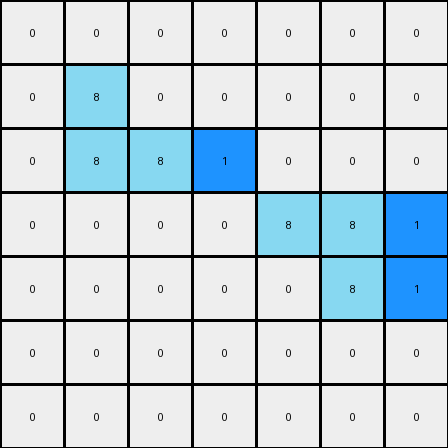

# 1-3aa6fb7a • 005 • refine_dreamer

---


Previous Code:
```python
"""
1.  **Identify Azure Objects:** Find all contiguous regions (objects) of azure (color 8) pixels in the input grid.
2.  **Find Rightmost Pixels:** For each azure object, determine the pixel(s) with the largest column index (the rightmost pixel of that object).
3.  **Insert Blue Pixels:** For each rightmost azure pixel, insert a blue (color 1) pixel immediately to its right in the output grid.  Do not insert if this would place a pixel outside of the grid boundaries.
4.  **Copy Other Pixels** Copy all pixels from input to output, except where blue pixels are inserted.
"""

import numpy as np

def get_objects(grid, color):
    """
    Find contiguous regions of the specified color.
    Returns a list of coordinates.
    """
    objects = []
    visited = set()
    rows, cols = grid.shape

    def is_valid(r, c):
        return 0 <= r < rows and 0 <= c < cols

    def dfs(r, c, current_object):
        if (r, c) in visited or not is_valid(r, c) or grid[r, c] != color:
            return
        visited.add((r, c))
        current_object.append((r, c))

        # Explore adjacent cells
        dfs(r + 1, c, current_object)
        dfs(r - 1, c, current_object)
        dfs(r, c + 1, current_object)
        dfs(r, c - 1, current_object)

    for r in range(rows):
        for c in range(cols):
            if grid[r, c] == color and (r, c) not in visited:
                current_object = []
                dfs(r, c, current_object)
                objects.append(current_object)
    return objects

def find_rightmost_pixels(object_coords):
    """
    Finds the rightmost pixel(s) of an object.  Handles cases where multiple pixels
    share the maximum column index.
    """
    if not object_coords:
        return []
    max_col = max(c for r, c in object_coords)
    return [(r, c) for r, c in object_coords if c == max_col]

def transform(input_grid):
    """
    Transforms the input grid according to the rule.
    """
    output_grid = np.copy(input_grid)
    rows, cols = input_grid.shape

    # 1. Identify Azure Objects
    azure_objects = get_objects(input_grid, 8)

    # 2. Find Rightmost Pixels
    for obj in azure_objects:
        rightmost_pixels = find_rightmost_pixels(obj)

        # 3. Insert Blue Pixels
        for r, c in rightmost_pixels:
            if c + 1 < cols:  # Check boundary
                output_grid[r, c + 1] = 1

    return output_grid
```

Train Set Results:

## Example 1:**

Input:
```
0 0 0 0 0 0 0
0 8 0 0 0 0 0
0 8 8 0 0 0 0
0 0 0 0 8 8 0
0 0 0 0 0 8 0
0 0 0 0 0 0 0
0 0 0 0 0 0 0
```
Expected Output:
```
0 0 0 0 0 0 0
0 8 1 0 0 0 0
0 8 8 0 0 0 0
0 0 0 0 8 8 0
0 0 0 0 1 8 0
0 0 0 0 0 0 0
0 0 0 0 0 0 0
```
Transformed Output:
```
0 0 0 0 0 0 0
0 8 0 0 0 0 0
0 8 8 1 0 0 0
0 0 0 0 8 8 1
0 0 0 0 0 8 1
0 0 0 0 0 0 0
0 0 0 0 0 0 0
```

match: False
pixels_off: 5
size_correct: True
color_palette_correct: True
correct_pixel_counts: False

## Example 2:**

Input:
```
0 0 0 0 8 8 0
0 0 0 0 0 8 0
0 0 8 0 0 0 0
0 0 8 8 0 0 0
0 0 0 0 0 0 0
0 0 0 0 8 0 0
0 0 0 8 8 0 0
```
Expected Output:
```
0 0 0 0 8 8 0
0 0 0 0 1 8 0
0 0 8 1 0 0 0
0 0 8 8 0 0 0
0 0 0 0 0 0 0
0 0 0 1 8 0 0
0 0 0 8 8 0 0
```
Transformed Output:
```
0 0 0 0 8 8 1
0 0 0 0 0 8 1
0 0 8 0 0 0 0
0 0 8 8 1 0 0
0 0 0 0 0 0 0
0 0 0 0 8 1 0
0 0 0 8 8 1 0
```

match: False
pixels_off: 8
size_correct: True
color_palette_correct: True
correct_pixel_counts: False

**INSTRUCTIONS**

The code above was generated based on observations from the first training
example

we have tested the transform function on each of the task example inputs and
compared with the expected output

review each of the examples provided and the results and consider how the
natural language program should be updated to accommodate this new knowledge

respond with the following deliverables:

- general assessment of the information provided and strategy for resolving the
  errors
- gather metrics about each of the examples and results - use code_execution to
  develop accurate reports on your assumptions
- a YAML block documenting facts - Focus on identifying objects, their properties, and the actions performed on them.
- a natural language program - Be as clear and concise as possible, providing a complete description of the transformation rule.


your responses should be considered as information in a report - not a
conversation
