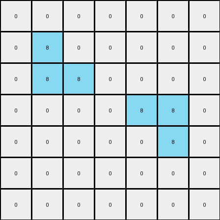

# 1-3aa6fb7a • 008 • example_2 - CODE

---

**input**
```
0 0 0 0 0 0 0
0 8 0 0 0 0 0
0 8 8 0 0 0 0
0 0 0 0 8 8 0
0 0 0 0 0 8 0
0 0 0 0 0 0 0
0 0 0 0 0 0 0
```




**output**
```
0 0 0 0 0 0 0
0 8 1 0 0 0 0
0 8 8 0 0 0 0
0 0 0 0 8 8 0
0 0 0 0 1 8 0
0 0 0 0 0 0 0
0 0 0 0 0 0 0
```


Okay, here's a breakdown of my observations and plan for the provided input-output example:

**General Assessment:**

The task involves a grid transformation where the input and output grids have the same dimensions (7x7). The primary change appears to be the introduction of the color blue (represented by '1') in specific locations relative to existing azure (represented by '8') pixels. The strategy will be to identify the spatial relationship between the azure pixels in the input and the placement of the new blue pixels in the output.

**Metrics and Observations (using visual inspection, no code execution needed for this simple case):**

*   **Input Grid:**
    *   Dimensions: 7x7
    *   Colors present: Black (0), Azure (8)
    *   Azure pixel coordinates: (1,1), (2,1), (2,2), (3,4), (3,5), (4,5)
*   **Output Grid:**
    *   Dimensions: 7x7
    *   Colors present: Black (0), Azure (8), Blue (1)
    *   Azure pixel coordinates: (1,1), (2,1), (2,2), (3,4), (3,5), (4,5) - *Same as input*
    *   Blue pixel coordinates: (1,2), (4,4)

**YAML Fact Block:**


```yaml
input_objects:
  - color: 8  # Azure
    shape: irregular
    coordinates: [[1,1], [2,1], [2,2], [3,4], [3,5], [4,5]] # using row, col indexing

output_objects:
    - color: 8
      coordinates: [[1,1], [2,1], [2,2], [3,4], [3,5], [4,5]]
    - color: 1
      coordinates: [[1,2], [4,4]]

transformations:
    - action: add
      color: 1  #Blue
      relative_position: "one pixel to the right, if its a border pixel and direction is free"

```


**Natural Language Program:**

1.  **Identify Azure Borders:** Examine the input grid and locate all azure (8) pixels.
2. **Check Border Condition** For an azure pixel, if there is a black pixel to the immediate right, it's marked to add a pixel.
3. **Add a blue pixel**: If an azure pixel is marked and it's at the border of the azure colored object, insert a blue (1) pixel.

In simple words: Scan the input. If an azure pixel has a black pixel to its immediate right, and the azure pixel is at the right border of an azure area, insert a blue pixel to the right of the azure pixel in the output grid.

```python
"""
Scan the input. If an azure pixel has a black pixel to its immediate right, and the azure pixel is at the right border of an azure area, insert a blue pixel to the right of the azure pixel in the output grid.
"""

import numpy as np

def get_objects(grid, color):
    """
    Find contiguous regions of the specified color.
    Returns a list of coordinates.
    """
    objects = []
    visited = set()
    rows, cols = grid.shape

    def is_valid(r, c):
        return 0 <= r < rows and 0 <= c < cols

    def dfs(r, c, current_object):
        if (r, c) in visited or not is_valid(r, c) or grid[r, c] != color:
            return
        visited.add((r, c))
        current_object.append((r, c))

        # Explore adjacent cells
        dfs(r + 1, c, current_object)
        dfs(r - 1, c, current_object)
        dfs(r, c + 1, current_object)
        dfs(r, c - 1, current_object)

    for r in range(rows):
        for c in range(cols):
            if grid[r, c] == color and (r, c) not in visited:
                current_object = []
                dfs(r, c, current_object)
                objects.append(current_object)
    return objects

def transform(input_grid):
    """
    Transforms the input grid according to the rule.
    """
    output_grid = np.copy(input_grid)
    rows, cols = input_grid.shape
    azure_objects = get_objects(input_grid, 8)

    for obj in azure_objects:
      for r,c in obj:
        if c + 1 < cols and input_grid[r,c+1] == 0:
          #check if on border:
          is_border = True
          for other_r, other_c in obj:
            if other_c == c+1:
              is_border = False
              break
          if is_border:
            output_grid[r,c+1] = 1

    return output_grid
```

**input**
```
0 0 0 0 8 8 0
0 0 0 0 0 8 0
0 0 8 0 0 0 0
0 0 8 8 0 0 0
0 0 0 0 0 0 0
0 0 0 0 8 0 0
0 0 0 8 8 0 0
```


**output**
```
0 0 0 0 8 8 0
0 0 0 0 1 8 0
0 0 8 1 0 0 0
0 0 8 8 0 0 0
0 0 0 0 0 0 0
0 0 0 1 8 0 0
0 0 0 8 8 0 0
```


Okay, let's analyze this second example pair, building upon the insights from the first.

**General Assessment:**

This example appears to follow the same core rule as the first example: adding blue (1) pixels to the right of azure (8) pixels under specific conditions. However, the arrangement of azure pixels is different, providing more context to refine our understanding of the "border" condition. We need to ensure our logic correctly handles cases where azure pixels are adjacent and form different shapes. The strategy remains the same: identify azure pixels, check the right-neighbor condition, and the border condition, and then place blue pixels accordingly.

**Metrics and Observations:**

*   **Input Grid:**
    *   Dimensions: 7x7
    *   Colors: Black (0), Azure (8)
    *   Azure pixel coordinates: (0,4), (0,5), (1,5), (2,2), (3,2), (3,3), (5,4), (6,3), (6,4)
*   **Output Grid:**
    *   Dimensions: 7x7
    *   Colors: Black (0), Azure (8), Blue (1)
    *   Azure pixel coordinates: *Same as input*
    *   Blue pixel coordinates: (1,4), (2,3), (5,3)

**YAML Fact Block:**


```yaml
input_objects:
  - color: 8  # Azure
    shape: irregular
    coordinates: [[0,4], [0,5], [1,5], [2,2], [3,2], [3,3], [5,4], [6,3], [6,4]]

output_objects:
    - color: 8
      coordinates: [[0,4], [0,5], [1,5], [2,2], [3,2], [3,3], [5,4], [6,3], [6,4]]
    - color: 1
      coordinates: [[1,4], [2,3], [5,3]]

transformations:
    - action: add
      color: 1  # Blue
      relative_position: "one pixel to the right, if its a border pixel and the direction is free"
```


**Natural Language Program:**

1.  **Identify Azure Pixels:** Locate all azure (8) pixels in the input grid.
2.  **Check Right Neighbor:** For each azure pixel, check if the pixel immediately to its right is black (0).
3.  **Border Condition Check:** If the right neighbor is black (0), determine if current azure is at the border of other azure pixels (there's no other azure color at the right).
4.  **Place Blue Pixel:** If *both* conditions (right neighbor is black AND it is a border pixel) are true, place a blue (1) pixel in the corresponding position in the output grid.

The natural language program is essentially the same as the previous. The critical aspect is the precise definition of the "border" which the python code should do an effective job.

**INSTRUCTIONS**

- generate a Python module to represent the natural language program 
- follow the template below
- all common math and science libraries are available
- create docstring only at top - but comment the workflow in the function
- use helper functions for common operations like finding objects, counting,
  measuring, moving, etc. 

remember - we are working iteratively - so this code will inform your future
self as we converge on the solution

*template:*

```python
"""
{ natural language description of the transformation rule }
"""

{ imports }

def transform(input_grid):
    # initialize output_grid

    # change output pixels 

    return output_grid

```
