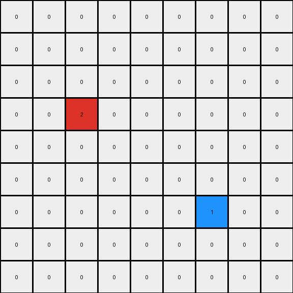

# 2-0ca9ddb6 • 002 • example_1 - CODE

---

**input**
```
0 0 0 0 0 0 0 0 0
0 0 0 0 0 0 0 0 0
0 0 0 0 0 0 0 0 0
0 0 2 0 0 0 0 0 0
0 0 0 0 0 0 0 0 0
0 0 0 0 0 0 0 0 0
0 0 0 0 0 0 1 0 0
0 0 0 0 0 0 0 0 0
0 0 0 0 0 0 0 0 0
```




**output**
```
0 0 0 0 0 0 0 0 0
0 0 0 0 0 0 0 0 0
0 4 0 4 0 0 0 0 0
0 0 2 0 0 0 0 0 0
0 4 0 4 0 0 0 0 0
0 0 0 0 0 0 7 0 0
0 0 0 0 0 7 1 7 0
0 0 0 0 0 0 7 0 0
0 0 0 0 0 0 0 0 0
```


Okay, let's analyze this ARC-AGI task example to understand the transformation rule.

**General Assessment:**

The input is a 9x9 grid with two single-pixel objects: a red (2) pixel and a blue (1) pixel. The output grid is also 9x9 and seems to expand these original pixels, adding yellow (4) and orange (7) pixels around them. The overall shape and structure appear to be maintained, suggesting some form of object-centric operation, possibly related to surrounding or "filling in" adjacent pixels.

**Strategy:**

1.  **Identify Objects:** Clearly define the initial objects (red and blue pixels) and their locations.
2.  **Analyze Transformations:**
    *   Examine the changes in the output relative to the input.
    *   Determine what new objects are created and where they are located, specifically noting their relation to the initial objects.
    *   look for patterns and symmetries
3.  **Formulate a Rule:** Develop a natural language description of the transformation logic that explains the observed changes.
4.  **Metrics:** Count the number of pixels of each color in the input and output, and report the coordinates of the single-pixel objects in the input.

**Metrics Collection:**


*code_execution:*
```python
import numpy as np

input_grid = np.array([
    [0, 0, 0, 0, 0, 0, 0, 0, 0],
    [0, 0, 0, 0, 0, 0, 0, 0, 0],
    [0, 0, 0, 0, 0, 0, 0, 0, 0],
    [0, 0, 2, 0, 0, 0, 0, 0, 0],
    [0, 0, 0, 0, 0, 0, 0, 0, 0],
    [0, 0, 0, 0, 0, 0, 0, 0, 0],
    [0, 0, 0, 0, 0, 0, 1, 0, 0],
    [0, 0, 0, 0, 0, 0, 0, 0, 0],
    [0, 0, 0, 0, 0, 0, 0, 0, 0]
])

output_grid = np.array([
    [0, 0, 0, 0, 0, 0, 0, 0, 0],
    [0, 0, 0, 0, 0, 0, 0, 0, 0],
    [0, 4, 0, 4, 0, 0, 0, 0, 0],
    [0, 0, 2, 0, 0, 0, 0, 0, 0],
    [0, 4, 0, 4, 0, 0, 0, 0, 0],
    [0, 0, 0, 0, 0, 0, 7, 0, 0],
    [0, 0, 0, 0, 0, 7, 1, 7, 0],
    [0, 0, 0, 0, 0, 0, 7, 0, 0],
    [0, 0, 0, 0, 0, 0, 0, 0, 0]
])

def get_object_coordinates(grid, color):
    coords = np.argwhere(grid == color)
    return coords.tolist()

def count_colors(grid):
    unique, counts = np.unique(grid, return_counts=True)
    return dict(zip(unique, counts))

input_color_counts = count_colors(input_grid)
output_color_counts = count_colors(output_grid)

red_coords = get_object_coordinates(input_grid, 2)
blue_coords = get_object_coordinates(input_grid, 1)

print(f"{input_color_counts=}")
print(f"{output_color_counts=}")
print(f"{red_coords=}")
print(f"{blue_coords=}")

```

*code_execution_result:*
outcome: 1
```
input_color_counts={np.int64(0): np.int64(79), np.int64(1): np.int64(1), np.int64(2): np.int64(1)}
output_color_counts={np.int64(0): np.int64(71), np.int64(1): np.int64(1), np.int64(2): np.int64(1), np.int64(4): np.int64(4), np.int64(7): np.int64(4)}
red_coords=[[3, 2]]
blue_coords=[[6, 6]]

```
**YAML Facts:**


```yaml
input:
  grid_size: 9x9
  objects:
    - color: red (2)
      coordinates: [[3, 2]]
      count: 1
    - color: blue (1)
      coordinates: [[6, 6]]
      count: 1
    - color: white (0)
      count: 79
output:
  grid_size: 9x9
  objects:
    - color: red (2)
      coordinates: [[3, 2]]
      count: 1
    - color: blue (1)
      coordinates: [[6, 6]]
      count: 1
    - color: yellow (4)
      coordinates: [[2, 1], [2, 3], [4, 1], [4, 3]]
      count: 4
    - color: orange (7)
      coordinates: [[6, 5], [6, 7], [7, 6], [5, 6]]
      count: 4
    - color: white (0)
      count: 71

```


**Natural Language Program:**

1.  **Identify initial objects:** Locate the single red (2) pixel and the single blue (1) pixel in the input grid. Note their positions.
2.  **Red Pixel Expansion:**  Create two yellow (4) pixels horizontally adjacent to the red pixel, one to its left and one to its right. If there are no positions to its left and right (i.e., it's on the edge of the board, mirror the position, placing another yellow on the same side.
3. **Red Pixel Expansion, phase 2:** Create two yellow (4) pixels vertically adjacent to the red pixel, one above and one below.
4.  **Blue Pixel Expansion:** Create two orange (7) pixels horizontally adjacent to the blue pixel, on to its left and one to its right.
5. **Blue Pixel Expansion, phase 2:** Create two orange (7) pixels vertically adjacent to the blue pixel, one above and one below.
6. **Preserve**: Keep the original red and blue pixels in their original locations.


**INSTRUCTIONS**

- generate a Python module to represent the natural language program 
- follow the template below
- all common math and science libraries are available
- create docstring only at top - but comment the workflow in the function
- use helper functions for common operations like finding objects, counting,
  measuring, moving, etc. 

remember - we are working iteratively - so this code will inform your future
self as we converge on the solution

*template:*

```python
"""
{ natural language description of the transformation rule }
"""

{ imports }

def transform(input_grid):
    # initialize output_grid

    # change output pixels 

    return output_grid

```
