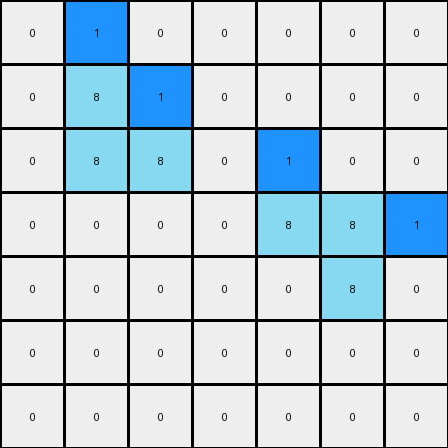
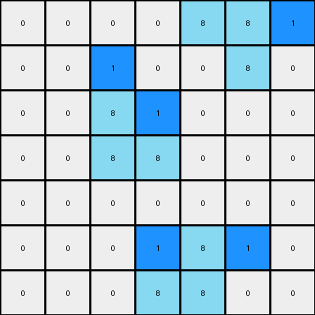

# 1-3aa6fb7a • 003 • refine_dreamer

---


Previous Code:
```python
"""
Identify azure (8) colored objects in the input grid and preserve them in the output. 
Place a blue (1) pixel to the right of the right-most pixel on the top row of the top-left azure object.
Place a blue pixel above the top-left corner pixel of the bottom-right azure object.
"""

import numpy as np

def find_objects(grid, color):
    objects = []
    visited = set()
    rows, cols = grid.shape

    def is_valid(r, c):
        return 0 <= r < rows and 0 <= c < cols

    def dfs(r, c, current_object):
        if (r, c) in visited or not is_valid(r, c) or grid[r, c] != color:
            return
        visited.add((r, c))
        current_object.append((r, c))
        for dr, dc in [(0, 1), (1, 0), (0, -1), (-1, 0)]:
            dfs(r + dr, c + dc, current_object)

    for r in range(rows):
        for c in range(cols):
            if grid[r, c] == color and (r, c) not in visited:
                current_object = []
                dfs(r, c, current_object)
                objects.append(current_object)
    return objects

def transform(input_grid):
    # Initialize output_grid as a copy of input_grid
    output_grid = np.copy(input_grid)
    rows, cols = input_grid.shape

    # Find azure objects
    azure_objects = find_objects(input_grid, 8)

    # Process each azure object
    for obj in azure_objects:
        # Sort pixels to easily find top-left and bottom-right
        sorted_pixels = sorted(obj)
        
        if len(obj) > 1: # need to determine location of objects.
            min_row = min(pixel[0] for pixel in obj)
            max_col_top_row = -1
            # if top left
            for r,c in obj:
                if r == min_row:
                    if c > max_col_top_row:
                       max_col_top_row = c
            if max_col_top_row > -1 and max_col_top_row + 1 < cols:
               output_grid[min_row, max_col_top_row + 1] = 1

            #if bottom right - find top left corner and insert blue above.
            corner_r = -1
            corner_c = -1
            for r, c in obj:
                is_corner = True
                for dr, dc in [(0, -1), (-1, 0)]:
                    if (r + dr, c+ dc) in obj:
                        is_corner = False
                if is_corner:
                    corner_r = r
                    corner_c = c
            if corner_r > -1 and corner_r -1 > -1:
                output_grid[corner_r - 1, corner_c] = 1

    return output_grid
```

Train Set Results:

## Example 1:**

Input:
```
0 0 0 0 0 0 0
0 8 0 0 0 0 0
0 8 8 0 0 0 0
0 0 0 0 8 8 0
0 0 0 0 0 8 0
0 0 0 0 0 0 0
0 0 0 0 0 0 0
```
Expected Output:
```
0 0 0 0 0 0 0
0 8 1 0 0 0 0
0 8 8 0 0 0 0
0 0 0 0 8 8 0
0 0 0 0 1 8 0
0 0 0 0 0 0 0
0 0 0 0 0 0 0
```
Transformed Output:
```
0 1 0 0 0 0 0
0 8 1 0 0 0 0
0 8 8 0 1 0 0
0 0 0 0 8 8 1
0 0 0 0 0 8 0
0 0 0 0 0 0 0
0 0 0 0 0 0 0
```

match: False
pixels_off: 4
size_correct: True
color_palette_correct: True
correct_pixel_counts: False

## Example 2:**

Input:
```
0 0 0 0 8 8 0
0 0 0 0 0 8 0
0 0 8 0 0 0 0
0 0 8 8 0 0 0
0 0 0 0 0 0 0
0 0 0 0 8 0 0
0 0 0 8 8 0 0
```
Expected Output:
```
0 0 0 0 8 8 0
0 0 0 0 1 8 0
0 0 8 1 0 0 0
0 0 8 8 0 0 0
0 0 0 0 0 0 0
0 0 0 1 8 0 0
0 0 0 8 8 0 0
```
Transformed Output:
```
0 0 0 0 8 8 1
0 0 1 0 0 8 0
0 0 8 1 0 0 0
0 0 8 8 0 0 0
0 0 0 0 0 0 0
0 0 0 1 8 1 0
0 0 0 8 8 0 0
```

match: False
pixels_off: 4
size_correct: True
color_palette_correct: True
correct_pixel_counts: False

**INSTRUCTIONS**

The code above was generated based on observations from the first training
example

we have tested the transform function on each of the task example inputs and
compared with the expected output

review each of the examples provided and the results and consider how the
natural language program should be updated to accommodate this new knowledge

respond with the following deliverables:

- general assessment of the information provided and strategy for resolving the
  errors
- gather metrics about each of the examples and results - use code_execution to
  develop accurate reports on your assumptions
- a YAML block documenting facts - Focus on identifying objects, their properties, and the actions performed on them.
- a natural language program - Be as clear and concise as possible, providing a complete description of the transformation rule.


your responses should be considered as information in a report - not a
conversation
