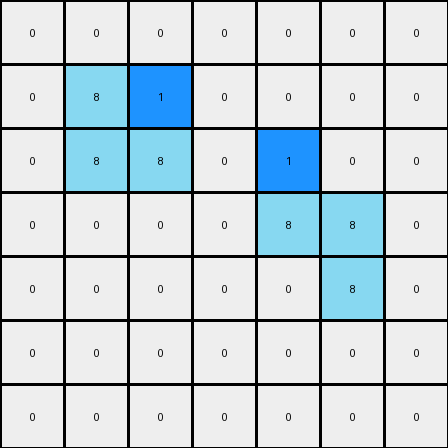

# 1-3aa6fb7a • 005 • refine_dreamer

---

Previous Code:
```python
"""
1.  **Find all Azure Objects:** Identify all distinct contiguous regions of azure (8) pixels in the input grid.
2.  **Identify Top-Left and Bottom-Right Objects:**
    *   The top-left object is the one whose top-most row is the highest (smallest row index). If multiple objects share the same top-most row, the one with the left-most column on that row (smallest column index) is the top-left.
    *   The bottom-right object is the one whose bottom-most row is the lowest (largest row index). If multiple objects share the same bottom-most row, the one with the right-most column on that row (largest column index) is the bottom-right.
3.  **Place Blue Pixel near Top-Left Object:** Find the right-most pixel on the top row of the top-left azure object. Place a blue (1) pixel immediately to the right of this pixel.
4.  **Place Blue Pixel near Bottom-Right Object:** Find the top-left corner pixel of the bottom-right azure object. Place a blue (1) pixel immediately above this pixel.
5. **Preserve Azure:** All azure pixels in original input are also in the output.
6. **Output:** create a copy of the input, apply the new blue pixels, and return.
"""

import numpy as np

def find_objects(grid, color):
    objects = []
    visited = set()
    rows, cols = grid.shape

    def is_valid(r, c):
        return 0 <= r < rows and 0 <= c < cols

    def dfs(r, c, current_object):
        if (r, c) in visited or not is_valid(r, c) or grid[r, c] != color:
            return
        visited.add((r, c))
        current_object.append((r, c))
        for dr, dc in [(0, 1), (1, 0), (0, -1), (-1, 0)]:
            dfs(r + dr, c + dc, current_object)

    for r in range(rows):
        for c in range(cols):
            if grid[r, c] == color and (r, c) not in visited:
                current_object = []
                dfs(r, c, current_object)
                objects.append(current_object)
    return objects

def find_top_left_and_bottom_right_objects(objects):
    if not objects:
        return None, None

    # Find top-left object
    top_left_object = min(objects, key=lambda obj: (min(r for r, c in obj), min(c for r, c in obj if r == min(row for row, _ in obj))))

    # Find bottom-right object
    bottom_right_object = max(objects, key=lambda obj: (max(r for r, c in obj), max(c for r, c in obj if r == max(row for row, _ in obj))))
    
    return top_left_object, bottom_right_object


def transform(input_grid):
    # Initialize output_grid as a copy of input_grid
    output_grid = np.copy(input_grid)
    rows, cols = input_grid.shape

    # Find azure objects
    azure_objects = find_objects(input_grid, 8)

    # Find top-left and bottom-right azure objects
    top_left_object, bottom_right_object = find_top_left_and_bottom_right_objects(azure_objects)

    # Place blue pixel near top-left object
    if top_left_object:
        top_row = min(r for r, c in top_left_object)
        right_most_col = max(c for r, c in top_left_object if r == top_row)
        if right_most_col + 1 < cols:
            output_grid[top_row, right_most_col + 1] = 1

    # Place blue pixel near bottom-right object
    if bottom_right_object:
        top_left_corner_r = min(r for r, c in bottom_right_object)
        top_left_corner_c = min(c for r, c in bottom_right_object if r == top_left_corner_r )
        if top_left_corner_r - 1 >= 0:
            output_grid[top_left_corner_r - 1, top_left_corner_c] = 1

    return output_grid
```

Train Set Results:

## Example 1:**

Input:
```
0 0 0 0 0 0 0
0 8 0 0 0 0 0
0 8 8 0 0 0 0
0 0 0 0 8 8 0
0 0 0 0 0 8 0
0 0 0 0 0 0 0
0 0 0 0 0 0 0
```
Expected Output:
```
0 0 0 0 0 0 0
0 8 1 0 0 0 0
0 8 8 0 0 0 0
0 0 0 0 8 8 0
0 0 0 0 1 8 0
0 0 0 0 0 0 0
0 0 0 0 0 0 0
```
Transformed Output:
```
0 0 0 0 0 0 0
0 8 1 0 0 0 0
0 8 8 0 1 0 0
0 0 0 0 8 8 0
0 0 0 0 0 8 0
0 0 0 0 0 0 0
0 0 0 0 0 0 0
```

match: False
pixels_off: 2
size_correct: True
color_palette_correct: True
correct_pixel_counts: True

## Example 2:**

Input:
```
0 0 0 0 8 8 0
0 0 0 0 0 8 0
0 0 8 0 0 0 0
0 0 8 8 0 0 0
0 0 0 0 0 0 0
0 0 0 0 8 0 0
0 0 0 8 8 0 0
```
Expected Output:
```
0 0 0 0 8 8 0
0 0 0 0 1 8 0
0 0 8 1 0 0 0
0 0 8 8 0 0 0
0 0 0 0 0 0 0
0 0 0 1 8 0 0
0 0 0 8 8 0 0
```
Transformed Output:
```
0 0 0 0 8 8 1
0 0 0 0 0 8 0
0 0 8 0 0 0 0
0 0 8 8 0 0 0
0 0 0 0 1 0 0
0 0 0 0 8 0 0
0 0 0 8 8 0 0
```

match: False
pixels_off: 5
size_correct: True
color_palette_correct: True
correct_pixel_counts: False
**INSTRUCTIONS**

The code above was generated based on observations from the first training
example

we have tested the transform function on each of the task example inputs and
compared with the expected output

review each of the examples provided and the results and consider how the
natural language program should be updated to accommodate this new knowledge

respond with the following deliverables:

- general assessment of the information provided and strategy for resolving the
  errors
- gather metrics about each of the examples and results - use code_execution to
  develop accurate reports on your assumptions
- a YAML block documenting facts - Focus on identifying objects, their properties, and the actions performed on them.
- a natural language program - Be as clear and concise as possible, providing a complete description of the transformation rule.


your responses should be considered as information in a report - not a
conversation
