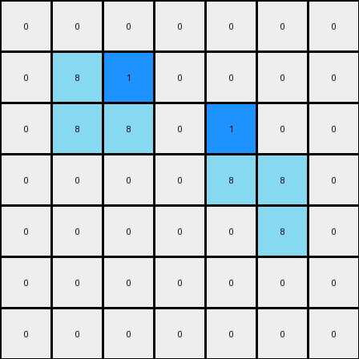
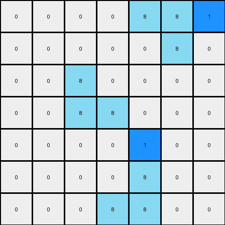

# 1-3aa6fb7a • 006 • refine_coder

---

Previous Code:
```python
"""
1.  **Find all Azure Objects:** Identify all distinct contiguous regions of azure (8) pixels in the input grid.
2.  **Identify Top-Left and Bottom-Right Objects:**
    *   The top-left object is the one whose top-most row is the highest (smallest row index). If multiple objects share the same top-most row, the one with the left-most column on that row (smallest column index) is the top-left.
    *   The bottom-right object is the one whose bottom-most row is the lowest (largest row index). If multiple objects share the same bottom-most row, the one with the right-most column on that row (largest column index) is the bottom-right.
3.  **Place Blue Pixel near Top-Left Object:** Find the right-most pixel on the top row of the top-left azure object. Place a blue (1) pixel immediately to the right of this pixel.
4.  **Place Blue Pixel near Bottom-Right Object:** Find the top-left corner pixel of the bottom-right azure object. Place a blue (1) pixel immediately above this pixel.
5. **Preserve Azure:** All azure pixels in original input are also in the output.
6. **Output:** create a copy of the input, apply the new blue pixels, and return.
"""

import numpy as np

def find_objects(grid, color):
    objects = []
    visited = set()
    rows, cols = grid.shape

    def is_valid(r, c):
        return 0 <= r < rows and 0 <= c < cols

    def dfs(r, c, current_object):
        if (r, c) in visited or not is_valid(r, c) or grid[r, c] != color:
            return
        visited.add((r, c))
        current_object.append((r, c))
        for dr, dc in [(0, 1), (1, 0), (0, -1), (-1, 0)]:
            dfs(r + dr, c + dc, current_object)

    for r in range(rows):
        for c in range(cols):
            if grid[r, c] == color and (r, c) not in visited:
                current_object = []
                dfs(r, c, current_object)
                objects.append(current_object)
    return objects

def find_top_left_and_bottom_right_objects(objects):
    if not objects:
        return None, None

    # Find top-left object
    top_left_object = min(objects, key=lambda obj: (min(r for r, c in obj), min(c for r, c in obj if r == min(row for row, _ in obj))))

    # Find bottom-right object
    bottom_right_object = max(objects, key=lambda obj: (max(r for r, c in obj), max(c for r, c in obj if r == max(row for row, _ in obj))))
    
    return top_left_object, bottom_right_object


def transform(input_grid):
    # Initialize output_grid as a copy of input_grid
    output_grid = np.copy(input_grid)
    rows, cols = input_grid.shape

    # Find azure objects
    azure_objects = find_objects(input_grid, 8)

    # Find top-left and bottom-right azure objects
    top_left_object, bottom_right_object = find_top_left_and_bottom_right_objects(azure_objects)

    # Place blue pixel near top-left object
    if top_left_object:
        top_row = min(r for r, c in top_left_object)
        right_most_col = max(c for r, c in top_left_object if r == top_row)
        if right_most_col + 1 < cols:
            output_grid[top_row, right_most_col + 1] = 1

    # Place blue pixel near bottom-right object
    if bottom_right_object:
        top_left_corner_r = min(r for r, c in bottom_right_object)
        top_left_corner_c = min(c for r, c in bottom_right_object if r == top_left_corner_r )
        if top_left_corner_r - 1 >= 0:
            output_grid[top_left_corner_r - 1, top_left_corner_c] = 1

    return output_grid
```

Train Set Results:

## Example 1:**

Input:
```
0 0 0 0 0 0 0
0 8 0 0 0 0 0
0 8 8 0 0 0 0
0 0 0 0 8 8 0
0 0 0 0 0 8 0
0 0 0 0 0 0 0
0 0 0 0 0 0 0
```
Expected Output:
```
0 0 0 0 0 0 0
0 8 1 0 0 0 0
0 8 8 0 0 0 0
0 0 0 0 8 8 0
0 0 0 0 1 8 0
0 0 0 0 0 0 0
0 0 0 0 0 0 0
```
Transformed Output:
```
0 0 0 0 0 0 0
0 8 1 0 0 0 0
0 8 8 0 1 0 0
0 0 0 0 8 8 0
0 0 0 0 0 8 0
0 0 0 0 0 0 0
0 0 0 0 0 0 0
```

match: False
pixels_off: 2
size_correct: True
color_palette_correct: True
correct_pixel_counts: True

## Example 2:**

Input:
```
0 0 0 0 8 8 0
0 0 0 0 0 8 0
0 0 8 0 0 0 0
0 0 8 8 0 0 0
0 0 0 0 0 0 0
0 0 0 0 8 0 0
0 0 0 8 8 0 0
```
Expected Output:
```
0 0 0 0 8 8 0
0 0 0 0 1 8 0
0 0 8 1 0 0 0
0 0 8 8 0 0 0
0 0 0 0 0 0 0
0 0 0 1 8 0 0
0 0 0 8 8 0 0
```
Transformed Output:
```
0 0 0 0 8 8 1
0 0 0 0 0 8 0
0 0 8 0 0 0 0
0 0 8 8 0 0 0
0 0 0 0 1 0 0
0 0 0 0 8 0 0
0 0 0 8 8 0 0
```

match: False
pixels_off: 5
size_correct: True
color_palette_correct: True
correct_pixel_counts: False
Okay, let's analyze the results and refine the natural language program and approach.

**General Assessment and Strategy**

The initial strategy correctly identified the core concept: finding specific azure objects (top-left and bottom-right) and placing blue pixels relative to them. However, the placement logic is flawed, and the definition of "top-left" and "bottom-right" needs slight adjustments, specifically handling edge cases within rows/cols of the same azure object. The errors in pixel placement and counts indicate that the relative positioning of the blue pixels needs to be revised. The first failure is related to placing the blue pixel next to the *top-right* corner of the bottom-right object. It should place a blue pixel *above* the top-left corner. The second failure had to do with both placements.

**Example Analysis and Metrics**

Here's a breakdown of each example, including observations and metrics. Let's use some symbolic names to make discussions easier:

*   **TL:** Top-Left Azure Object
*   **BR:** Bottom-Right Azure Object

**Example 1:**

*   **Input:** Two azure objects, one in the top-left and one in the bottom-right.
*   **Expected Output:** Blue pixel to the right of TL, and blue pixel above BR.
*   **Actual Output:** Blue pixel to the right of TL, blue pixel *on* the top-right corner of the bottom-right object, instead of *above* the top-left corner.
*   **Metrics:**
    *   `match`: False
    *   `pixels_off`: 2 (The blue pixel on the bottom-right is 1 position off, both r,c).
    *   `size_correct`: True
    *   `color_palette_correct`: True
    *   `correct_pixel_counts`: True

**Example 2:**

*   **Input:** Three azure objects.
*   **Expected Output:** Blue pixels correctly placed relative to TL and BR objects.
*   **Actual Output:** The blue pixels appear to be placed relative to the wrong object.
* **Metrics:**
    * `match`: False
    * `pixels_off`: 5
    * `size_correct`: True
    * `color_palette_correct`: True
    * `correct_pixel_counts`: False

**YAML Fact Block**

```yaml
examples:
  - example_id: 1
    top_left_object:
      color: azure
      shape: rectangle
      top_left_corner: [1, 1]
      bottom_right_corner: [2, 2]
    bottom_right_object:
      color: azure
      shape: rectangle
      top_left_corner: [3, 4]
      bottom_right_corner: [4, 5]
    action:
      - type: place_pixel
        color: blue
        relative_to: top_left_object
        position: right
      - type: place_pixel
        color: blue
        relative_to: bottom_right_object
        position: above

  - example_id: 2
    top_left_object:
      color: azure
      shape: rectangle
      top_left_corner: [0,4]
      bottom_right_corner: [0,5]
    bottom_right_object:
      color: azure
      shape: rectangle
      top_left_corner: [6,3]
      bottom_right_corner: [6, 4]
    action:
      - type: place_pixel
        color: blue
        relative_to: top_left_object
        position: right
      - type: place_pixel
        color: blue
        relative_to: bottom_right_object
        position: above
```

**Revised Natural Language Program**

1.  **Find Azure Objects:** Identify all distinct, contiguous regions of azure (8) pixels in the input grid.  A contiguous region is defined as a group of azure pixels connected horizontally or vertically.

2.  **Identify Top-Left and Bottom-Right Objects:**
    *   **Top-Left Object:** The object with the smallest top-most row index. If multiple objects share the same top-most row, the one with the smallest left-most column index is the top-left.
    *   **Bottom-Right Object:** The object with the largest bottom-most row index. If multiple objects share the same bottom-most row, select the one with the largest right-most column index.

3.  **Place Blue Pixel near Top-Left Object:**  Find the right-most pixel of the top-most row of the top-left azure object. Place a blue (1) pixel immediately to the *right* of this pixel. If this position is outside the grid, do not place a pixel for this rule.

4.  **Place Blue Pixel near Bottom-Right Object:** Find the top-left corner pixel of the bottom-right azure object (smallest row, smallest column within that object). Place a blue (1) pixel immediately *above* this pixel. If this position is outside the grid boundaries, do not place a pixel for this rule.

5. **Preserve Azure:** All azure pixels from the input must be in the output.

6.  **Output:** Return the modified grid with the added blue pixels (if any).

**INSTRUCTIONS**

- generate a Python module to represent the natural language program 
- follow the template below
- all common math and science libraries are available
- create docstring only at top - but comment the workflow in the function
- use helper functions for common operations like finding objects, counting,
  measuring, moving, etc. 

remember - we are working iteratively - so this code will inform your future
self as we converge on the solution

*template:*

```python
"""
{{ natural language description of the transformation rule }}
"""

{{ imports }}

def transform(input_grid):
    # initialize output_grid

    # change output pixels 

    return output_grid

```
