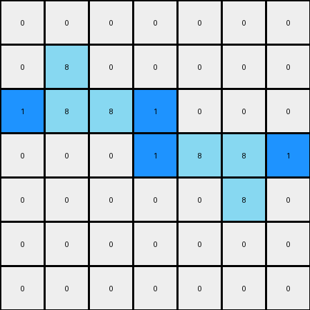

# 1-3aa6fb7a • 003 • refine_dreamer

---

Previous Code:
```python
"""
1.  **Identify Azure Pixels:** Locate all pixels with the value 8 (azure) in the input grid.
2.  **Mark Adjacent Cells:** For each identified azure pixel, examine its neighboring cells (up, down, left, and right).
    - if an azure pixel is to the right of another azure pixel, place a blue pixel to its immediate right
    - if an azure pixel is to the left of another azure pixel, place a blue pixel to its immediate left
3.  **Output:** Create the output grid with the original azure pixels and the newly placed blue (1) pixels. All other cells remain white (0).
"""

import numpy as np

def find_pixels_by_color(grid, color):
    return np.argwhere(grid == color)

def transform(input_grid):
    # initialize output_grid as a copy of the input grid
    output_grid = input_grid.copy()
    
    # Find the locations of all azure (8) pixels
    azure_pixels = find_pixels_by_color(input_grid, 8)
    
    # Iterate and mark adjacent cells based on the rules
    for row, col in azure_pixels:
        #check to right
        if col + 1 < input_grid.shape[1] and input_grid[row, col + 1] == 8:
            if col+2 < input_grid.shape[1]:
                output_grid[row,col+2] = 1
        #check to left
        if col - 1 >= 0 and input_grid[row, col - 1] == 8:
            if col - 2 >= 0:
                output_grid[row,col-2] = 1


    return output_grid
```

Train Set Results:

## Example 1:**

Input:
```
0 0 0 0 0 0 0
0 8 0 0 0 0 0
0 8 8 0 0 0 0
0 0 0 0 8 8 0
0 0 0 0 0 8 0
0 0 0 0 0 0 0
0 0 0 0 0 0 0
```
Expected Output:
```
0 0 0 0 0 0 0
0 8 1 0 0 0 0
0 8 8 0 0 0 0
0 0 0 0 8 8 0
0 0 0 0 1 8 0
0 0 0 0 0 0 0
0 0 0 0 0 0 0
```
Transformed Output:
```
0 0 0 0 0 0 0
0 8 0 0 0 0 0
1 8 8 1 0 0 0
0 0 0 1 8 8 1
0 0 0 0 0 8 0
0 0 0 0 0 0 0
0 0 0 0 0 0 0
```

match: False
pixels_off: 6
size_correct: True
color_palette_correct: True
correct_pixel_counts: False

## Example 2:**

Input:
```
0 0 0 0 8 8 0
0 0 0 0 0 8 0
0 0 8 0 0 0 0
0 0 8 8 0 0 0
0 0 0 0 0 0 0
0 0 0 0 8 0 0
0 0 0 8 8 0 0
```
Expected Output:
```
0 0 0 0 8 8 0
0 0 0 0 1 8 0
0 0 8 1 0 0 0
0 0 8 8 0 0 0
0 0 0 0 0 0 0
0 0 0 1 8 0 0
0 0 0 8 8 0 0
```
Transformed Output:
```
0 0 0 1 8 8 1
0 0 0 0 0 8 0
0 0 8 0 0 0 0
0 1 8 8 1 0 0
0 0 0 0 0 0 0
0 0 0 0 8 0 0
0 0 1 8 8 1 0
```

match: False
pixels_off: 9
size_correct: True
color_palette_correct: True
correct_pixel_counts: False
**INSTRUCTIONS**

The code above was generated based on observations from the first training
example

we have tested the transform function on each of the task example inputs and
compared with the expected output

review each of the examples provided and the results and consider how the
natural language program should be updated to accommodate this new knowledge

respond with the following deliverables:

- general assessment of the information provided and strategy for resolving the
  errors
- gather metrics about each of the examples and results - use code_execution to
  develop accurate reports on your assumptions
- a YAML block documenting facts - Focus on identifying objects, their properties, and the actions performed on them.
- a natural language program - Be as clear and concise as possible, providing a complete description of the transformation rule.


your responses should be considered as information in a report - not a
conversation
